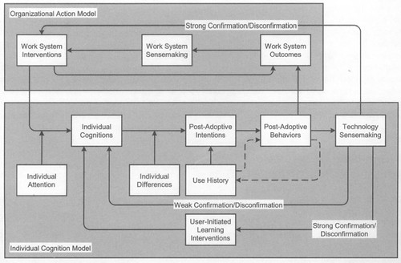

---
categories:
- bad
- elearning
date: 2015-10-31 15:25:36+10:00
next:
  text: '"Exploring "post adoptive usage" of the #moodle Book module - a draft proposal"'
  url: /blog/2015/11/06/exploring-post-adoptive-usage-of-the-moodle-book-module-a-draft-proposal/
previous:
  text: The CSCW view of Knowledge Management
  url: /blog/2015/10/30/the-cscw-view-of-knowledge-management/
title: Anyone capturing users' post-adoptive behaviours for the LMS? Implications?
type: post
template: blog-post.html
---
Jasperson, Carter & Zmud (2005)

> advocate that organizations strongly consider capturing users' post-adoptive behaviors, overtime, at a feature level of analysis (as well as the outcomes associated with these behaviors). It is only through analyzing a community's usage patterns at a level of detail sufficient to enable individual learning (regarding both the IT application and work system) to be exposed, along with the outcomes associated with this learning, that the expectation gaps required to devise and direct interventions can themselves be exposed. Without such richness in available data, it is unlikely that organizations will realize significant improvements in their capability to manage the post-adoptive life cycle (p. 549)

Are there any universities "capturing users' post-adoptive behaviours" for the LMS? Or any other educational system?

There's lots of learning analytics research (e.g. interesting stuff from Gasevic et al, 2015) going on, but most of that is focused on learning and learners. This is important stuff and there should be more of it.

But Jasperson et al (2015) are Information Systems researchers publishing in one of the premier IS journals. Are there University IT departments that are achieving the "richness in available data...(that) will realize significant improvements in their capability to manage the post-adoptive life cycle"?

If there is, what does that look like? How do they do it? What "expectation gaps" have they identified? What "direct interventions" have they implemented? How?

My experience suggests that this work is limited. I wonder what implications that has for the quality system use and thus the quality of learning and teaching?

What "expectation gaps" are going ignored? What impact does that have on learning and teaching?

Jasperson et al (2005) develop a "Conceptual model of post-adoptive behaviour" shown in the image below. Post-adoptive behaviours can include the decision not to use, or change how to use. A gap in expectations that is never filled, is not likely to encourage on-going use.

They also identify that there is an "insufficient understanding of the technology sensemaking process" (p. 544). The model suggests that technology sensemaking is a pre-cursor to "user-initiated learning interventions", examples of which include: formal or informal training opportunities; accessing external documentation; observing others; and, experimenting with IT application features.

Perhaps this offers a possible explanation for complaints about academics not using the provided training/documentation for institutional digital learning systems? Perhaps this might offer some insight into the apparent ["low digital fluency of faculty" problem](/blog/2014/09/12/you-want-digitally-fluent-faculty/).

## References

Gašević, D., Dawson, S., Rogers, T., & Gasevic, D. (2015). Learning analytics should not promote one size fits all: The effects of instructional conditions in predicating learning success. The Internet and Higher Education, 28, 68–84. doi:doi:10.1016/j.iheduc.2015.10.002

Jasperson, S., Carter, P. E., & Zmud, R. W. (2005). A Comprehensive Conceptualization of Post-Adaptive Behaviors Associated with Information Technology Enabled Work Systems. MIS Quarterly, 29(3), 525–557.