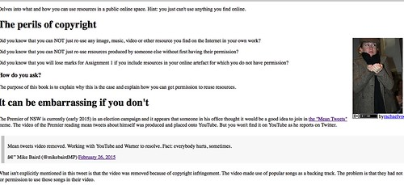
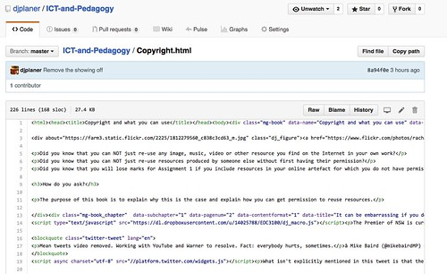

---
categories:
- moodle
- moodleopenbook
- thesis
date: 2015-12-03 14:28:08+10:00
next:
  text: '"Moodle book to a single file: which format?"'
  url: /blog2/2015/12/11/moodle-book-to-a-single-file-which-format/
previous:
  text: 'Opening up and enhancing #moodle books with GitHub, ePub, etc.'
  url: /blog2/2015/11/30/opening-up-and-enhancing-moodle-books-with-github-epub-etc/
tags:
- oer
title: '"Moodle book and GitHub: working together"'
type: post
template: blog-post.html
comments:
    []
    
pingbacks:
    - approved: '1'
      author: 'Opening up and enhancing #moodle books with GitHub, ePub, etc. | The Weblog
        of (a) David Jones'
      author_email: null
      author_ip: 192.0.113.102
      author_url: https://davidtjones.wordpress.com/2015/11/30/opening-up-and-enhancing-moodle-books-with-github-epub-etc/
      content: '[&#8230;] Moodle book and GitHub: working together [&#8230;]'
      date: '2015-12-03 15:10:29'
      date_gmt: '2015-12-03 05:10:29'
      id: '1455'
      parent: '0'
      type: pingback
      user_id: '0'
    - approved: '1'
      author: 'Share your Moodle Book resource on GitHub with Moodle Book GitHub tool
        #Moodle @djplaner - Moodle World'
      author_email: null
      author_ip: 209.105.228.209
      author_url: http://www.moodleworld.com/share-your-moodle-book-resource-on-github-with-moodle-book-github-tool-moodle-djplaner/
      content: '[&#8230;] This blog post gives a description with pictures on how this
        Moodle Book GitHub tool works. You can also download the code for the project
        from this GitHub repository. The code is still under development so it is not
        recommended to be used on the production sites. [&#8230;]'
      date: '2015-12-10 21:19:40'
      date_gmt: '2015-12-10 11:19:40'
      id: '1456'
      parent: '0'
      type: pingback
      user_id: '0'
    - approved: '1'
      author: 'Moodle book to a single file: which format? | The Weblog of (a) David Jones'
      author_email: null
      author_ip: 192.0.100.44
      author_url: https://davidtjones.wordpress.com/2015/12/11/moodle-book-to-a-single-file-which-format/
      content: '[&#8230;] Moodle book and GitHub: working together [&#8230;]'
      date: '2015-12-11 14:53:49'
      date_gmt: '2015-12-11 04:53:49'
      id: '1457'
      parent: '0'
      type: pingback
      user_id: '0'
    - approved: '1'
      author: "moodleopenbook | The Weblog of (a) David Jones | Moodle \u05D1\u05D7\u05D9\
        \u05E0\u05D5\u05DA &#8211; \u05D9\u05D5\u05DE\u05DF \u05DE\u05E1\u05E2 \u05D8\u05DB\
        \u05E0\u05D9"
      author_email: null
      author_ip: 80.244.168.25
      author_url: http://moodlemagic.info/blog/?p=1363
      content: '[&#8230;] Moodle Book github tool allows the import/export (pull/push)
        of Book content from/to GitHub. (and share a single book in [&#8230;]'
      date: '2015-12-23 01:51:22'
      date_gmt: '2015-12-22 15:51:22'
      id: '1458'
      parent: '0'
      type: pingback
      user_id: '0'
    - approved: '1'
      author: Sharing Moodle Books Through GitHub | Moodle News
      author_email: null
      author_ip: 162.144.26.251
      author_url: http://www.moodlenews.com/2015/sharing-moodle-books-through-github/
      content: "[&#8230;] has recently given a presentation\_(see below) and posted on\
        \ his blog about the ability to connect the book module with GitHub. Creating\
        \ this connection ultimately [&#8230;]"
      date: '2016-01-29 14:39:53'
      date_gmt: '2016-01-29 04:39:53'
      id: '1459'
      parent: '0'
      type: pingback
      user_id: '0'
    
---
A major aim of the [Moodle Open Book project](/blog2/the-moodle-open-book-module-project/) has been to connect the [Moodle Book module](https://docs.moodle.org/28/en/Book_module) with [GitHub](http://github.com). The intent was that such a connection would enable the easy sharing of content that is currently largely locked within the LMS, not to mention improving the authoring process for the [Moodle Book module](https://docs.moodle.org/28/en/Book_module). Earlier this week I [gave a presentation](/blog2/2015/11/30/opening-up-and-enhancing-moodle-books-with-github-epub-etc/) in which I demonstrated a working connection between the Book module and GitHub. The following post illustrates how this connection works.

This connection is implemented as [a Moodle book tool](https://moodle.org/plugins/browse.php?list=category&id=56), i.e.  an extension to the Moodle Book module that can be installed on any current version of Moodle. The code for the GitHub tool is available from [this GitHub repository](https://github.com/djplaner/moodle-booktool_github). The current status of this code is that it works, but is ugly (as the screenshots below will illustrate) and incomplete. The intent is that to get a working first version contributed to [the Moodle Plugins database](https://moodle.org/plugins/index.php) by early 2016 (end of January hopefully).

This work is funded by [the USQ Open Textbook Initiative](http://www.usq.edu.au/learning-teaching/excellence/landtgrants/OpenTextbooks).

### What is github?

If you don't know what GitHub is, then I suggest you take the time to read the following or anyone of the many other resources on the web that explain GitHub.

- [What is GitHub and what do geeks use it for](http://www.howtogeek.com/180167/htg-explains-what-is-github-and-what-do-geeks-use-it-for/)? Basic intro into git and github.
- [Embracing participatory culture in education](http://alexeyza.com/blog/2015/09/10/embracing-participatory-culture-in-education/). Blog post summarising some findings of a research study that examined why and how University academics are using GitHub, includes links to the published article.

## Summary of how it works

The Moodle Book github tool currently works by

1. Connecting a single "book" (a collection of web pages) created using the Moodle book with a single HTML file in a GitHub repository.
2. The tool keeps a track of the relationship between the "book" and the HTML file and tells you if they are the same or different.
3. Provides the ability to
    1. _push_ the content of the "book" onto GitHub, and
    2. _pull_ the content of the GitHub file back into the "book".

Once the content of the book is on GitHub, this means it can be shared, modified, and updated by anyone via any means.

Hopefully it might become common for other people using Moodle to use the Book github tool to import books authored by someone else from GitHub into their Moodle course.

I'm certainly looking forward to being able to create and modify Moodle books outside of Moodle and using GitHub to migrate my changes back into Moodle.

## Demonstration of how it works

The following contains a range of cropped screen-shots illustrating how the tool currently works. Click on any of the images to see a larger version.

### A Moodle Book

First, let's start with a Moodle book.  Here's what one looks like in my course site.

It's just a collection of web pages.  But it does provide the Table of Contents and the "next page" and "previous page" navigation. It's also a full part of Moodle hence services like activity completion can be used.

### Make a change

Let's make a change to this Moodle book.

Can you see the rather pointless change ("\*\*\*\* SHOWING OFF GITHUB TOOL \*\*\*\*") that I made to that page? Let's assume that this change is important and responds to the experience of learners.

### Is the Book github tool installed?

I want to save this change and the book to GitHub.  To do this the Book github tool needs to be installed.  Is it?

To find this out I look at the Book adminstration menu, which on my institutions Moodle theme looks like this.  Can you see evidence of the GitHub tool?

### Create the connection between book and github

To create (or check) the connection between the book and github I click on the GitHub link.

### Authorise with your GitHub account

The first time you click on the GitHub link within Moodle, you will be redirected to GitHub and will see something like the following

The github tool assumes that you have a user account on GitHub. This step is the github tool asking you for permission to use your GitHub account. Everything the github tool does on github will be done using this account.

If you agree to this you will see the connection page. This page allows you to configure the connection between the book and github, and also to view the status of that connection.  Here's some of what I see.

**Under construction:** The current interface for the tool is very much under development. What you see is the minimal interface necessary to get all this working.

In this case a connection has already been established.

In it's current state the github tool expects you to provide two components for the connection

1. the name of the GitHub repository; and,
2. the full path to the specific file within the repository to connect with.

Currently the tool then combines these two bits of information with your GitHub username to arrive at the location of the file within GitHub.

I could change the connection to point another file on GitHub, but I'll stick with this one.

**Under construction:** At the very least the ability to specify the github username and perhaps the branch (or similar) for the github file needs to be added.  Perhaps the option to copy and paste a github URL and have it checked and parsed?

### View the file on GitHub

My username on GitHub is **djplaner** which means that the URL for the file that this book is connected to is [http://github.com/djplaner/ICT-and-Pedagogy/Copyright.html.](http://github.com/djplaner/ICT-and-Pedagogy/Copyright.html)

If you click on that link, you can see the current status of the file on GitHub. When I wrote this, the file on GitHub looked like the following

The book is a sequence of web pages. When pushing a book onto GitHub the Book github tool combines all of those web pages into a single HTML file. That HTML file includes some additional HTML to help the Book github tool pull the content back into the book.

**Under Construction:** The format/structure of the HTML produced by the Book github tool's export/import is still undergoing some refinement. Use of HTML5 semantic tags is on the list.

### View the file as a web page

If you look closely at the image above of the github tool showing the connection you should see

View the file as a [web page](https://cdn.rawgit.com/djplaner/ICT-and-Pedagogy/master/Copyright.html).

If you click on [that link](https://cdn.rawgit.com/djplaner/ICT-and-Pedagogy/master/Copyright.html) you will see something like the following (depending on what changes I've made since I took this screenshot)

**Under Construction:** This uses a free service to display a GitHub file as a web page. How this is done also requires a bit more work.

**Under Construction:** At the moment the HTML is a simple concatenation of the book pages. Very soon this will be modified to include some additional markup and some basic style sheets. The aim is that when you view this HTML page you will see a table of contents and be able to navigate it like a book.

### What's the status of the connection?

Underneath the details of the connection the Book github tool page shows a simple summary of the status of the connection. In the image above, the status is

The book has been revised since the last push.

This is because of the change I made to the book earlier in this post. That change means that the GitHub file is now out of date. It's not the latest version of Book.

### Update the GitHub file

At this stage I can decide whether or not I want to update the file. When and if I update GitHub file will be entirely up to me, the source of the book I've edited, the changes I've made etc.

But if I do wish to update the GitHub file, I hit the "Push" link and see something like the following.

First, there's a brief warning just to make sure that you know that pushing will probably make the content of the book open to all to see.

Second, there is a space to enter some details (a comment) about the changes you are about to push onto GitHub.  The details about the push are visible in both GitHub and the Book github tool. The details about the push are useful for understanding what changes are being made.

Once I've entered my comment, I hit the push button and hopefully see a report of a successful push.

This means that the GitHub file has been changed.

### View the file on GitHub

If I view the file on GitHub, that change should be visible in the change below

The first change is that the comment/details I added about the push is visible in the row with the blue background ("Just showing off for the blog post"). That row includes my username, avatar, and how long ago the change was made. The second change is that the HTML for the file now contains the change I made in the Moodle book up above. I've highlighted it in green to highlight it.

### View the change history

If I return to the Book github tool to view the connection, I can see the following

The Status has been updated to indicate that the Book and the GitHub file are now the same.

You can also see that the "Change History" for the connection now includes the same comment/details ("Just showing off for the blog post") that showed up on GitHub. Can you see the link "commit details" in the Change History?

[The link](https://github.com/djplaner/ICT-and-Pedagogy/commit/01b31f32f09329c2085b0513bfaee8c9a64c3347#diff-5825aeb7afb1717e4e415d8075194f69) takes me to GitHub and shows me the following colour coded summary of the changes that were made to the file by this commit.

The green and red colours are used to indicate the additions (79) and deletions (128) made by this commit. This is much higher than you'd expect from the simple change I made.  This is because I've been playing with the code.

**Note:** you should be able to click on [the link](https://github.com/djplaner/ICT-and-Pedagogy/commit/01b31f32f09329c2085b0513bfaee8c9a64c3347#diff-5825aeb7afb1717e4e415d8075194f69) and see the same page. Even though I've subsequently made changes to the file on GitHub, I (and you) can always take a look at what the file looked like at this particular point in time.

### View the file on my computer

So far we've been using the Moodle book and GitHub to view and change the file. There are GitHub clients for a wide array of software and hardware. For example, there is a GitHub application for Mac OS X that I can use to make a local copy of the GitHub repository on my computer.

The following image is an example of a Mac finder window showing my local copy of the repository.  It shows that the version of the Copyright.html file (the one we're using for the Moodle book) was created and modified yesterday.

With the repository files on my computer I can then use all my normal applications to edit and view the file.  If I double click on the Copyright.html file in Finder, this is what I see.

Note that the "SHOWING OFF" message is missing.  That's because the copy on my computer is behind that on GitHub.

### Update it

To fix this I use the GitHub desktop tool to _pull_ the latest content from GitHub to my computer. Having done that I see the following when I view the Copyright.html file on my computer

All up to date

### Make a change

The change I made to the file is silly. I can't leave it there, I need to remove it.  There are currently three methods I could use to make this change:

1. Directly on GitHub. GitHub provides a means by which to directly edit the files via the GitHub website.
2. Using the Moodle Book. I could go back to Moodle book where I first made the change, delete what I added, and then use the Book github tool to push it back to GitHub (and then pull the change to my computer).
3. On my computer. Change the file on my computer, use the Desktop GitHub tool to push that change back to GitHub, and then use the Book github tool to pull the change back into the Book

I'm going to use the last option.

Due to my age and background, I use the vim editor to edit HTML

But you could use any HTML editing tool you wished to make the change.

### Push it back

Time to push these changes back to GitHub using the Mac GitHub application.

Note how the application does a very nice job of highlighting the change I've made.  The text I removed is highlighted by the dark red background.

Just like with the Book github tool, I get the chance to enter a some details/comment about the change I made.  In this case, "Remove the showing off"

### Check GitHub

On GitHub the file now looks like the following

Can you see that the message within the blue background row has changed to "Remove the showing off".  The message I used on my Mac to commit the change.

### What's the status of the connection

Let's head back into Moodle and the Moodle book github tool to check the status of the connection between the book and the github file

As you can see "The GitHub file is ahead of the book." and you can also see that the "Change History" is now headed by the message "Remove the showing off".  Matching the message shown on GitHub in the previous image.

### Pull

In order to update the Moodle book with this new content, I need to **pull** the data from GitHub into the book. Click on **Pull** and see the following warning

The pull process will replace the existing content of the book with the content from GitHub, hence the need to be sure.  I'm happy with that so go ahead and **Pull**

If I check the status via the Book github tool it will show green - the book and the github file are the same.

### View the change

And back to look at the book to see that the change has been made

# What's yet to be done

### Coding

More work is required to get a version 1 ready use. There are a few "under construction" indicates listed above and [a list of issues](https://github.com/djplaner/moodle-booktool_github/issues) on the tool's GitHub repository.

Anything missing?  Then let me know, or better yet, fork the tool repository, make the change, and generate a pull request

### Use

Once version 1 is complete, the task will be to get it installed within the institution and then start working with people who want to use it. In particular, explore how it might be used within my institution to transform current practices.