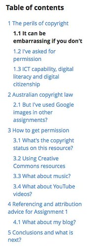
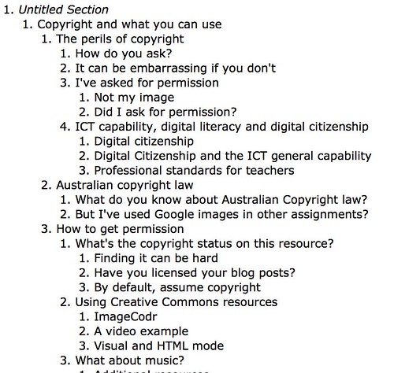

Following on from the [work late last week](/blog2/2015/12/11/moodle-book-to-a-single-file-which-format/) and the lovely feedback provided by @rolley it's time to convert some plans into action.

The aim is to modify the under-development [Moodle Book github tool](https://github.com/djplaner/moodle-booktool_github) so that when it concatenates the chapters from a Moodle Book resource into a single HTML file, the HTML file is structured HTML 5 semantic elements.

An initial version is apparently working. Though it still needs some checking and likely tweaking.

You can [view the output on GitHub](https://github.com/djplaner/ICT-and-Pedagogy/blob/master/Copyright.html) (at least you can at the moment) as raw HTML.

### Side benefits

As part of my testing of the code, I ran the HTML produced by the tool through [this free online HTML 5 outliner](https://gsnedders.html5.org/outliner/). The outliner parses the HTML and its semantic elements and constructs an outline of the content. In much the same way that the Moodle Book module currently does via other means.

Here's what the Moodle Book interface looks like for my test "book". 

It shows the Moodle Book design feature in terms of hierarchy. The Moodle Book only has two levels: chapter and sub-chapter. Won't do three levels within a single book.

The image below is a screen capture of the output generated by the HTML 5 outliner on [the single HTML file](https://github.com/djplaner/ICT-and-Pedagogy/blob/master/Copyright.html) produced by the Moodle Book github tool.

There are more than two levels here.

### The _Untitled Section_

First, there's the "Untitled Section".  I need to identify where that's coming from something wrong with:

1. the HTML 5 my code is producing; or,
2. the outliner tool.

I tried a few variations to address #1, didn't work. May need to find another auto-outliner of HTML5.

### More levels

HTML 5 outlining doesn't stop at the use of the section and article elements I've added in.  It also makes use of the heading elements and other parts of the HTML.

e.g. the first page in this book (titled "The perils of copyright") includes a H3 title for a section of that page. The section is titled "How do you ask?".  Which is the second part of the outline produces by the auto-outliner.

The next heading "It can be embarrassing if you don't" is a sub-chapter in the Moodle book.  The trouble here is that both are showing up at the same level.  Not quite the behaviour the best fits.

However, there is some potential in this auto generation of the outline. Might be useful for other purposes

Need to

1. Test out what's working and what's not here.
2. Explore a bit more with what other tools produce HTML5 with semantic elements.
3. Update the Moodle book github tool so it imports this content.