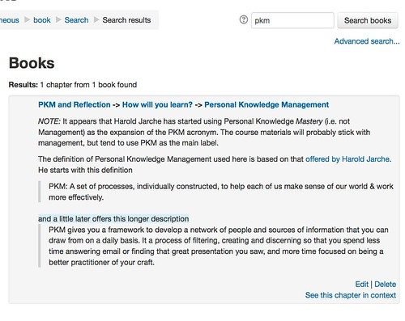

See also: [[blog-home | Home]]

A [previous post](/blog2/2015/12/15/tweaking-moodle-book-search/) recorded some early exploration of what tweaks might be necessary to be made to the Moodle book search block. The [original code](https://github.com/stronk7/moodle-block_search_books) for the block and the [tweaks I've made](https://github.com/djplaner/moodle-block_search_books) are available via GitHub.

### Current status

This is something I started before Xmas. Coming back to it in 2016, I've finished off item #1 of the todo list below. What I've done is described in more detail below.

In essence, I've replaced the old Book search method with the method used in the forum search mechanism.  This

1. Removes the SQL injection problem;
2. Improves support for standard search approaches (e.g. use of double quotes); and
3. Slight changes the default treatment of title and content. i.e. Old search mechanism returned a match only if all parts of the search string appeared in either the title of the book chapter OR the content of the book chapter. (A book chapter equates more closely to a page in the book, than a collection of pages).   e.g. a search for **copyright creative** would only find pages where both words appear in either the title or the content.The new search mechanism returns a match if all parts of the search string are find in the title or the content. e.g. a search for **copyright creative** would find pages that had copyright in the title and creative in the content; copyright in the content and creative in the title; both copyright and content in the title; and, both copyright and content in the content.

### Giving back to github

Bugger, didn't have these changes managed via git.  Stick it back in [my repository](https://github.com/djplaner/moodle-block_search_books) for this block and create [a pull request](https://github.com/stronk7/moodle-block_search_books/pull/1) for [the original](https://github.com/stronk7/moodle-block_search_books).

##  Original to do list

The to do list I'm working from includes:

1. Remove the sql injection problem;  **DONE.**
2. Improve the search results format;  **DELAYED** e.g. as illustrated [in this image](https://farm1.staticflickr.com/313/19195121204_5d57647079.jpg).
3. Provide a bit more scaffolding about how to use the search mechanism (e.g. use of " + and - etc) **DELAYED**
4. Provide an advanced search form/mechanism; **DELAYED** e.g. as shown [in this image](https://farm4.staticflickr.com/3765/19196124143_cf9b416c2a.jpg) which is a modification of Forum search interface.

## Remove the sql injection problem

As of yesterday, an initial modification had been made to the block to adopt the approach used by the Forum search block.  This needs to be further tweaked, tested and improved.  Steps include:

1. Install a vanilla version of the Book search block for testing
2. Move the "get identifiable" books into a function.
3. Finalise and test the move to the "Forum search" approach.
4. Explore what other changes might be possible

### Vanilla book search for testing

Clone a version of the block straight from the original, stick it in a v\_search\_books directory and update the code to use this slightly different name (v = vanilla)

Can it install?  Yes.

Can I add it as a block?  Yes

Does it work? Not yet

- Change the hard-coded URL to put to new location
- The language strings aren't working. Why? Need to rename the language file.

Working and it appears that they are producing the same output.  My tweaks yesterday were better than I thought.

### Relocate "get identifiable" books

This is basically a cosmetic/personal preference change.

### Finish the move to the "Forum search" approach

Parameters && get\_in\_or\_equal - this is done and working.

The old search block when searching for "copyright creative" generates the following (partial) SQL

( ( bc.title ILIKE '%copyright%' AND bc.title ILIKE '%creative%' ) OR ( bc.content ILIKE '%copyright%' AND bc.content ILIKE '%creative%' ) )

The forum search method (that I've adapted for searching books) for the same string generates the following SQL  (I've manually replaced the parameters with the actual string)

OLD    ( TITLE = A && TITLE = B ) or ( CONTENT = A && CONTENT = B )

NEW ( TITLE = A or CONTENT = A ) AND ( TITLE = B or CONTENT = B ) -- possibly more inclusive and better

```
(
 (bc.title ILIKE "%copyright%" ESCAPE E'\') OR (bc.content ILIKE '%copyright%' ESCAPE E'\')
 ) AND
 (
 (bc.title ILIKE '%creative%' ESCAPE E'\') OR (bc.content '%creative' ESCAPE E'\')
 )
```

Support for - and +: the existing block supports the following searches

- **"copyright creative"** - search for whole strings. Old doesn't support it. New does. **NEW is better**
    - ```
        old - (( bc.title ILIKE '%"copyright%' AND bc.title ILIKE '%creative"%' ) OR ( bc.content ILIKE '%"copyright%' AND bc.content ILIKE '%creative"%' ) )
        ```
        
        This is actually including the double quotes.
    - **new -** ((bc.title ILIKE '%copyright creative%' ESCAPE E'\\') OR (bc.content ILIKE '%copyright creative%' ESCAPE E'\\'))This is what is expected from a normal search.
- **copyright** **+creative** \- to ensure that it's a word - new is using "proper" Postgresql approach. Old is using a regular expression kludge. **NEW is better**
    - **old**
        
        ```
         (( bc.title ILIKE '%copyright%' AND
               bc.title ~* '(^|[^a-zA-Z0-9])creative([^a-zA-Z0-9]|$)' )
        OR ( bc.content ILIKE '%copyright%' AND
            bc.content ~* '(^|[^a-zA-Z0-9])creative([^a-zA-Z0-9]|$)' ) )
        ```
        
    - ```
        new
        
        ((bc.title ILIKE "%copyright%" ESCAPE E'\') OR
             (bc.content ILIKE "%copyright%" ESCAPE E'\'))
        AND ((bc.title ~* "\[\[:<:\]\]creative\[\[:>:\]\]") OR
                 (bc.content ~* "\[\[:<:\]\]creative[[:>:\]\]" ))
        ```
        
- **copyright -creative** - has copyright but not creative  **- largely the same.**
    - **old**
        
        ```
        (( bc.title ILIKE '%copyright%' AND
            bc.title !~* '(^|[^a-zA-Z0-9])creative([^a-zA-Z0-9]|$)' )
        OR ( bc.content ILIKE '%copyright%' AND
            bc.content !~* '(^|[^a-zA-Z0-9])creative([^a-zA-Z0-9]|$)' ) )
        ```
        
    - **new**
        
        ```
        ((bc.title ILIKE "%copyright%" ESCAPE E'\') OR
            (bc.content ILIKE "%copyright%" ESCAPE E'\'))
        AND (NOT ((bc.title ILIKE "%creative%" ESCAPE E'\') OR
             (bc.content ILIKE "%creative%" ESCAPE E'\'))) 
        
        ```
        

 

### Explore other changes

 

 

## Improve results format

This particular task includes the following sub-tasks

1. Rewrite the interface using a renderer I haven't used the rendered approach and no bugger all about it.  Might be too much work for now.
2. Improve the interface.

 

### Improve the interface

The current search results look like this

[](https://www.flickr.com/photos/david_jones/23485445450/in/dateposted-public/ "Book search (existing)")

The earlier mock up I produced looks like this

[](https://www.flickr.com/photos/david_jones/19195121204/in/dateposted-public/ "004_results") Some possible improvements include:

- Nest book and chapter titles As shown above, the current search interface repeats the name of the book "Copyright and what you can use" for each chapter.  A different interface might be to next book, chapter, and sub-chapters.
- Include the module/topic name in the hierarchy Book's typically fit within a module/topic. Including that in the search response would likely help the user orient themselves to where the discovered books reside on the broader site.
- Show some of the matching content. Provide a snippet of the content matching the search for each chapter. In much the same way that Google does.

## Advanced search form