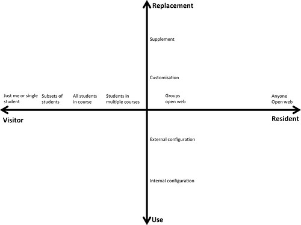

---
categories:
- protean
- publications
- thesis
date: 2016-01-20 15:52:11+10:00
next:
  text: What if our digital technologies were protean? Implications for computational
    thinking, learning, and teaching
  url: /blog2/2016/02/02/what-if-our-digital-technologies-were-protean-implications-for-computational-thinking-learning-and-teaching/
previous:
  text: Finishing tweaks to Moodle book search block
  url: /blog2/2016/01/17/finishing-tweaks-to-moodle-book-search-block/
title: '"Mapping the digital practices of teacher educators: Implications for teacher
  education in changing digital landscapes"'
type: post
template: blog-post.html
comments:
    []
    
pingbacks:
    - approved: '1'
      author: What if our digital technologies were protean? Implications for computational
        thinking, learning, and teaching | The Weblog of (a) David Jones
      author_email: null
      author_ip: 192.0.99.156
      author_url: https://davidtjones.wordpress.com/2016/02/02/what-if-our-digital-technologies-were-protean-implications-for-computational-thinking-learning-and-teaching/
      content: '[&#8230;]  Mapping the digital practices of teacher educators: Implications
        for teacher education in changing &#8230; [&#8230;]'
      date: '2016-02-02 08:49:25'
      date_gmt: '2016-02-01 22:49:25'
      id: '1465'
      parent: '0'
      type: pingback
      user_id: '0'
    - approved: '1'
      author: What to expect/look for from SITE&#8217;2016? &#8211; The Weblog of (a)
        David Jones
      author_email: null
      author_ip: 192.0.101.31
      author_url: https://davidtjones.wordpress.com/2016/03/22/what-to-expectlook-for-from-site2016/
      content: "[&#8230;] our paper didn&#8217;t get an overall paper award, it was successful\
        \ in winning a TPACK SIG Paper Award.\_ [&#8230;]"
      date: '2016-03-22 10:02:09'
      date_gmt: '2016-03-22 00:02:09'
      id: '1466'
      parent: '0'
      type: pingback
      user_id: '0'
    - approved: '1'
      author: 'Mapping the digital practices of teacher educators: Implications for teacher
        education in changing digital landscapes &#8211; The Weblog of (a) David Jones'
      author_email: null
      author_ip: 192.0.81.140
      author_url: https://davidtjones.wordpress.com/2016/03/24/mapping-the-digital-practices-of-teacher-educators-implications-for-teacher-education-in-changing-digital-landscapes-2/
      content: '[&#8230;] The following slides are for a (award winning no less) paper
        presented at SITE&#8217;2016 titled Mapping the digital practices of teacher educators:
        Implications for teacher education in changing d&#8230;. [&#8230;]'
      date: '2016-03-24 04:57:57'
      date_gmt: '2016-03-23 18:57:57'
      id: '1467'
      parent: '0'
      type: pingback
      user_id: '0'
    - approved: '1'
      author: 'University digital technology: problems, causes, and suggested solutions
        &#8211; The Weblog of (a) David Jones'
      author_email: null
      author_ip: 192.0.116.169
      author_url: https://davidtjones.wordpress.com/2016/09/07/university-digital-technology-problems-causes-and-suggested-solutions/
      content: '[&#8230;] technologies. e.g. existing use of cloud-based technologies
        (Google docs etc) and other forms of digital technology modification. (Jones,
        Albion &amp; Heffernan, [&#8230;]'
      date: '2016-09-07 13:08:53'
      date_gmt: '2016-09-07 03:08:53'
      id: '1468'
      parent: '0'
      type: pingback
      user_id: '0'
    - approved: '1'
      author: 'Making course activity more transparent: A proposed use of MAV &#8211;
        The Weblog of (a) David Jones'
      author_email: null
      author_ip: 192.0.81.36
      author_url: https://davidtjones.wordpress.com/2016/09/08/making-course-activity-more-transparent-a-proposed-use-of-mav/
      content: '[&#8230;] (I believe I can talk with my co-authors) found using an adapted
        version of the mapping process for this paper to be very [&#8230;]'
      date: '2016-09-08 13:13:07'
      date_gmt: '2016-09-08 03:13:07'
      id: '1469'
      parent: '0'
      type: pingback
      user_id: '0'
    
---
Paper presented at [SITE'2016](http://site.aace.org/conf/). One of three papers awarded the Ann Thompson TPACK Paper Award.

Authors: [Peter Albion](http://peter.albion.id.au/), [Amanda Heffernan](http://staffsearch.usq.edu.au/profile/Amanda-Heffernan), David Jones

# Abstract

Almost 40 years since the first personal computers appeared in classrooms Education is still awaiting transformation on the scale experienced in other parts of society. The replacement of digital immigrant teachers by a younger generation of digital natives has not made the anticipated difference. That metaphor is discredited and new perspectives are needed. In this paper the metaphor of digital visitors and residents is adapted to support examination and mapping of the digital practices of teacher educators according to the traces they leave in the digital landscape and levels of modification to tools as supplied. Questions are asked about the degree to which teachers and teacher educators need to modify tools or create their own in order to better adapt ICT in support of learning and teaching.

# Priming the Future

In his introduction to an Australian Council of Learned Academies (ACOLA) report on _Technology and Australia’s Future_ (Williamson, Raghnaill, Douglas, & Sanchez, 2015), Australia’s Chief Scientist commented that humanity would be better served by ‘future-priming’ rather than ‘future-proofing’ (Chubb, 2015) since the future is something we create through our actions in the present rather than necessarily a threat. The report itself laid out four key messages: technology will drive long-term economic growth, technology will transform the workforce, Australia can leverage technology change for societal benefit, and forecasting future technology development is challenging. In essence, we are in a period of rapid technological change and future citizens need to be prepared through their education to adapt creatively and manage, rather than be shaped by, technological change.

If our future generations are to be prepared for adaptability to technological change as suggested, then education in the present must deal with a cascading series of challenges. Changing the capabilities of graduates from our schools and universities requires that the teachers responsible for their education must change their practice. For teachers to change, their own preparation and professional development must change and that requires change in the practice of teacher education and teacher educators. Hence questions about the technological capabilities required of teachers inevitably raise questions about the capabilities required of teacher educators.

As recognized in the ACOLA report (Williamson et al., 2015), many of the technological changes to which we must adapt are based on digital technologies in whole or part. Hence there is increasing emphasis on digital technologies in education. The Australian Curriculum (ACARA, 2015) includes digital technologies in multiple guises. Information and Communication Technology (ICT) is included as one of 7 general capabilities, incorporating investigating, creating and communicating with ICT, managing and operating ICT and applying social and ethical protocols and practices. The curriculum lays out a learning continuum and expectations for how ICT should be represented within the 8 learning areas. One of those areas is Technologies for which the recently endorsed curriculum includes two related subjects to be taught from Foundation to Year 10. Design and Technologies is an updated version of a subject that has been taught around the country in varying forms over the past couple of decades. Digital Technologies is a new departure with a focus on computational thinking in conjunction with design and systems thinking. It includes some required study of programming alongside study of hardware, including robotics, and data design. Over and above the inclusion of ICT in the curriculum there is a general expectation that ICT will be used effectively for learning and teaching across all curriculum areas. One indicator of the prevalence of that idea was the Digital Education Revolution, a national project initiated in 2008 with a series of measures including funding to provide laptop computers to all students in Years 9 to 12 (Jamieson-Proctor et al., 2014).

# Priming Teachers for a Changing Future

There are teachers in Australian primary schools doing excellent work with ICT in support of learning and teaching across the curriculum while at the same time embedding the ICT general capability and engaging with elements of the new Digital Technologies curriculum. However, it seems certain such teachers are a small minority and that many primary school teachers risk being overwhelmed by the perfect storm of ICT general capability, Digital Technologies and ICT-enhanced pedagogy. A requirement to engage seriously with coding, which will be literally a foreign language for them, may push them too far. Schooling has often been a convenient location to send problems identified in the wider society. The consequence has been an increasingly crowded curriculum and uncertainty about the knowledge required of teachers.

The challenges of preparing pre-service teachers (PSTs) to enhance learning and teaching with ICT have been widely canvassed and the associated challenges of supporting teacher educators to model the behaviors desired from PSTs have been examined (Jones, Heffernan, & Albion, 2015). Those challenges have been described as “wicked problems” (Mishra & Koehler, 2007) for which solutions are elusive. Nevertheless, “Integrating Technology in Teacher Education” has been identified as a “solvable challenge”, one that “we understand and know how to solve” (Johnson et al., 2015), with the proposed solutions ranging across competency training based on national standards, using ICT to recruit and train teachers for technology integration, and specially produced training resources. Variations of these approaches have been tried over the past 30 years but the challenge persists and it is tempting to ask how the new projects are different.

Early observers of the limited application of ICT by teachers in their classrooms easily leapt to the conclusion that the change was difficult for teachers unfamiliar with ICT but that the arrival of a new generation of teachers who had grown up with ICT would make the difference. For several years this idea drew support from the meme about digital natives and immigrants (Prensky, 2001) but subsequent examination of the evidence debunked that concept, likening it to a form of ‘moral panic’ (Bennett, Maton, & Kervin, 2008). Other researchers have confirmed that the age-related fault lines suggested by Prensky’s metaphor do not exist. In reality, the rate of development in ICT means that we are all perpetual immigrants required to adapt to a constantly changing and unfamiliar landscape.

Granted that adaptability is a desirable quality in a time marked by rapid technological change (Williamson et al., 2015), there are questions around the nature and degree of adaptability required of graduates from schools, their teachers, and the teacher educators who prepare them. Tools and practices that are familiar as analogues can be adopted easily. For example, word processing was widely adopted based on its similarity to using a typewriter and email and other communication tools have followed, though there is often little sophistication of use and advanced features are mostly neglected. Spreadsheets and databases have been much less widely adopted and very few ‘immigrants’ have attempted to learn a local language and engage in coding. What level of adaptation will, or should, be required of teachers and teacher educators? Is it realistic, as seems to be suggested by the Queensland Government (DET, 2015), to expect all to engage in learning and teaching coding? If coding is the new literacy required by every student, then how will teachers and teacher educators make the necessary transition? The type of ‘moral panic’ induced by the native/immigrant meme can limit our ability to understand what motivates individuals’ engagement with digital technologies and make it more difficult to understand and develop the capability and desire for individuals to engage with digital technologies (Connaway, White, Lanclos, & Le Cornu, 2011).

White & Cornu (2011) introduced the Digital Visitor and Resident (V&R) model as a framework to understand how people engage with digital technologies, especially the participatory web. The V&R model does not assume that either age or gender determines engagement with digital technologies. Instead it focuses on examining what is done with digital technologies (digital activities) and why. The V&R model uses a _space/place_ metaphor. A Digital Visitor sees the digital space as a collection of disparate tools that are used to achieve specific tasks before beating a hasty retreat, leaving little evidence of having entered the digital space. A Digital Resident sees the digital space as an environment to inhabit, build relationships with other people, and project identity(ies). For a Digital Resident there is value in inhabiting the digital space. The visitor and resident modes are not exclusionary, with individuals likely to practice a mixture of both, dependent on the goals or tasks they have set themselves from time to time. The V&R model was used as the primary framework for a three-year longitudinal study (Connaway et al., 2011) to understand the motivations behind, and types of engagement with, digital technologies by a sample of students and scholars from late secondary students through experienced academics. This study led to the development of a V&R mapping tool that has been used to explore how students and scholars are engaging with the digital services provided by institutions.

This paper adopts and adapts the V&R mapping tool to explore the motivations and engagement with a digitally rich learning space by teacher educators with the hope that such an approach can help understand how and why teacher educators are engaging with digital technologies. Given the growing level of interest in computational thinking and the identified importance of the protean nature of digital technologies (Jones et al., 2015) this project has a particular interest in exploring how and why teacher educators engage in practices where they modify the digital tools provide by institutions, and adopt or create new digital tools to serve their pedagogical purposes.

The remainder of the paper offers a brief description of the participants and process used for data collection followed by a description of the mapping dimensions as adapted for this study. It will then present some examples of stories and describe their mapping on the axes before proceeding to derive some implications for teacher education.

The Queensland Government has recently launched a new action plan for its next phase of educational advancement (DET, 2015). One aspect of that plan includes a commitment to implement the new Digital Technologies curriculum from 2016 with a focus on the “coding and robotics skills needed by students for their future”. According to the website, “coding has quickly become the new literacy and a ‘must have’ for every student”. The launch included a hashtag, #codingcounts, and invitations to “join the conversation” by completing online surveys.

# Understanding and mapping digital practices

## Participants and process

The data for this research are provided by stories of the digital practices undertaken by each of the authors within a teacher education program that has up to 70% of its students studying some subjects online (Albion, 2014) and has identified digital learning in various forms as a strategic priority. This particular sample is seen as likely to provide useful insights due to the apparent digital richness of the learning environment and the diversity of the three authors. Given the strategic importance of online learning in this context, teacher educators are required to make significant use of digital technologies. However, as reported previously (Jones et al., 2015) there has been the need to engage in a range of practices to address limitations in institutional practices and technologies. Each of the authors also represents a cross section of experience (20+ years in teacher education; 4 years in teacher education; 3 years in teacher education) and digital literacy (proficient user but no formal qualifications; graduate diploma in Information Technology; bachelor degree in computer science and PhD in information systems).

Each author was asked to generate a list of stories where they have modified (broadly defined) digital technologies while undertaking their role as teacher educator. Each story used a consistent format of four parts: a descriptive title; a description of the change made; an explanation of the rationale; and, a summary of the outcomes. All stories were added to the same Google document ([http://bit.ly/1nuLZdH](http://bit.ly/1nuLZdH)) allowing each participant to read the others' stories. Each participant then located his or her stories on a map (Figure 1) adapted from the V&R mapping process (White, Connaway, Lanclos, Hood, & Vass, 2014). As an exploratory process the story creation and mapping process was iterative. The final maps (Figures 2-5) from each author were then used as the basis for discussion and analysis.

## The map

While informed by the original V&R mapping process (White et al., 2014) and attempting to retain its overall goals to understand digital practices, the change in focus in this work has led to adaptation of the V&R map (Figure 1). The V&R map remains as a Cartesian graph with an X- and Y-axis. The X-axis retains the Visitor and Resident scale, but with the scale understood to start with individual use of a tool and then proceed through increasingly large groups of people including: individuals; small groups; whole course cohorts; multiple course cohorts; and eventually onto the open web. Given our focus on why and how teachers are modifying digital technologies, the original scale of personal/enterprise for the Y-axis is replaced by a scale indicating the level of modification summarized in Table 1. While the focus in this project is on how digital technologies are modified, "use" is retained in the scale so that the map can be part of broader explorations of the digital practices of teachers. Table 1 describes the levels of modification used on the Y-axis of the map and Figure 1 represents the template used during initial mapping of stories. The mapping process was iterative, with the template and dimensions subject to refinement as stories were mapped.

**Table 1:** Levels of modification for Y-axis

| **_Item_** | **_Description_** | **_Example_** |
| --- | --- | --- |
| **_Use_** | Tool used with no change | Add an element to a Moodle site |
| **_Internal configuration_** | Change operation of a tool using the configuration options of the tool | Change the appearance of the Moodle site with course settings |
| **_External configuration_** | Change operation of a tool using means external to the tool | Inject CSS of Javascript into a Moodle site to change its operation |
| **_Customization_** | Change the tool by modifying its code | Modify the Moodle source code, or install a new plugin |
| **_Supplement_** | Use another tool(s) to offer functionality not provided by existing tools | Implement course level social bookmarking by requiring use of Diigo |
| **_Replacement_** | Use another tool to replace/enhance functionality provided by existing tools | Require students to use external blog engines, rather than the Moodle blog engine. |

 

**Figure 1:** Axes used for mapping stories

# Stories and themes

Part of the ‘wicked problem’ of ICT in education (Mishra & Koehler, 2007) is the particularity of each context. Hence it is important that teachers be able to modify or contextualize their learning environment. The mapping exercise encouraged the authors to review the various ways each of us has modified our course learning environments, and identify that while some of our practices skewed toward the ‘resident’ dimension, our behaviors generally remained primarily in the ‘visitor’ dimension. A wider spread in behavior was identified in the modification dimension, with practices evident from the lower end of the scale and the ‘use’ of tools as they were initially intended, moving through to the higher end of the scale and the ‘replacement’ of tools that were deemed to not meet our needs.

**Figure 2:** David's V&R modification map

**Figure 2:** Peter's V&R modification map

**Figure 3:** Amanda's V&R modification map

## Minor Modifications: Internal and External Configuration of Tools

 

The stories provided us with examples of practice at each level on the modification scale. For example, at the lower end of the scale, Amanda achieved minor renovation of the learning space through the **internal configuration** of the layout of the weekly study schedule page on her course site within the Moodle Learning Management System (LMS). This is traditionally an area where students are provided with an overview of the semester’s work and default headings provide students with information about required readings, module work, and assessment information. Amanda adjusted the traditional headings and layout to provide two streams of sequencing throughout the course, directing students towards course content as one stream and employment information as the other. As a result, she was able to configure the tool to better meet the needs of her course and its participants, all of whom are in their final semester and looking towards employment and career development as well as their coursework.

 

At the next level, David and Peter both provided examples of practice where they used **external configuration** of tools to meet their needs. David identified the use of jQuery and CSS to modify the operation of the course environment’s university-wide standardized look and feel. The key outcome of this configuration was that ongoing cultivation of the learning environment was not halted by the university’s new streamlined look, and students were able to access the course content in a way that was more functional and efficient. Similarly, Peter made use of AppleScript/JavaScript to more efficiently organize student groupings within the online environment based on data managed in a spreadsheet. The external configuration of the grouping option enabled Peter to have greater control over group composition according to factors that were identified as being important (such as geographic location, age, or other demographic factors).

 

These minor modifications at the internal and external configuration levels are representative of some of the stories shared by the authors, and the practices above are indicative of renovations being made for pedagogical as well as administrative purposes, enabling us to configure the learning environment for our needs. More advanced modifications were also identified within the stories, resulting in higher levels of customization and the tailoring of learning environments to our needs, as well as the needs of our students.

## Major Modifications: Customization, Supplement, Replacement of Tools

During the mapping and analysis of practices, it became evident that David and Peter worked more in these areas of customizing, supplementing, and replacing tools than Amanda did. Their level of expertise and experience no doubt plays some part here in enabling higher levels of customization of tools through the use of coding. However, all three of the authors was able to identify some practices at the **replacement** level, wherein an internal tool was replaced with an external tool that better suited our purposes.

David and Peter identified practices of **customization**, providing examples of modifying codes within the tools to meet their needs. Peter described his use of HTML and CSS to arrange the display of Twitter and Diigo in boxes on his Moodle sites. In previous semesters this had been a simple inclusion but the shift to the new look and feel of the institution’s LMS removed the ability to use pre-existing blocks to do this. Instead, Peter had to modify the code of the page, using the browser inspection tools to deconstruct the HTML and CSS in order to customize the layout of the page and place the code for the required content.

Similarly, David’s practices at the customization level included the installation of his BIM activity module, enabling students to use blogs outside of the institution’s own tools and register them within his course environment. David outlined a number of reasons for the creation and implementation of this activity module, ranging from pedagogical reasons (enabling his students to connect with networks outside of the course) to administrative processes (the inclusion of marking interfaces and options into the module). Even though David is the designer and maintainer of the BIM activity module, the mismatch between the functionality of this tool and the requirements of the learning design led David to undertake some **supplement** level modifications.

At this higher level of modification, David and Peter detailed practices within the **supplement** level, many of which minimized administrivia by enabling system tools to interface more efficiently. For example, David used his coding skills to develop a collection of scripts and tools referred to as ‘know thy student’, providing him with information about students with the ease of a single click, which would otherwise take over ten minutes and multiple webpages to unearth (Jones and Clark, 2014). This supports David’s teaching in both a pedagogical sense (enabling him to better know his students and meet their needs more effectively), and in a practical sense, ensuring the value of his time is maximized by having this information readily and easily available when needed. David’s use of practices at the **supplement** level frequently resulted in streamlined processes that saved time and unnecessary additional work, with another practice being identified that more easily supported the process for finalizing course results. Through a collection of Perl scripts and spreadsheets, David is more easily able to undertake the potentially onerous process of finalizing results in a large course with over 300 students enrolled. David also had a number of other **supplement** stories with names including: ‘Diigo’; ‘Google docs’; ‘Gradebook fix’; parts of the ‘Book authoring process’; and, ‘A duplicate Moodle’.

Peter’s practices at the **supplement** level were equally effective in enabling efficient use of time to undertake administrative processes. He was able to develop a Greasemonkey script to assemble and display simple statistics for comparing results from different markers in his courses. With 150 students over 4 offers, and markers being typically casual staff with limited experience of the course, Peter felt it necessary to guard against any systematic advantage that might occur for students in one or other offer because of marker differences. Rather than the traditional method for comparing marks by markers, which requires exporting data from Moodle to a spreadsheet and constructing formulas to generate statistics, Peter developed a script to perform these calculations. Again, this is pedagogically sound and ensures equity in marking and assessment for all students, regardless of their circumstances. The ability to renovate at this level saved Peter a significant amount of time.

Examples of practices at the final level of the modification scale, **replacement** involve the teacher replacing an internal tool with a similar external tool. Examples of these practices were very limited in our story collection. One example of **replacement** was of Amanda making use of Vimeo rather than the institution’s internal media repository to organize and share videos so that other users, including students’ mentor teachers and past students, can access certain videos and presentations. The use of Vimeo also allows Amanda to embed videos within pages and reflects the internal configuration level, where existing tools are enhanced. David had two - somewhat similar - stories of **replacement** both based on the use of external blog engines to replace institutional systems. In ‘Escape the LMS\` the primary course site for a Master’s course titled Networked and Global Learning was moved from the institution’s Moodle to a blog hosted on Wordpress.com. In ‘Student space as their space’ students in an undergraduate ICT and Pedagogy course were required to create and use a blog on an external blog engine for reflection and building a personal learning network, rather than use an institutional e-portfolio or the Moodle blog. It is arguable whether these two stories are truly examples of **replacement**, rather than stories of how to **supplement**.

# Discussion and implications

The aim here has been to use the metaphor of digital visitors and residents to examine and map the digital practices of teacher educators, in particular, those practices that involve the modification of provided tools or the creation of new tools. This is important due to a range of factors, including: the perceived value of teachers being able to modify or contextualize their learning environment; the protean nature of digital technologies; the growing prevalence of digital technologies within curriculum, learning and teaching; and, the argument that being successful in the future will require such skills. The focus here has been on the stories of digital modification practices by three teacher educators operating in a learning environment where use of digital technologies is compulsory. These stories have been examined and mapped using a modified Digital Visitor and Resident mapping process.

The analysis has revealed that all three teacher educators – regardless of perceived digital literacy – have engaged in a range of practices where the digital environment was modified. The greater digital knowledge of two of the teacher educators did increase the breadth and complexity of modifications. While there a few examples of modification at the replacement level, most modification was at the supplement level or below. By default, the digital learning spaces offered by the institution are limited to course participants; hence they are not part of the open web. This is evident in that most of the modification stories tended to congregate toward the Visitor end of the spectrum. It is interesting to note that all of the stories of replacement involved moving learning out onto the open web. Looking more closely at the stories suggests that there were two underpinning reasons for the modification activities. The first was to improve the efficiency of institutional systems or practices, and the second was to enhance learning through specific learning activities not directly supported by institutional systems.

This suggests that there is value in teachers being able to engage in digital modification practices to customize and contextualize the digital learning environment to the needs of themselves and their learners. It raises questions about how broadly digital modification practices are amongst teachers, the outcomes of those practices, and how any perceived inability to engage in digital modification practices is impacting student learning and the teacher experience. Experience engaging in these digital modification practices suggests that institutional systems and policies are not always able to recognize the need for teachers to engage in digital modification practices, let alone allow and enable such practices. What is the impact of these limitations on digital modification? Do digital modification practices become more important only in a learning environment - like that described here - where the use of digital technologies is a compulsory part of the learning and teaching experience? What, if any, digital modification practices do teachers in a more blended environment engage in?

We are operating in a learning space where we must use digital technologies. We have no choice. This is different from many other learning spaces. There is a chance that increasingly more learning spaces will have some level of compulsory digital technologies. The stories and maps arising from this work indicate that it will be likely that teachers will have to engage in activities that modify the provided digital technologies.

This work is exploratory. As such any findings may be specific to the particular institutional context and the three teacher educators. The broader value of these findings will need further testing and consideration but the V&R lens seems useful in terms of revealing new insights into educators’ use of ICT.

# References

ACARA. (2015). _The Australian Curriculum_.  Canberra: Commonwealth of Australia (Australian Curriculum, Assessment and Reporting Authority) Retrieved from http://www.australiancurriculum.edu.au.

Bennett, S., Maton, K., & Kervin, L. (2008). The ‘digital natives’ debate: A critical review of the evidence. _British Journal of Educational Technology, 39_(5), 775-786. doi: 10.1111/j.1467-8535.2007.00793.x

Connaway, L. S., White, D., & Lanclos, D. (2011). Visitors and residents: What motivates engagement with the digital information environment? _Proceedings of the American Society for Information Science and Technology, 48_(1), 1-7. doi: 10.1002/meet.2011.14504801129

Chubb, I. (2015). ‘Technology and Australia’s Future’ report launch, from http://www.chiefscientist.gov.au/2015/09/speech-technology-and-australias-future-report-launch/

DET. (2015). _Advancing education: An action plan for education in Queensland_.  Brisbane: The State of Queensland (Department of Education and Training) Retrieved from http://advancingeducation.qld.gov.au/.

Jamieson-Proctor, R., Redmond, P., Zagami, J., Albion, P., & Twining, P. (2014). _Redefining education for the digital age: a snapshot of the state of play in three Queensland schools._ Paper presented at the Australian Computers in Education Conference 2014, Adelaide, SA.

Johnson, L., Adams Becker, S., Estrada, V., & Freeman, A. (2015). _The NMC Horizon Report: 2015 K-12 Edition_. Austin, Texas: The New Media Consortium.

Jones, D., Heffernan, A., & Albion, P. (2015). TPACK as shared practice: Toward a research agenda. In L. Liu & D. C. Gibson (Eds.), _Research Highlights in Technology and Teacher Education 2015_ (pp. 13-20). Waynesville, NC, United States: Association for the Advancement of Computing in Education (AACE).

Jones, D., & Clark, D. (2014). Breaking BAD to bridge the reality/rhetoric chasm. In B. Hegarty, J. McDonald, & S. Loke (Eds.), _Rhetoric and Reality: Critical perspectives on educational technology. Proceedings ascilite Dunedin 2014_ (pp. 262–272). Dunedin. Retrieved from http://ascilite2014.otago.ac.nz/files/fullpapers/221-Jones.pdf

Mishra, P., & Koehler, M. J. (2007). _Technological Pedagogical Content Knowledge (TPCK): Confronting the Wicked Problems of Teaching with Technology._ Paper presented at the Society for Information Technology and Teacher Education International Conference 2007, San Antonio, Texas, USA.

Prensky, M. (2001). Digital natives, digital immigrants Part 1. _On the Horizon, 9_(5), 1, 3-6.

Selwyn, N., & Bulfin, S. (2015). Exploring school regulation of students’ technology use – rules that are made to be broken? _Educational Review_, _1911_(October), 1–17. doi:10.1080/00131911.2015.1090401

White, D. S., & Le Cornu, A. (2011). Visitors and Residents: A new typology for online engagement. _First Monday, 16_(9). doi: 10.5210/fm.v16i9.3171

White, D., Connaway, L., Lanclos, D., Hood, E., & Vass, C. (2014). Evaluating digital services: a Visitors and Residents approach. Retrieved October 22, 2015, from http://www.jiscinfonet.ac.uk/whole-infokit/?infokit=10856

Williamson, R. C., Raghnaill, M. N., Douglas, K., & Sanchez, D. (2015). Technology and Australia's Future: New technologies and their role in Australia's security, cultural, democratic, social and economic systems. Melbourne: Australian Council of Learned Academies.

Wright, F., White, D., Hirst, T., & Cann, A. (2014). Visitors and Residents: mapping student attitudes to academic use of social networks. _Learning, Media and Technology_, _39_(1), 126–141. doi:10.1080/17439884.2013.777077