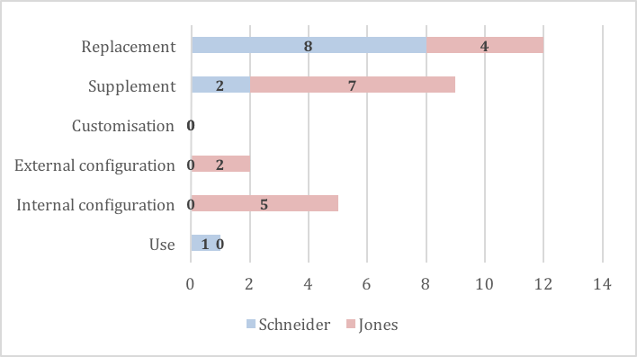

See also: [[blog-home | Home]]

David Jones, Elke Schneider

To be presented at  [ACCE'2016](http://www.aomevents.com/ACCE2016) and an extension of [Albion et al (2016)](/blog2/2016/01/20/mapping-the-digital-practices-of-teacher-educators-implications-for-teacher-education-in-changing-digital-landscapes/).

# Abstract

Not for the first time, the transformation of global society through digital technologies is driving an increased interest in the use of such technologies in both curriculum and pedagogy. Historically, the translation of such interest into widespread and effective change in learning experiences has been less than successful. This paper explores what might happen to the translation of this interest if the digital technologies within our educational institutions were protean. What if the digital technologies in schools were flexible and adaptable by and to specific learners, teachers, and learning experiences? To provide initial, possible answers to this question, the stories of digital technology modification by a teacher educator and a novice high school teacher are analysed. Analysis reveals that the modification of digital technologies in two very different contexts was driven by the desire to improve learning and/or teaching by: filling holes with the provided digital technologies; modelling to students effective practice with digital technologies; and, to better mirror real world digital technologies. A range of initial implications and questions for practitioners, policy makers, and researchers are drawn from these experiences. It is suggested that recognising and responding to the inherently protean nature of digital technologies may be a key enabler of attempts to harness and integrate digital technologies into both curriculum and pedagogy.

# Introduction

Coding or computational thinking is the new black. Reasons given for this increased interest include the need to fill the perceived shortage of ICT-skilled employees, the belief that coding will help students “to understand today’s digitalised society and foster 21st century skills like problem solving, creativity and logical thinking” (Balanskat & Engelhardt, 2015, p. 6), and that computational thinking is “a fundamental skill for everyone” (Wing, 2006, p. 33). Computational thinking is seen as “a universal competence, which should be added to every child’s analytical ability as a vital ingredient of their school learning” (Voogt, Fisser, Good, Mishra, & Yadav, 2015, p. 715). Consequently, there is growing worldwide interest in integrating coding or computational thinking into the school curriculum. One example of this is the Queensland Government’s #codingcounts discussion paper (Department of Education and Training, 2015) which commits the government “to making sure that every student will learn the new digital literacy of coding” (p. 9). It appears that students also recognise the growing importance of coding. The #codingcounts discussion paper (Department of Education and Training, 2015) cites a Microsoft Asia Pacific survey (Microsoft APAC News Centre, 2015) that suggests 75% of students (under 24) in the Asia Pacific “wish that coding could be offered as a core subject in their schools” (n.p.). While not all are convinced of the value of making coding a core part of the curriculum it appears that it is going to happen. Balanskat & Engelhardt (2015) report that 16 of the 21 Ministries of Education surveyed already had coding integrated into the curriculum, and that it was a main priority for 10 of them. Within Australia, the recently approved Technologies learning area of the Australian Curriculum includes a focus on computational thinking combined with design and systems thinking as part of the Digital Technologies subject. This is the subject that is the focus of the Queensland government’s #codingcounts plan and it has been argued that it may also “provide a framework upon which female participation in computing can be addressed” (Zagami, Boden, Keane, Moreton, & Schulz, 2016, p. 13). The question appears to have shifted from if coding or computational thinking should be integrated into the curriculum, toward questions of how and if it can be done effectively in a way that scales for all learners?

These types of questions are especially relevant given the observation that despite extensive efforts over the last 30+ years to eliminate known barriers, the majority of teachers do not yet use digital technologies to enhance learning (Ertmer & Ottenbreit-Leftwich, 2013). It appears that the majority of teachers still do not have the knowledge, skills, resources, and environment in which to effectively _use_ digital technologies to enhance and transform student learning. The introduction of computational thinking – “solving problems, designing systems, and understanding human behaviour, by drawing on the concepts fundamental to computer science” (Wing, 2006, p. 33) – into the curriculum requires teachers to move beyond _use_ of digital technologies into practices that involve the design and _modification_ of digital technologies. In recognition of the difficulty of this move, proponents of integrating computational thinking are planning a range of strategies to aid teachers. One problem, however, is that many of these strategies seem to echo the extensive efforts undertaken to encourage the use of digital technologies for learning and teaching that have yet to prove widely successful. At this early stage, the evaluation and research into the integration of computational thinking into the curriculum remains scarce and with a limited amount of “evidence as to how far teachers really manage to integrate coding effectively into their teaching and the problems they face“ (Balanskat & Engelhardt, 2015, p. 15).

However, attempts to integrate coding or computational thinking into the curriculum are not new. Grover and Pea (2013) identify the long history of computational thinking, tracing it back to recommendations for college students in the 1960s and to Papert’s work with Logo in K12 education in the 1980s. By the mid-1990s, Maddux and Lamont Johnson (1997) write of “a steady waning of interest in student use of the Logo computer language in schools” (p. 2) and examine a range of reasons for this. In the late 1990s, the dotcom boom helped increase interest, but it did not last. By the 2000s the overall participation rate in IT education within Australia declined.  With an even greater decline in enrolments in software development subjects, and especially in female participation (Rowan & Lynch, 2011). The research literature has identified a range of factors for this decline, including the finding that “Students in every participating school joined in a chorus defining the subject as ‘boring’” (Rowan & Lynch, 2011, p. 88). More recently the rise of interest in computational thinking has led to the identification of a range of issues to be confronted, including: “defining what we mean when we speak of computational thinking, to what the core concepts/attributes are and their relationship to programming knowledge; how computational thinking can be integrated into the curriculum; and the kind of research that needs to be done to further the computational thinking agenda in education” (Voogt et al., 2015, p. 716). In this paper, we are interested in exploring the related issue of how and if widespread common perceptions of digital technologies may be hindering attempts to harness and integrate digital technologies into both curriculum and pedagogy.

What if the digital technology environments within education institutions do not mirror the environments in contemporary and future digitalised societies? What if our experience within these limited digital technology environments is negatively impacting our thinking about how to harness and integrate digital technologies into curriculum and pedagogy? What if thinking about digital technology has not effectively understood and responded to the inherent protean nature of digital technologies? What if the digital technologies provided to educators were protean? Might this have an impact on attempts to harness and integrate digital technologies into curriculum and pedagogy? It is these and related questions that this paper seeks to explore.

The paper starts by drawing on a range of literature to explore different conceptions of digital technologies. In particular, it focuses on the 40+ year old idea that digital technologies are the most protean of media. Next, the paper explains how stories of digital technology modification by a high school teacher and a teacher educator were collected and analysed to offer insights into what might happen if our digital technologies were protean. Analysis of these stories is then discussed and used to develop an initial set of implications for practice, policy, and research for attempts to harness and integrate digital technologies into curriculum and pedagogy. The paper suggests that an educational environment that is rich with protean digital technologies appears likely to have a range of positive impacts on attempts to harness and integrate digital technologies into curriculum and pedagogy. However, such an environment requires radically different mindsets than currently used within educational institutions, and is thus likely to be extremely challenging to create and maintain.

# Digital technology: A protean meta-medium, or not?

The commonplace notions of digital technologies that underpin both everyday life and research have a tendency to see them “as relatively stable, discrete, independent, and fixed” (Orlikowski & Iacono, 2001, p. 121). Digital technologies are seen as hard technologies, technologies where what can be done is fixed in advance either by embedding it in the technology or “in inflexible human processes, rules and procedures needed for the technology’s operation” (Dron, 2013, p. 35). As noted by Selwyn and Bulfin (2015) “Schools are highly regulated sites of digital technology use” (p. 1) where digital technologies are often seen as a tool that is: used when and where permitted; standardised and preconfigured; conforms to institutional rather than individual needs; and, a directed activity. Rushkoff (2010) argues that one of the problems with this established view of digital technologies is that “instead of optimizing our machines for humanity – or even the benefit of some particular group – we are optimizing humans for machinery” (p. 15). This hard view of digital technologies perhaps also contributes to the problem identified by Selwyn (2016) where in spite of the rhetoric of efficiency and flexibility surrounding digital technologies, “few of these technologies practices serve to advantage the people who are actually doing the work” (p. 5). Digital technologies have not always been perceived as hard technologies.

Seymour Papert in his book Mindstorms (Papert, 1980) describes the computer as “the Proteus of machines” (p. viii) since the essence of a computer is its “universality, its power to simulate. Because it can take on a thousand forms and can serve a thousand functions, it can appeal to a thousand tastes” (p. viii). This is a view echoed by Alan Kay (1984) and his discussion of the “protean nature of the computer” (p. 59) as “the first metamedium, and as such has degrees of freedom and expression never before encountered” (p. 59). In describing the design of the first personal computer, Kay and Goldberg (1977) address the challenge of producing a computer that is useful for everyone. Given the huge diversity of potential users they conclude “any attempt to specifically anticipate their needs in the design of the Dynabook would end in a disastrous feature-laden hodgepodge which would not be really suitable for anyone” (Kay & Goldberg, 1977, p. 40). To address this problem they aimed to provide a foundation technology and sufficient general tools to allow “ordinary users to casually and easily describe their desires for a specific tool” (Kay & Goldberg, 1977, p. 41). They aim to create a digital environment that opens up the ability to create computational tools to every user, including children. For Kay (1984) it is a must that people using digital technologies should be able to tailor those technologies to suit their wants, since “Anything less would be as absurd as requiring essays to be formed out of paragraphs that have already been written” (p. 57). For Stallman (2014) the question is more fundamental, “To make computing democratic, the users must control the software that does their computing!” (n.p.).

This perceived 40-year-old need for individuals to use protean digital technologies to make their own tools in order to fulfil personal desires resonates strongly with the contemporary Maker movement. A movement that is driven by a combination of new technologies that increase the ease of creation, a cultural shift toward do-it-yourself practices, and is seeing people increasingly engaged in creating and customising physical and virtual artefacts. Martinez and Stager (2013) make this link explicit by labelling Seymour Papert as the “Father of the Maker Movement” (n.p.). Similarly, Resnick and Rosenbaum (2013) note the resonance between the Maker movement and a tradition within the field of education that stretches from Dewey’s progressivism to Papert’s constructionism. Resnick and Rosenbaum (2013) see tinkering “as a playful style of designing and making, where you constantly experiment” (p. 165) for which digital technologies – due to their association with logic and precision – may not always appear suitable. A perception reinforced by the evolution of digital technologies after the work of Kay and Goldberg in the 1970s.

The work of Kay, Goldberg, and others at Xerox PARC on Dynabook directly and heavily influenced Apple, Microsoft, and shaped contemporary computing. However, Kay and Goldberg’s conception of computers as a protean medium where tool creation was open to every user did not play a part in that shaping (Wardrip-Fruin & Montfort, 2003). In fact, there’s evidence that digital technologies are getting less modifiable by the end-user. Writing about how our relationship with computers is changing, Turkle (1995) argues that we “have become accustomed to opaque technology” (p. 23). Where early computer systems encouraged, even required, people to understand the mechanism of the computer, the rise of the GUI interface hides the mechanism behind the simulation of a desktop or other metaphor. Limiting users to clicking prepared icons and menus. Desktop personal computers once had an architecture that enabled enhancement and upgrading. While increasingly mobile devices are typically “not designed to be upgraded, serviced or even opened, just used and discarded” (Traxler, 2010, p. 5). The decision by Apple to prevent the creation of executable files on the iPad means “that you can’t make anything that may be used elsewhere. The most powerful form of computing, programming, is verboten” (Stager, 2013, n.p.). But it’s not just the design of technology that hardens digital technologies.

As noted above, Dron (2013) argues that technology can be hardened by embedding it “in inflexible human processes, rules and procedures” (p. 35). Resnick and Rosenabuam (2013) make the point that designing contexts that allow for tinkerability is as important as designing technologies for tinkerability. The affordance of a digital technology to be protean is not solely a feature of the technology. An affordance to be protean arises from the on-going relationship between digital technologies, the people using it, and the environment in which it is used. Being able to code, does not always mean you are able to modify a digital technology. Selwyn and Bulfin’s (2015) positioning of schools as “highly regulated sites of digital technology use” (p. 1) suggest that they are often not a context that are designed for tinkerability through the provision of protean digital technologies.

Even though the context may not provide protean digital technologies, this hasn’t stopped educators modifying digital technologies. Jones, Albion and Heffernan (2016) examine and map stories of digital technology modification by three teacher educators by the traces left in the digital landscape and the levels of modification. Table 1 provides an overview of the levels of digital technology modification used by Jones et. al. (2016). It ranges from simply using a digital technology as is, through changing its operation via _configuration_ options (internal and external), modifying the operation of a digital technology by _combining_ or supplementing it with other digital technologies, and finally to _coding_. Table 1 suggests that digital technologies can be modified via configuration, combination, and coding.

**Table 1: Levels of digital technology modification (Albion et al., 2016)**

| **Type of change** | **Description** | **Example** |
| --- | --- | --- |
| **Use** | Tool used with no change | Add an element to a Moodle site |
| **Internal configuration** | Change operation of a tool using the configuration options of the tool | Change the appearance of the Moodle site by changing Moodle course settings |
| **External configuration** | Change operations of a tool using means outside of the tool | Inject CSS or Javascript into a Moodle site to change its appearance or operation |
| **Customization** | Change the tool by modifying its code | Modify the Moodle source code, or create/install a new plugin |
| **Supplement** | Use another tool to offer functionality not provided by existing tool | Implement course level social bookmarking through Diigo |
| **Replacement** | Use another tool to replace/enhance functionality provided by existing tool | Require students to use external blog engines, rather than the Moodle blog engine |

 

# Methodology

This paper uses a qualitative case study to describe and explore the potential value, impact, and issues faced by educators when they seek to treat digital technologies as protean. The aim being to offer some initial responses to the question “what if our digital technologies were protean?” As this is an attempt to understand a particular social phenomenon as it occurs in real-life it is well-suited to the case study method (Aaltio & Heilmann, 2010). Data for this case study is drawn from the authors’ own experiences as educators. For Jones this draws on his experiences as a teacher educator at the University of Southern Queensland from commencement in 2012 through 2015. During this time his main teaching responsibility was for a large – over 300 students split evenly between on-campus and online students - 3rd year course within the Bachelor of Education. For Schneider, this draws on her experience as a teacher at secondary schools (neither her current school) within south-east Queensland in 2014 and 2015 teaching grades 7 to 12 in IT and Business subjects.

The authors’ experiences provide a number of advantages for the purpose of exploring the potential impact of protean digital technologies. Both authors have: formal tertiary education in fields related to the development of Information Technology; undertaken professional work within Information Technology; and, later trained as Secondary IPT teachers. Consequently, both authors see digital technologies as more inherently protean than those without an IT background, and have the knowledge and skills necessary to modify existing, somewhat less than protean, digital technologies. While not an activity currently broadly available to all educators, the authors’ experience and knowledge provide an indication of what might be possible if digital technologies available to educators were more protean. At the same time, the authors have different cultural backgrounds (Australia and Canada). The case also explores the impact of protean digital technologies within two very different educational contexts: tertiary and secondary education. The tertiary education context involves a large course with hundreds of students in both on-campus and online modes. This large and diverse student cohort means that there is significant use of digital technologies with online students learning solely via digital technologies. The secondary education context involves a greater number of smaller student cohorts with digital adoption in a state of flux and still primarily delivering teaching and assessing learning with traditional, non-digital means.

The authors engaged in an iterative and cyclical process that involved the gathering, sharing, discussing, and analysing stories of how, why, and what digital technologies they had modified while teaching. Both authors drew on personal records and writings in the form of tweets, blog posts, email archives, and other documents to generate a list of such stories. These stories (Jones: 16, Schneider: 10) were written up using a common format, shared via a Google document, generated on-going discussion, and led to an iterative process of analysis to identify patterns and implications. A major part of the analysis was grouping the stories of digital technology modification via: the purpose (e.g. improve administration, model good practice, teaching, or learning); cause (e.g. inefficient systems, non-existent systems, missing functionality); impact (e.g. save time, improve learning); and, the type of change (as per Table 1). From this analysis a number of evident themes were extracted and are described in the next section.

# Themes evident in stories of protean technologies

Upon reading each other’s stories, both authors were immediately struck by the level of commonality between the stories both had told. Not so surprising was that all stories told of attempts to improve learning, teaching, or both. However, even though these stories were taking place in very different types of educational institutions there were three common themes prevalent in stories from both authors. The three themes were: _filling holes_ (14 stories); _modelling effective practice_ (12 stories); and, _mirroring the real world_ (7 stories). There were, however, significant differences in the amount of coding required for these stories and the levels of digital technology modification undertaken.

In terms of _coding_, eventually none of Schneider’s ten stories involved the use of coding. Two of her stories did initially involve coding (Yahoo Pipes and Java), but she subsequently implemented other modifications that did not require coding. Seven of Jones’ sixteen stories involved coding using Perl, PHP, or jQuery/Javascript. This suggests the digital technologies can be modified without necessarily being able to code. However, it does raise questions about the reasons between the greater prevalence of coding in Jones’ stories. Is it due to the greater reliance on digital technologies within the specific context? Is it his longer work history within higher education? Was Jones less fearful of getting in trouble for wandering away from officially mandated practices? Is it his longer engagement with modifying digital technologies for learning and teaching? Or, are there other factors at play?

Figure 1 describes the level of digital technology modification (as per Table 1) evidence in the stories from each author (some stories involved more than one level of modification). All but one of Schneider’s stories involved supplementing or replacing digital technologies provided by the school. This suggests some significant perceived limitations with the school digital technology environment. Jones’ stories were almost evenly balanced between configuring provided digital technologies, or supplementing/replacing them with different digital technologies.

**Figure 1: Number of stories per author for each level of digital technology modification**

Four of Schneider’s stories and ten of Jones’ stories of digital technology modification were designed to _fill holes_ in the functionality provided by institutional technologies. In her very first story (Digital grading using Excel) Schneider outlines her use of Excel spreadsheets to supplement the school’s requirement that teachers update paper-based student profiles located within a dedicated physical folder kept in the head-of-department’s office. Her use of Excel spreadsheets to supplement the required practice provided necessary support for teacher tasks such as maintaining student progress records and discussing progress with individual students. Practices that the school practice did not support – the hole to be filled. In the story “Web scraping to contact not submits” Jones describes a similar hole in an institutionally provided technology. In this story, the University’s online assignment management system provides no mechanism by which students who have not submitted an assignment and have not received an extension can be identified and contacted. Instead, Jones had to use a combination of Perl scripts, regular expressions, manual copying and pasting, and an email client to fill the hole. The value and difficulty in making this particular modification is illustrated by the following quote from a third-year student who was contacted via this modification.

Thank you for contacting me in regards to the submission. You’re the first staff member to ever do that so I appreciate this a lot_._

Six of Schneider’s stories and six of Jones’ stories of digital technology modification were intended to _improve student learning_. These were all driven by a combination of _modelling the effective use of digital technologies_ and/or _adopting enhanced pedagogical practices_. In “Moviemaker to introduce teacher and topics” Schneider describes how the production by her of a movie trailer for her subject is intended to model the use of digital technologies to visually present information, but also to engage students. In “Course barometers via Google forms” Jones  describes how functionality provided by the University LMS is replaced with Google forms as a way to more effectively gather student feedback, but also model a technology that they may be used by students in their practice. That both authors primarily teach in subjects related to the use of digital technologies would appear to suggest that prevalence of the _modelling_ theme may be reduced for teachers of other areas.

Four of Schneider’s stories and three of Jones’ stories suggest that the institutionally provided digital technologies do not always appropriately _mirror_ the capabilities of real-world technologies and subsequently negatively impact learning and teaching. Both authors share stories about how the visual and content capabilities of institutional learning management systems fail to mirror the diversity, quality, and capabilities of available online technologies, including social networking software. Consequently, both authors tell stories of creating teaching related websites on external blog engines. In “Creating a teaching website with Edublogs” Schneider outlines the visual and functional limitations of the official Learning Management System (LMS) and how use of Edublogs saved teacher time, was more visually appealing, and provided a more authentic experience to students of services they are likely to encounter in the real-world. Schneider also tells stories where computer hardware and network bandwidth provided by the school to students is supplemented through use of personal resources from both students and herself. The story “Encourage student use of phone hot-spots” tells of how the widespread inability of school Internet connections to fulfil learning needs was addressed by encouraging those students with access to use their mobile phone hot spots.

In general, the modification of institutional digital technologies does not come without _problems, risks, or costs_. Both authors make mention of the additional workload required to implement the changes described, especially when such changes aren’t directly supported or encouraged by the institution.  Such cost can be assuaged through on-going use of the changes and the benefits they generate. However, these types of changes can challenge institutional polices and be frowned upon by management. In “Hacking look and feel” Jones  describes how an institutionally mandated, default look and feel for course websites was modified to avoid a decrease in functionality. A story that also describes how the author had to respond to a “please explain” message from the institutional hierarchy and was for a time seen as “hacking” the institution’s online presence. Similarly, in “Encouraged students to hot-spot with their phones to connect to the web” Schneider describes one digital technology modification that both broke institutional policy, but also enhanced student learning. It is not hard to foresee situations where the outcomes of these stories may well have been considerably more negative for those involved.

# What if? Discussion, implications and questions

The perception of digital technologies as protean does not appear widespread within educational institutions. What if our digital technologies were protean? Since designing the context for tinkerability is important (Resnick & Rosenbaum, 2013), what if the context within educational institutions were designed to enable, encourage, and support all teachers and learners in the modification of digital technologies to create the tools they see as necessary to best support their learning and teaching? Understanding and correctly predicting the potential implications and outcomes of such a radical transformation of the complex environment of an education institution is difficult. Hence the following are presented as a tentative exploration of some possible future states and are seen more as questions for exploration and confirmation than firm predictions. The assumption underpinning the following implications and questions is that the experience of the authors described above can be used to generate some indications of what might happen if our digital technologies were protean.

## Filling holes – bricolage

One of the reviewers of this paper made the following observation

Some of the tinkerability/evidence of protean behaviour sound rather like the old idea of a kludge - a ‘quick and dirty’ workaround for some computer processes

As noted earlier in the paper, almost 40 years ago, Kay and Goldberg (1977) recognised that any digital technology that attempted to anticipate the needs of a diverse user population would end up as “a disastrous feature-laden hodgepodge which would not be really suitable for anyone” (p. 40). Over recent years the digital technologies used within educational institutions are increasingly enterprise information systems. Systems – such as Learning Management Systems - intended to fulfil the needs of the entire institution and are perhaps more likely to fulfil the prediction of Kay and Goldberg. Jones, Heffernan and Albion (2015) offer a range of additional examples of how institutionally mandated digital technologies are often not suited to specific educational aims and contexts and thus generate the need for ‘digital renovation’.  An example of Koopman’s and Hoffman’s (2003) description of how some “work-arounds are necessary because the computer or software as originally designed simply doesn’t address the problem or task at hand” (p. 72). Koopman and Hoffman (2003) argue that workarounds should not be seen as users departing from officially condoned uses of technology (illustrated above by the increased chance of organisational censure the authors digital renovation risked), but rather as the legitimate practice of adaptive design where the users are helping finish the design of the digital technologies.

A perspective mirrored by Turvey (2012) who argues that the construction of pedagogical tools does not end with production, but instead such tools continue to be refined through “use within a complex ecology of mediating influences, as teachers exercise agency over the development of their professional practice” (p. 114). Further echoed by the argument of Mishra and Koehler (2006) that “there is no single technological solution that applies for every teacher, every course, or every view of teaching” (p. 1029) and that instead quality teaching “requires developing a nuanced understanding of the complex relationships between technology, content, and pedagogy, and using this understanding to develop appropriate context-specific strategies and representations” (p. 1029). Jones, Heffernan and Albion (2015) describe how the protean possibilities of existing digital technologies can be used to engage in ‘digital renovation’ and thus create educational possibilities specific to particular teaching contexts.

Would digital technologies that are protean better support teachers engaging in digital renovation activities that “fill the holes” between those digital technologies and the context-specific requirements of learner and teacher? Would teacher engagement in context-appropriate digital renovation activities lead to improvements in the quality of teaching and learning? If existing digital technologies are largely not protean, what is the nature of the “holes” that are currently experienced by learners and teachers? What impact does an inability to “fill these holes” have on teachers and their workload, sense of agency, their perception of digital technologies, their learners etc.?

## Modelling the effective use of digital technologies

The digital technologies subject from the technologies area of the Australian Curriculum defines computational thinking as “A problem solving method that involves various techniques and strategies in order to solve problems that can be implemented by _digital systems_” (ACARA, 2014). Workarounds, kludges, and digital renovation are examples of the application of computational thinking by users to solve problems that they face. Engaging in digital renovation allowed Schneider to model the application of computational thinking for her secondary computing students. With the incorporation of the Australian Curriculum’s digital technologies subject into the compulsory curricula, the advantages of being able to do this now expand to a majority of teachers. However, as noted above there is the question about whether or not this broader sample of teachers have the experience, knowledge and skills to take advantage of this opportunity. To address this problem a range of professional development opportunities are being made available to teachers.

In the context of ‘technologising literacy education’, Lankshear and Bigum (1999) develop and describe four principles for “guiding further developments in technologizing classrooms” (p. 445) and then show how those principles are seen differently by an ‘insider’ mindset and an ‘outsider-newcomer’ mindset. The first of these principles is ‘Teachers first’. This principle recommends that teachers must first be aided in “making use of new technologies to enhance their personal work before learning to use them in their teaching” (p. 453). The argument is that in order for teachers to be able to make appropriate pedagogical decisions around new technologies “they must first know how to use those technologies for their own purposes (and any benefits of doing so) for their own purposes” (p. 453). Lankshear and Bigum (1999) argue that the intent of this principle is “easy to subvert” (p. 460) by practices “designed to put teachers into classrooms with improved technological skills and understandings, _but within the confines of the newcomer-outsider world view_” (p. 460). On the other hand, an insider world view focuses both on the importance of addressing teachers’ on-going needs, but also on developing new alliances and articulations around learning, teaching, and the new technologies. Professional development alone is not likely to be sufficient to allow teachers to model computational thinking. Protean digital technologies would seem to be at least a catalyst, if not a pre-requisite, for teachers and others to be able to begin modelling computational thinking in the context of the requirements of the digital technologies subject.

Would the widespread availability of protean digital technologies better enable teachers to develop and model computational thinking? What impact would this have on student learning? Will the absence of protean digital technologies hinder teachers’ ability to develop and refine their computational thinking abilities? Can protean digital technologies help support the creation of new alliances and articulations around learning, teaching, and digital technologies within schools? What other types of support and changes would be required to develop such alliances and articulations? What new alliances and articulations would or should be developed?

## Mirror the real world

The introduction of the digital technologies subject into core curricula is being done to ensure that students leave school with the skills necessary to engage in a digital world. It has been suggested that within Australia the introduction of the “compulsory Digital Technologies curriculum may provide a framework upon which female participation in computing can be addressed” (Zagami, Boden, Keane, Moreton, & Schulz, 2016, p. 13). On the other hand, in critiquing school mathematics Lockhart (2009) suggests that “there is surely no more reliable way to kill enthusiasm and interest in a subject than to make it a mandatory part of the school curriculum” (p. 36). A major part of Lockhart’s (2009) critique of school mathematics is a complaint about “the lack of _mathematics_ in our mathematics classes” (p. 29). A problem that arises from a complex set of factors including “that nobody has the faintest idea what it is that mathematicians do” (p. 22) which leads to “forced and contrived” (p. 38) attempts to explain how what happens in mathematics classes as relevant to daily life. Margolis, Estrella, Goode et. al. (2008) found  that classroom practices associated with the teaching of computer science in American schools “can be disconnected from students’ lives, seemingly devoid of real-life relevance” (p. 102). Echoes of the limited relevance problem was found by Rowan & Lynch (2011) in post-compulsory information technology secondary courses in Australia. Margolis et al (2008) argue that it is important that teachers be able to demonstrate to students the relevance and significance of computer science to students’ lived experience, but identify that typically teachers have not received any support in developing approaches that meet this need.

The renewed interest in computational thinking and digital technologies arise from visions of the future, such as that seen by the Queensland Government where digital technologies are “fundamentally transforming the world of work and generating new ways of doing business on a global scale” (Department of Education and Training, 2015, p. 11). A vision of a future real world that is very different from the experience learners and teachers have of digital technologies within schools. As identified by Selwyn and Bulfin (2015), an experience heavy on regulation, standardisation, pre-configuration, directed activity, and on institutional and not individual needs. Suggesting that the prevalent school digital environment is unlikely to help prepare learners and teachers well for the future, fundamentally transformed world. Suggesting also that the teaching of computational thinking within schools may fall into the same trap as the type of school-based mathematics critiqued by Lockhart.

Are current, school-based digital environments suitable for preparing learners and teachers “to understand today’s digitalised society and foster 21st century skills like problem solving, creativity and logical thinking” (Balanskat & Engelhardt, 2015, p. 6)? Would an environment with the widespread availability of protean digital technologies better mirror this future world? What challenges exist in making school-based digital environments better mirror a future world that has been fundamentally transformed by digital

# Discussion and Conclusions

This paper has posed the question “What if our digital technologies were protean?” To provide some initial responses to this question the paper has explored what is meant by protean digital technologies and analysed stories of digital technology modification from a high-school teacher and a teacher educator. Analysis of these stories revealed that these educators were driven to modify the available digital technologies while attempting to improve aspects of learning and/or teaching. These attempts at improvement aimed to: fill holes in the functionality provided by the digital technologies; model effective practice with digital technologies; or, better mirror real world digital technologies. Only seven of twenty-six stories of digital technology modification required use of coding. The majority of digital technology modification stories involved the configuration or combination of digital technologies, often to replace digital technologies provided by the organisation. Using this experience as a foundation, the paper has used a range of literature to develop some initial suggestions for what might happen more broadly within education if our digital technologies more protean. Given the complex nature of education and the difficulty of predicting the future, these suggestions are framed as questions for further exploration and confirmation, rather than prediction. However, the authors do suspect that the impact of more protean digital technology within education would be positive for both the teaching of computational thinking, and more broadly for the use of digital technology to enhance learning and teaching.

Actually exploring whether or not this is the case will be quite a challenge. Not the least because the idea of protean digital technologies is diametrically opposed to the existing digital technology environment within most educational institutions, and indeed broader society. Enabling more protean digital technologies within education would need to engage with existing widely held perspectives and practices around difficult issues such as accountability, efficiency, resourcing, risk management, and student safety. This task is made more difficult by the question about whether or not those engaged  with such discussions bring – as identified by Lankshear and Bigum (1999) - an ‘insider’ or ‘outsider-newcomer’ mindset. An 'outsider-newcomer’ sees “the world as the same, but just more technologised” where the insider sees how pervasive and protean digital technologies means that the world – and subsequently educational institutions – “is radically different” (Lankshear & Bigum, 1999, p. 458). The insider view appears more in line with the espoused rationale behind that rise of computational thinking and coding in schools. However, there remain questions about how much of the rhetoric around digital technology-enabled transformation of society. More pragmatically there is the question of how to provide protean digital technologies within education institutions? A question that might be answered by drawing on research on creating computationally rich environments for learners. Such as Grover and Pea’s  (2013) potential principles including: low floor, high ceiling; support for the “use-modify-create” progression; scaffolding; enable transfer; support equity; and, be systemic and sustainable. Principles that might fruitfully be used to break education out of its traditional norms and structures and allow us to finally explore the question “What IF schools were not encumbered by traditional norms and structures, and technology, social capital and pedagogies were used to their true realisation or potential?”

# References

Aaltio, I., & Heilmann, P. (2010). Case Study as a Methodological Approach. In A. J. Mills, G. Durepos, & E. Wiebe (Eds.), _Encyclopedia of Case Study Research._ (pp. 67–78). Thousand Oaks, CA: Sage Publications.

ACARA. (2014). Computational thinking - Glossary term. Retrieved from 2 July 2016

Balanskat, A., & Engelhardt, K. (2015). _Computing our future: Computer programming and coding - Priorities, school curricula and initiatives across Europe_. Brussels. Retrieved from http://www.eun.org/c/document\_library/get\_file?uuid=3596b121-941c-4296-a760-0f4e4795d6fa&groupId=43887

Department of Education and Training. (2015). _#codingcounts: A discussion paper on coding and robotics in Queensland schools_. Brisbane, Australia. Retrieved from http://advancingeducation.qld.gov.au/SiteCollectionDocuments/Coding-and-robotics-booklet.pdf

Dron, J. (2013). Soft is hard and hard is easy: learning technologies and social media. _Form@ Re-Open Journal per La Formazione in Rete_, _13_(1), 32–43.

Ertmer, P. a., & Ottenbreit-Leftwich, A. (2013). Removing obstacles to the pedagogical changes required by Jonassen’s vision of authentic technology-enabled learning. _Computers & Education_, _64_, 175–182.

Grover, S., & Pea, R. (2013). Computational Thinking in K-12: A Review of the State of the Field. _Educational Researcher_, _42_(1), 38–43.

Jones, D., Albion, P., & Heffernan, A. (2016). Mapping the digital practices of teacher educators: Implications for teacher education in changing digital landscapes. In _Proceedings of Society for Information Technology & Teacher Education International Conference 2016_ (pp. 2878–2886). Chesapeake, VA: Association for the Advancement of Computing in Education.

Jones, D., Heffernan, A., & Albion, P. (2015). TPACK as Shared Practice: Toward a Research Agenda,. In L. Liu & D. Gibson (Eds.), _Research Highlights in Technology and Teacher Education 2015_ (pp. 13–20). Waynesville, NC: AACE.

Kay, A. (1984). Computer Software. _Scientific American_, _251_(3), 53–59.

Kay, A., & Goldberg, A. (1977). Personal Dynamic Media. _Computer_, _10_(3), 31–41.

Koopman, P., & Hoffman, R. (2003). Work-arounds, make-work and kludges. _Intelligent Systems, IEEE_, _18_(6), 70–75.

Lankshear, C., & Bigum, C. (1999). Literacies and new technologies in school settings. _Pedagogy, Culture & Society_, _7_(3), 445–465.

Lockhart, P. (2009). _A Mathematician’s Lament: How school cheats us out of our most fascinating and imagintive art forms_. New York: Bellevue Literary Press.

Maddux, C. D., & Lamont Johnson, D. (1997). Logo: A retrospective. _Computers in the Schools_, _14_(1/2), 1–8.

Margolis, J., Estrella, R., Goode, J., Jullison Holme, J., & Nao, K. (2010). _Stuck in the shallow end: Education, race, and computing_. Cambridge, MA: MIT Press.

Martinez, S. L., & Stager, G. (2013). _Invent to learn: Making, tinkering, and engineering in the classroom_. Torrance, CA: Constructing Modern Knowledge Press.

Microsoft APAC News Centre. (2015). Three out of four students in Asia Pacific want coding as a core subject in school, reveals Microsoft study | Asia News Center. Retrieved January 20, 2016, from https://news.microsoft.com/apac/2015/03/23/three-out-of-four-students-in-asia-pacific-want-coding-as-a-core-subject-in-school-reveals-microsoft-study/

Mishra, P., & Koehler, M. (2006). Technological pedagogical content knowledge: A framework for teacher knowledge. _Teachers College Record_, _108_(6), 1017–1054.

Orlikowski, W., & Iacono, C. S. (2001). Research commentary: desperately seeking the IT in IT research a call to theorizing the IT artifact. _Information Systems Research_, _12_(2), 121–134.

Papert, S. (1980). _Mindstorms: children, computers, and powerful ideas_. New York: Basic Books.

Resnick, M., & Rosenbaum, E. (2013). Designing for Tinkerability. _Design, Make, Play: Growing the next Generation of STEM Innovators_, 163–181. doi:Resnick, M.; Rosenbaum, E. (1993). Designing for tinkerability. In Design, Make, Play: Growing the Next Generation of STEM Innovators (pp. 163–181). New York: Routledge.

Rowan, L., & Lynch, J. (2011). The continued underrepresentation of girls in post-compulsory information technology courses: a direct challenge to teacher education. _Asia-Pacific Journal of Teacher Education_, _39_(2), 83–95.

Rushkoff, D. (2010). _Program or be programmed: Ten commands for a digital age_. New York: OR Books.

Selwyn, N. (2016). The digital labor of digital learning : notes on the technological reconstitution of education work. Retrieved January 25, 2016, from http://newmediaresearch.educ.monash.edu.au/lnm/the-digital-labor-of-digital-learning/

Selwyn, N., & Bulfin, S. (2015). Exploring school regulation of students’ technology use – rules that are made to be broken? _Educational Review_, _1911_(October), 1–17.

Stager, G. (2013). For the love of laptops. _Adminstr@tor Magazine_. Retrieved January 30, 2016, from http://www.scholastic.com/browse/article.jsp?id=3757848

Stallman, R. (2014). Comment on “We can code IT! Why computer literacy is key to winning the 21st century.” _Mother Jones_. Retrieved January 26, 2016, from http://www.motherjones.com/media/2014/06/computer-science-programming-code-diversity-sexism-education#comment-1437791881

Traxler, J. (2010). Will student devices deliver innovation, inclusion, and transformation? _Journal of the Research Centre for Educational Technology_, _6_(1), 3–15.

Turkle, S. (1995). _Life on the screen: Identity in the age of the Internet_. New York: Simon & Schuster.

Turvey, K. (2012). Constructing Narrative Ecologies as a Site for Teachers’ Professional Learning with New Technologies and Media in Primary Education - E-Learning and Digital Media Volume 9 Number 1 (2012). _E-Learning and Digital Media_, _9_(1), 113–126.

Voogt, J., Fisser, P., Good, J., Mishra, P., & Yadav, A. (2015). Computational thinking in compulsory education: Towards an agenda for research and practice. _Education and Information Technologies_, _20_(4), 715–728.

Wardrip-Fruin, N., & Montfort, N. (2003). _New Media Reader_. Cambridge, MA: MIT Press.

Wing, J. M. (2006). Computational thinking. _Communications of the ACM_, _49_(3), 33–35.

Zagami, J., Boden, M., Keane, T., Moreton, B., & Schulz, K. (2016). _Female participation in school computing : reversing the trend_. Retrieved from http://digitalcareers.edu.au/wp-content/uploads/2015/04/Female-Participation.pdf