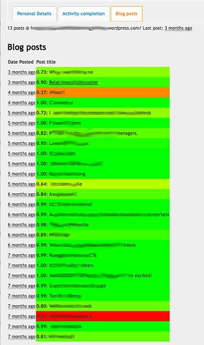

---
categories:
- bad
- edc3100
- learninganalytics-elearning
- pirac
date: 2016-02-14 11:17:00+10:00
next:
  text: '"Can video be emedded in ePub exported from #moodle book?"'
  url: /blog/2016/02/17/can-video-be-emedded-in-epub-exported-from-moodle-book/
previous:
  text: Minimalism, constructivism and use of Moodle or any other e-learning tool
  url: /blog/2016/02/11/minimalism-constructivism-and-use-of-moodle-or-anyother-e-learning-tool/
title: Sentiment analysis of student blog posts
type: post
template: blog-post.html
comments:
    - approved: '1'
      author: elketeaches
      author_email: elkeclarissa@hotmail.com
      author_ip: 101.183.231.25
      author_url: http://elketeaches.wordpress.com
      content: Hi David. How did you collect the data first?
      date: '2016-02-17 06:58:58'
      date_gmt: '2016-02-16 20:58:58'
      id: '3285'
      parent: '0'
      type: comment
      user_id: '0'
    - approved: '1'
      author: elketeaches
      author_email: elkeclarissa@hotmail.com
      author_ip: 101.183.231.25
      author_url: http://elketeaches.wordpress.com
      content: I mean, how did you collect the separate original post data? And then fed
        it through the sentiment function.
      date: '2016-02-17 07:01:07'
      date_gmt: '2016-02-16 21:01:07'
      id: '3286'
      parent: '3285'
      type: comment
      user_id: '0'
    - approved: '1'
      author: David Jones
      author_email: davidthomjones@gmail.com
      author_ip: 139.86.69.33
      author_url: https://djon.es/blog/
      content: 'I use the <a href="https://davidtjones.wordpress.com/research/bam-blog-aggregation-management/"
        rel="nofollow">BIM module</a> for Moodle. BIM is a module that I wrote. At the
        start of semester students create their blog where ever they want and then register
        it with BIM on the course site. The students then return to their blog and write
        to their heart''s content.
    
    
        BIM tracks their blog''s feed and makes a copy of their posts within Moodle. Meaning
        all the post data is sitting in the Moodle database.
    
    
        I can''t access the institutional Moodle database directly, I have a local copy
        of the BIM tables. That''s what I used for the above.'
      date: '2016-02-17 07:32:52'
      date_gmt: '2016-02-16 21:32:52'
      id: '3287'
      parent: '3285'
      type: comment
      user_id: '1'
    
pingbacks:
    []
    
---
In June last year [I started an exploration](/blog/2015/06/16/exploring-bim-sentiment-analysis-what-might-it-say-about-student-blog-posts/) into the value of sentiment analysis of student blog posts. This morning I've actually gotten it to work. There may be some value, but further exploration is required. Here's the visible representation of what I've done.

The following is a screen shot of the modified ["know thy student" kludge](/blog/2015/09/15/helping-teachers-know-thy-students/) I've implemented for my course. The window shows some details for an individual student from second semester last year (I've blurred out identifying elements). The current focus is on the blog posts the student has written. 

Each row in the above corresponds to an individual blog post. It used to show how long ago the post was written, the post's title, and provide a link to the blog post. The modified version has the background colour for the cell modified to represent the sentiment of the blog post content. A red background indicates a negative post, a green background indicates a positive post, and a yellow background indicates somewhere in the middle.

The number between 0 and 1 shown next to the post title is the result provided by the [Indico sentiment analysis function](https://indico.io/docs#sentiment_hq). The method use to perform the sentiment analysis.

## Does this help?

Does this provide any help? Can it be useful?

An initial quick skim of posts from different students seemed to indicate mostly all green. Was the sentiment analysis revealing anything useful? Was it working?

In the following I examine what is revealed by the sentiment analysis by paying close attention to an individual student, the one shown in the image above.

### Red blog post - reveal target for intervention?

The "red" blog post from the image above included words like "epic fail". It tells the story of how the student had problems getting the new software for the course working. It shows as the third post the student made in the semester. The start of this course can be frustrating for students due to technical problems. This particular student didn't report any of these problems on the course discussion forums.

Given that the course is totally online and there are ~100 students in this offering, there's little chance for me to have known about these problems otherwise. Had the sentiment analysis been in place during the offering and if it was represented effectively, I might have been able to respond and that response might have been helpful.

### Yellow blog post - a problem to address?

The yellow post above is a reflection on the students experience on Professional Experience, in a school, in front of a classroom, actually teaching. It is a reflection on how the student went through an emotional roller coaster on prac (not unusual), how her mentor really helped (also not unusual, but a little less so), but also how the various exemptions she received contributed to her problems.

### Very positive blog posts - loved resources?

A number of the posts from this student are as positive as they can get - 1.0. Interestingly, almost all of them are descriptions of useful resources and include phrases like

what a wonderful learning tool ...lovely resource...wonderful resource for teachers

## What's next?

Appears that the following are required/might be useful

1. Explore different representations and analysis So far I've only looked at the student by student representation. Another forms of analysis/representation would seem potentially useful. Are there differences/patterns across semester, between students that are the same/different on certain characteristics, between different offerings of the course etc.How can and should this representation be made visible to the students?
2. Set this in place for Semester 1. In a couple of weeks the 300+ student version of this course runs. Having the sentiment analysis working live during that semester could be useful.
3. Explore useful affordances. One of the points of the [PIRAC framework](/blog/2013/10/03/the-irac-framework-locating-the-performance-zone-for-learning-analytics/) is that this form of learning analytics is only as useful as the affordances for action that it supports. What functionality can be added to this to help me and the students take action in response?

### Reflection

I've been thinking about doing this for quite some time. But the business of academic life has contributed to a delay.  Getting this to work actually only required three hours of free time. But perhaps more importantly, it required the breathing space to get it done. That said, I still did the work on a Sunday morning and probably would not have had the time to do it within traditional work time.