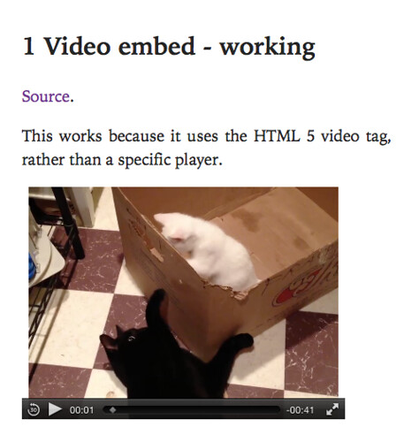

---
categories:
- bad
date: 2016-02-17 10:56:53+10:00
next:
  text: Open educational practice beyond the institution?
  url: /blog/2016/02/22/open-educational-practice-beyond-the-institution/
previous:
  text: Sentiment analysis of student blog posts
  url: /blog/2016/02/14/sentiment-analysis-of-student-blog-posts/
title: '"Can video be emedded in ePub exported from #moodle book?"'
type: post
template: blog-post.html
comments:
    - approved: '1'
      author: Tim Klapdor
      author_email: tim.klapdor@gmail.com
      author_ip: 137.166.105.218
      author_url: http://timklapdor.wordpress.com
      content: Nice to see someone else's experience with ePub and video! To be honest
        on paper it seems like a great standard but in reality it's terrible. The problem
        is often less to do with the standard as it does with it's actual implementation.
        Most "reader" software focuses on text only books and so often don't even bother
        to implement most o the ePub3 standard which means that video, javascript and
        a huge number of significant functions just don't work. I was interested to see
        you trying to use the  tag from an online source. We were actually using ePub
        for a downloadable/offline resource so packaged the video with the file... which
        I guessed might have been the source of some of your problems. It's interesting
        that Apple have been the only ones really supportive of ePub, but even they got
        jack of it and developed iBooks (which is just an enhanced version of ePub). Didn't
        have time to play with this before but started to think that something like the
        Baker Framework might be a better idea http://www.bakerframework.com - just wrapping
        HTML5 and losing some of the pretence of "ebooks".
      date: '2016-02-18 08:52:43'
      date_gmt: '2016-02-17 22:52:43'
      id: '3288'
      parent: '0'
      type: comment
      user_id: '0'
    - approved: '1'
      author: David Jones
      author_email: davidthomjones@gmail.com
      author_ip: 139.86.69.33
      author_url: https://djon.es/blog/
      content: 'Complete and cross-platform does not appear to be characteristics of ePub.
        Which is a bit sad as I was hoping/thinking it would be a bit more useful and
        not require a great deal of work. Sadly not the case.
    
    
        Thanks for the pointer to the Baker Framework.  May look at it more in the future.  Wil
        likely need some sort of solution to this problem.'
      date: '2016-02-18 11:54:11'
      date_gmt: '2016-02-18 01:54:11'
      id: '3289'
      parent: '3288'
      type: comment
      user_id: '1'
    - approved: '1'
      author: Bron Chandler
      author_email: bron.chandler@gmail.com
      author_ip: 139.86.69.34
      author_url: null
      content: I also had success with Video working in the Calibre reader.
      date: '2017-01-16 10:01:06'
      date_gmt: '2017-01-16 00:01:06'
      id: '3941'
      parent: '0'
      type: comment
      user_id: '0'
    
pingbacks:
    []
    
---
Last year my institution installed the [Lucimoo epub export tool](https://moodle.org/plugins/view/booktool_exportepub) for the [Moodle Book module](https://docs.moodle.org/28/en/Book_module). I did some of [the testing of it](/blog/2015/08/18/testing-the-lucimoo-epub-export-book-tool/). I'm particularly interested (but not overly) in its ability to export a book resource as an ePub file (see I'm innovative, I support the kiddies and their fancy new mobile devices). While the export basically works, the testing identified a number of problems. I've fixed most of those (mainly tidying up my hand-crafted HTML and that produced by a few tools I use).

The one remaining problem is

The videos don't show

The following is an exploration of if and how this problem can be fixed. I haven't solved the problem. I am no expert. Feel free to point out flaws and recommend improvements.

In summary

- It is possible to use the epub export tool to produce ePub files that contain videos that will play in some ePub readers on computers.
- These ePub files don't appear to work on mobile devices but this needs to be confirmed.
- For this to work you need to get direct access to the video file and for that file to be in a format that is linked by the HTML 5 video tag and the device/reader being used.
- To do this on Vimeo, you need a Pro account.

In my context, if I had access to a Vimeo Pro account I could in theory convert most of my "video embeds" over to using the Video tag and help enhance the experience of the ePub user. They would be able to play the video in iBooks on a computer, but not the phone. However, at least on the phone they would see some evidence of a video being present, rather than an empty space.

Beyond the cost of the Vimeo Pro account, that would also require converting all the embedded videos. There's enough to be annoying.

### Initial explanation of the problem

I assumed that the problem was due to my use of Vimeo to host most of my videos. In particular, that ePub readers (iBooks is what I test with) didn't like the default Vimeo embed HTML.  Possibly because the ePub reader doesn't have sufficient smarts to parse and do something with the iframe etc.

### It can work

This 2010 blog post provides proof that you can play video within [an ePub file](http://www.elizabethcastro.com/pgw_extras/video.epub) on a computer (MacOSX/iBooks) and a mobile (iOS/iBooks). Some level of proof given in the image below. If I hit the play button, the video plays quite nicely thank you.

### Let's try this with vimeo

Woo hoo! Sadly my quick initial skim (late last week) thought I'd found the solution. The ["video" tag](https://en.wikipedia.org/wiki/HTML5_video). Use that and all is good. (I was missing a few things because I only skimmed the article last week).

First question, can you use the HTML 5 video tag?

An answer to [this question](http://stackoverflow.com/questions/18426410/vimeo-video-not-working-with-html5-tag) on Stack Overflow suggests that it is indeed possible and it provides an example.

In essence, you can find a direct link to an mp4 version of your Vimeo movie and use that with the video tag.

### First problem with vimeo and the video tag

As pointed out by one of the comments on the answer to the Stack Overflow question, you have to have a pro Vimeo account to find the direct link to an mp4 version of your Vimeo movie.

A [Vimeo pro account](https://vimeo.com/pro) costs $USD219 a year.  A little beyond the price I'm prepared to change. Wonder if there's an institutional solution?

### Second problem with vimeo and the video tag

The price is a bit of a bugger, but let's test this with the Moodle Book module and the Lucimoo epub tool.

So I create a Moodle Book resource that contains three pages (chapters in Moodle Book speak) each of which embeds a video via different means:

1. the video tag to embed the video from [the original tutorial,](http://www.pigsgourdsandwikis.com/2010/05/html5-video-works-on-ibooks-on-ipad.html) to demonstrate it working;
2. use the standard vimeo player to embed one of my videos; and,
3. the video tag to embed the "direct vimeo video" from the answer to [the Stack Overflow question](http://stackoverflow.com/questions/18426410/vimeo-video-not-working-with-html5-tag).

Success, it works as expected when viewed on iBooks on the Mac. In addition, when viewing the Book via Moodle all the videos are playable.

The video tag embed from the original tutorial works and I can play the video of the kittens playing.

As expected the standard Vimeo player embed did not work. Just an empty page. No indication that there was meant to be a video embedded.

 And very interestingly the embed of a Vimeo video using the video tag did work.

### ") But not on the phone

The problem is that it doesn't work on the phone.

The first page from the original tutorial will display a "play" button indicating that a video is there. But nothing happens when the button is pressed. 

 

The standard Vimeo embed doesn't work, as expected. But the use of the video tag to embed a Vimeo video shows a "play" button crossed out. Indicating some major problem.

### It works if you embed the video in the ePub file

[The ePub file](http://www.elizabethcastro.com/pgw_extras/video.epub) from the original tutorial actually embeds the video file in the ePub file.  It's local. That's why it works on the mobile phone.

For this to work with the Book export tool the videos would all have to be local to the book etc. Not likely to happen anytime soon.

### Other readers

The [original tutorial post](http://www.pigsgourdsandwikis.com/2010/05/html5-video-works-on-ibooks-on-ipad.html) is titled "HTML5 Video Works on iBooks on iPad!!". In addition, I've only tested this in iBooks, not other readers. The comments include mention that this approach is not "standard" and that the video playing will not work when viewing the ePub using "Adobe Digital Editions".

Something that I can confirm. I can view the textual content, but not the video.

Not surprisingly it will work using the [Firefox EPUBReader extension](https://addons.mozilla.org/en-US/firefox/addon/epubreader/).