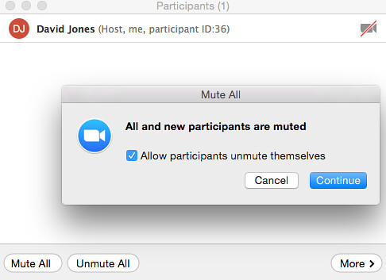

See also: [[blog-home | Home]]

Semester has commenced. First lecture yesterday. Big plans to use [Zoom](https://zoom.us/) to "broadcast" the lecture to online students and to make a recording that could be shared with those who didn't want to/couldn't listen to my dulcet, droning tones at 8am on a Tuesday morning.

Zoom performed as expected. Easy to set up and get working. As expected a small issue with participants not following the advice to mute their microphones. Hence my dulcet, droning tones and the nodding off of the face-to-face audience were occasionally interrupted by the sounds of the domestic life of the online audience. Thankfully Zoom has the capability for the host of the session to mute mics of participants.

## PEBKAC

 "[PEBKAC](https://www.flickr.com/photos/morosbruts/13928696037/)" ([CC BY-NC 2.0](https://creativecommons.org/licenses/by-nc/2.0/)) by  [Rafa Esteve](https://www.flickr.com/people/morosbruts/) 

The tendency for people to forget to turn off their mic appears to be an example of [PEBKAC](https://en.wikipedia.org/wiki/User_error). A reasonably well known term amongst computing people, especially those in technical support. As the image to the right explains PEBKAC is an acronym that expands out to

- **P**roblem
- **E**xists
- **B**etween
- **K**eyboard
- **A**nd
- **C**hair

i.e. the object that exists between keyboard and chair is the user. It's user error.

It's a term that expresses the bewilderment of technical people when the person with the problem has done something that clearly demonstrates a lack of basic understanding. At least in part, the term arises because technical support people see this type of problem all the time.

Why is it so common?

## Poor mental models as a source of PEBKAC

This is a question which the content of this week's lecture has an answer to provide due to a combination of the nature of digital technologies (ICT) and how people learn.

Ben-Ari and colleague (Ben-Ari, 1999; Ben-Ari & Yeshno, 2006) suggest that the problem is that many people have superficial mental models of how the technology works. In the absence of a reasonable correspondence between their mental model of the technology works, and how the technology actually works people are left to "aimless trial and error" when they attempt to use digital technologies. By definition, the reliance on trial and error means that errors will occur and PEBKAC will become evident.

In the Zoom lecture experience the participants joining the Zoom lecture - perhaps many for the first time - don't understand (they don't have a mental model) how Zoom works. They don't understand that their mic is on by default. When it is on, any noise made where they are is shared with all the other participants in the Zoom session. Including, the 40 odd people in the lecture theatre in Toowoomba.

So blame the user?

## The opaque nature of digital technologies

Maybe we can blame the technology.

Koehler and Mishra (2009) have this to say

Digital technologies—such as computers, handheld devices, and software applications—by contrast, are _protean (usable in many different ways;_ Papert, 1980); _unstable (rapidly changing)_; and _opaque (the inner workings are hidden from users;_ Turkle, 1995).On an academic level, it is easy to argue that a pencil and a software simulation are both technologies. The latter, however, is qualitatively different in that its functioning is more opaque to teachers and offers fundamentally less stability than more traditional technologies. By their very nature, newer digital technologies, which are protean, unstable, and opaque, present new challenges to teachers who are struggling to use more technology in their teaching. (p. 61)

Digital technologies are opaque. It's not easy to get a handle on the models that underpin the design and implementation of digital technologies. It's difficult for a student sitting at home in front of their computer to hear the sound of their neighbour's lawn mower echoing around the R113 lecture theatre on the Toowoomba campus and connect that to their mic not being muted in Zoom.

There is a picture of a mic on the Zoom interface. But you have to click on it to see the option to mute the mic. That requirement makes it difficult for a person using Zoom for the first time (especially if they are new to video-conferencing) to be aware of how to mute the mic, let alone the need for it.

People who have a mental model that more closely corresponds to how the technology works are better able to prepare for (avoid) or solve problems.

Before starting the lecture I thought this might be a problem (based on prior experience) so I explored the Zoom interface to see if it had an feature that would allow me (as meeting host) to mute the mics of other people.  It did, and that's what I used to address this problem.

## Developing mental models through conceptual models

Ben-Ari and Yashno (2006) found that if they presented people with a conceptual model of how an ICT works, those people were able to move beyond trial and error and solve problems conceptually.

At the moment, my mental model of Zoom is that I'll have to be manually muting participants next week. As I'm sure, even with all the recommendations, the opaque nature of the Zoom, and the limited mental models of Zoom held by people will once again create the problem.

I wonder now if Zoom has a feature by which you can specify that participants mics are muted automatically as they join.  This is an example where my mental model of Zoom breaks down. Time to play with Zoom.

Hey presto, it does indeed.  The image below shows the "Mute All" button that includes the ability to mute all participants, including new participants. I've just learned something new. 

Interestingly, however, for me this reinforces the opaque nature of digital technologies (or at least their user interfaces). The button "Mute All" suggests to me that it will mute all existing participants. I didn't assume it would include participants yet to join. Minor, but useful example.

## Environment/context plays a part as well

But it's just not the technology that is to blame.

As explained above, due to a combination of technical training and experience with video conferencing I have a fairly good mental model of how video conference works. But even with that I still make mistakes.

About 3/4 of the way through the hour lecture yesterday I realised that I hadn't hit the record button. This is a problem as I'd planned to share that recording with those who couldn't attend.

So if I had a good mental model of the technology, why did I make the mistake.

I blame the environment. This was my first time trying to use Zoom in a lecture theatre. Due to the theatre set up I was using a Windows computer for the presentation (I'm normally a Mac user). I also had to set up my Mac as secondary machine so I could observe the chat. I also had to worry about the lapel mic and getting that to work. Lastly, it was the first lecture of new semester. A lecture that I'd only finished preparing 30 minutes before the start of the lecture.

It was a novel environment, I was feeling rushed. So even though I knew the importance of hitting record, I didn't hit record.

## Improving my mental model

That mistake and having to re-record the lecture this morning means that I'm unlikely to make this same mistake again. Human beings learn best from making mistakes (especially public mistakes) and reflecting on them.

## Broader implications

Some ad hoc ponderings and hypotheses.

The learning activities this week should be designed to require people to make mistakes and then build their conceptual models from there. The pre-packaged errors won't be as beneficial.

Will the conceptual models that have been provided of the technology and the course be useful enough to help people develop useful mental models?

Are all the problems with staff using the Moodle Assignment activity down to this problem of opaque technology and limited mental models? Could this be fixed by sharing accessible conceptual models with staff? How do overcome the sheer complexity of the model of the Moodle assignment activity?

What role does the teaching context play in these limited mental models?

Would improving the mental models of teaching staff address the perceived quality issues around University digital learning?

## References

Ben-Ari, M. (1999). Bricolage Forever! In _Eleventh Workshop on the Psychology of Programming Interest Group_ (pp. 53–57). Leeds, UK. Retrieved from http://www.ppig.org/papers/11th- benari.pdf

Ben-Ari, M., & Yeshno, T. (2006). Conceptual Models of Software Artifacts. _Interacting with Computers_, _18_(6), 1336–1350. doi:10.1016/j.intcom.2006.03.005

Koehler, M., & Mishra, P. (2009). What is Technological Pedagogical Content Knowledge (TPACK)? Contemporary Issues in Technology and Teacher Education, 9(1), 60–70. Retrieved from [http://www.editlib.org/p/29544/](http://www.editlib.org/p/29544/)