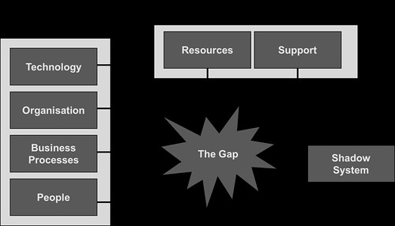
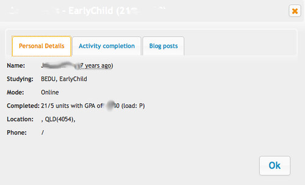
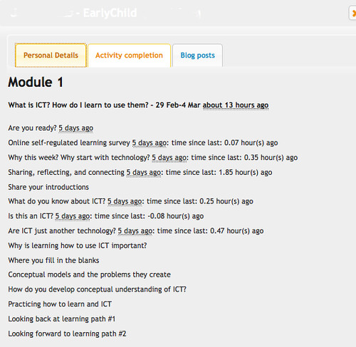
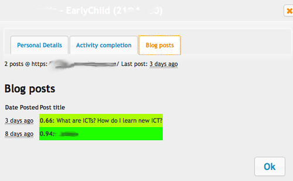

See also: [[blog-home | Home]]

The following documents the (hopefully) last bit of extra work I have to undertake to prepare the digital "learning space" for [EDC3100, ICT and Pedagogy](http://www.usq.edu.au/course/synopses/2016/EDC3100.html). It's work that has taken most of my working day. At a time when I can't really afford it.  But it's time I have to spend if I want to engage effectively in one of the most fundamental activities in teaching - know thy student.

## End result

The work I've done today allows me to easily access from within the main digital learning space for EDC3100 (the Moodle course site) three different types of additional information about individual students.

It's also an example of how the [BAD mindset](/blog2/2014/09/21/breaking-bad-to-bridge-the-realityrhetoric-chasm/#badset) is able to work around the significant constraints caused by the SET mindset and in the process create [shadow systems](/blog2/publications/the-rise-and-fall-of-a-shadow-system-lessons-for-enterprise-system-implementation/), which in turn illustrates the presence of a gap (i.e. yawning chasm) between what is provided and what is required.

Adapted from Behrens and Sedera (2004)

### What are they studying? What have they done before?

This student is studying Early Childhood education. They've completed 21 prior courses, but 5 of those were exemptions. I can see their GPA (blurred out below). They are studying via the online mode and is located in Queensland.

### How much of the course activities they've completed and when

This particular student is about half way through the first week's material. They made that progress about 5 days ago. Looks like the "sharing, reflecting and connecting" resource took a while for them to complete. More so than the others - almost two hours

### What they've written on their blog and how they are "feeling"?

This student has written two blog posts. Both are fairly positive in the sentiment they express. Through the second is a little less positive in outlook.

## Reasons for the post

There are a number of reasons for this post:

1. Reinforce the point about the value of an API infrastructure for sharing information between systems (and one that's open to users).
2. Document the huge gap that exists between the digital learning spaces universities are providing and what is actually required to implement useful pedagogies - especially when it comes to what Goodyear and Dimitriatdis (2013) call ["design for orchestration"](/blog2/2013/11/13/on-the-limitations-of-learning-design-for-improving-learning-and-teaching/) - providing support for the teacher’s work at learn time.
3. Make sure I document the process to reduce the amount of work I have to do next time around.
4. Demonstrate to the EDC3100 participants some of the possibilities with digital technologies, make them aware of some of what happens in the background of the course, and illustrate the benefits that can come from manipulating digital technologies for pedagogical purposes.
5. Discover all the nastly little breaks in the routine caused by external changes (further illustrating the unstable nature of digital technologies).

## What will I be doing

I'll be duplicating a range of institutional data sources (student records and Moodle) so that I can implement a range of additional pedagogical supports, including:

- ["Know thy student"](/blog2/2015/09/15/helping-teachers-know-thy-students/); and
- [draft learning journal reports](/blog2/2013/06/10/the-kludge-for-marking-learning-journals/).

Hopefully, I'll be able to follow [the process vaguely outlined](/blog2/2015/07/23/updating-more-student-details/) from prior offerings. (Yep, that's right. I have to repeat this process for every course offering, would be nice to automate).

### Create new local Moodle course

I have a version of Moodle running on my laptop. I need to create a new course on that Moodle which will the local store for information about the students in my course.

Need to identify:

- USQ moodle course id - 8036
- local course id - 15 Create the course in Moodle and get the id
- group id - 176 Create the group in the course
- context id - 1635 select \* from mdl\_context where instanceid=_local__\_course\_id_  and contextlevel=50
- course label - EDC3100\_2016\_S1 One of the values defined when creating the course.
- Update MoodleUsers::TRANSLATE\_PARAMETERS
- Update ActivityMapping::TRANSLATE\_PARAMETERS
- enrolid - 37 select \* from mdl\_enrol where courseid=_local\_course\_id_ and enrol='manual';

### Create BIM activity in new course

Need to identify

- bim id - 9

### Enrol students in the course

Ahh, returning to [Webfuse](/blog2/the-life-and-death-of-webfuse-principles-for-learning-and-leading-into-the-future/) scripts, the sad, depleted remnants of my PhD.

~/webfuse/lib/BAM/3100/3100\_support/participants/parse.pl is a script that will parse the Moodle participants web page, extract data about the enrolled users, and insert them appropriately into the database for my local Moodle course.

Initial test, no-one showing up as a participant. But add myself as teacher.

1. Figure out that the "show all participants" option is hidden down the very bottom of the page.
2. Save the page to my laptop
3. Edit the parse.pl script to update course details
4. Test that it parses the HTML file (in case changes have been made by the institution or by the new version of Moodle) - looking good.
5. The finding of old students appears to be working. Oh nice, easy way to identify repeating students.  Need to save that data.
6. Run the script
7. Fix the errors
    - Duplicate key inserting into groups
    - missing required parameter COURSE\_ID 111 Complaint from MoodleUsers class - need to update TRANSLATE\_PAREMETERS above
    - Particpants still not appearing, something missing -- have to update the script. Done.

Took a while, but that should further automate the process for next time.

### Add some extras

The above step only adds in some basic information about the student (USQ Moodle ID, email address). TO be useful I need to be able to know the sector/specialisation of the student, their postal code etc.

This information comes from a spreadsheet generated from the student records. And the data added into a "special" table in the Moodle database. This year I'm using a different method to obtain the spreadsheet, meaning that the format is slightly different. The new process was going to be automated to update each night, but that doesn't appear to be working yet. But I have a version, will start with that.

1. Compare the new spreadsheet content Some new fields: transferred\_units, acad\_load. Missing phone number.
2. Add columns to extras table.
3. Update the parsing of the file

Seems to be working

### Activity data

This is to identify what activities are actually on the study desk.

Another script that parses a Moodle web page to extract data. Currently re-writing some of the activities, wonder how that will work. Actually, seem to have designed for it.  Does a replace of the list, not an update

~~/activites/parseActivity.pl

1. Add in the course id for the new course
2. ??? may be update the script to handle that parameterised section titles

Seems to be working

### Activity completion data

Now to find out which activities each student has completed. Another script, this time parsing a CSV file produced by Moodle.

~/activities/parseCompletion.pl

1. Update the script with new course data
2. Unable to find course id - update ActivityMapping.pm
3. Having problems again with matching activity names
    1. EDC3100 Springfield resources it shouldn't be there. Turn off activity completion and get new CSV file
    2. For "."???. First field is a . should be empty **May need to watch this.**
4. Parses okay - try checkStudents Getting a collection of missing students.
    1. Are they in the local database at all? - no
    2. Have they withdrawn, but still in activity completion - yes.
5. Seems to have worked

### Student blog data

Yet another scraping of a Moodle web page.   ~/BIM/parseBIM.pl

1. Update the config
2. Check the parsing of the file
    1. Only showing a single student - the last one in the list For some reason, the table rows are missing a class. Only the lastrow has a class. Given I wrote the BIM code, this might be me. The parsing code assumes no class means it's the header row.  But seems to work.
3. Check the conversion process
    1. Crashed and burned at me - no Moodle id - hard code my exclusion
4. Check insertion
5. Do insertion
6. Check BIM activity
7. Check mirror for individual student - done
8. Run them all - looks like there might be a proxy problem with the cron version.  Will have to do this at home - at least wait until it finishes.

### Greasemonkey script

This is the user interface end of the equation.  What transforms all of the above into something useful.

/usr/local/www/mav

- gmdocs/moreStudentDetails.user.js
    - Add the Moodle course id - line 331
- phpdocs/api/getUserDetails.php
    - map the USQ and local Moodle ids
    - map USQ course id to BIM
    - add in the hard coded week data
    - Modify the module mapping (hard coded to the current course) -- actually probably don't need to do this.
- Download the modified version of the greasemonkey client - http://localhost:8080/fred/mav/moreStudentDetails.user.js
- Test it
    - Page is being updated with details link
    - Personal details being displayed
    - Activity completion not showing anything
        - Check server
            - Getting called - yes
            - Activity completion string is being produced
            - But the completion HTML is empty - problem in displayActivityStructure
            - That's because the structure to display (from updateActivityStructure) is empty - which is actually from getActivityMapping
            - getActivityMapping
                - \*\*\*\* course id entered incorrectly
    - Blog posts showing error message Problem with type with the course id
- Can I add in the extra bits of information - load, transferred courses
    - Client

### Sentiment analysis

This is the new one, run the blog posts through indico sentiment analysis

~/BIM/sentiment.pl

- update the BIM id

 

 

## References

Behrens, S. & Sedera, W. (2004) [Why do shadow systems exist after an ERP implementation? Lessons from a case study](http://aisel.aisnet.org/pacis2004/136/). IN WEI, C.-P. (Ed.) _The 8th Pacific Asia Conference on Information Systems._ Shanghai, China.