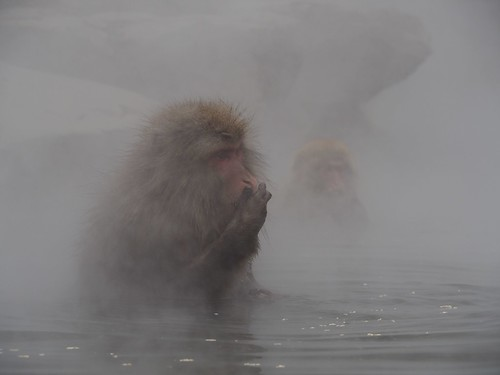
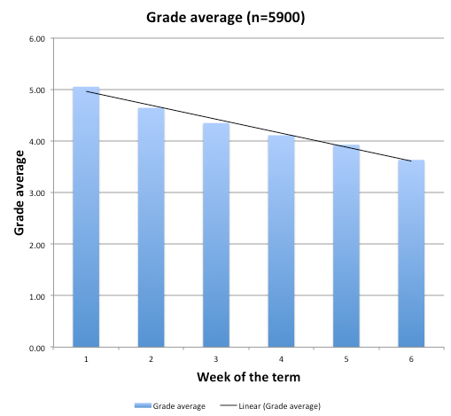

---
categories:
- edc3100
date: 2016-03-06 16:33:39+10:00
next:
  text: Setting up an Excel checklist
  url: /blog/2016/03/10/setting-up-an-excel-checklist/
previous:
  text: Producing OPML files for EDC3100 student blogs
  url: /blog/2016/03/06/producing-opml-files-for-edc3100-student-blogs/
title: Using resources appropriately
type: post
template: blog-post.html
comments:
    - approved: '1'
      author: elketeaches
      author_email: elkeclarissa@hotmail.com
      author_ip: 101.183.231.25
      author_url: http://elketeaches.wordpress.com
      content: 'Reblogged this on <a href="https://elketeaches.wordpress.com/2016/03/06/using-resources-appropriately/"
        rel="nofollow">elketeaches</a> and commented:
    
        Handy how-to use/reference sources with examples post: '
      date: '2016-03-06 16:54:58'
      date_gmt: '2016-03-06 06:54:58'
      id: '3311'
      parent: '0'
      type: comment
      user_id: '0'
    - approved: '1'
      author: jacquelinehowlett
      author_email: jac19701212@y7mail.com
      author_ip: 118.208.168.64
      author_url: http://jacquelinehowlett.wordpress.com
      content: 'Reblogged this on <a href="https://jacquelinehowlett.wordpress.com/2016/03/14/using-resources-appropriately/"
        rel="nofollow">The Blog Belonging to Jacqueline</a> and commented:
    
        Currently sifting through Module 2, was directed to this blog post by David and
        figured I should probably keep a copy for myself for future reference.'
      date: '2016-03-14 11:40:21'
      date_gmt: '2016-03-14 01:40:21'
      id: '3321'
      parent: '0'
      type: comment
      user_id: '0'
    - approved: '1'
      author: annaakhurst
      author_email: annaakhurst@hotmail.com
      author_ip: 124.183.251.1
      author_url: http://annaakhurst.wordpress.com
      content: 'Reblogged this on <a href="https://annaakhurst.wordpress.com/2016/03/17/using-resources-appropriately/"
        rel="nofollow">annaakhurst</a> and commented:
    
        An awesome blog entry to assist with understanding on how to use resources appropriately.
        Gaining an understanding of copy right  and ownership of images and documents
        relating to ICT has been a hurdle for me to overcome during this semester. This
        certainly helps!'
      date: '2016-03-17 20:59:41'
      date_gmt: '2016-03-17 10:59:41'
      id: '3323'
      parent: '0'
      type: comment
      user_id: '0'
    
pingbacks:
    - approved: '1'
      author: Copyright and GIFs | The Blog Belonging to Jacqueline
      author_email: null
      author_ip: 192.0.116.11
      author_url: https://jacquelinehowlett.wordpress.com/2016/03/08/copyright-and-gifs/
      content: '[&#8230;] how we could possibly, unknowingly, violate copyright laws,
        and he touched upon the subject again in this blog post. Shortly after this my
        fellow student Chloe posted a question on our course forum regarding the use [&#8230;]'
      date: '2016-03-08 12:09:26'
      date_gmt: '2016-03-08 02:09:26'
      id: '3312'
      parent: '0'
      type: pingback
      user_id: '0'
    - approved: '1'
      author: Using resources appropriately | 21st Century Sc...
      author_email: null
      author_ip: 185.82.148.10
      author_url: http://www.scoop.it/t/21st-century-school-libraries-by-sarah-betteridge/p/4060835680/2016/03/08/using-resources-appropriately
      content: '[&#8230;] The following is intended to be an example that will be used
        in the course I&#039;m teaching. It&#039;s meant to demonstrate appropriate ways
        to reuse resources that have been created in different ways. It&#039;s also an
        opportunity to explicitly test my understanding. So feel free to correct me. The
        idea is that how and if&hellip;&nbsp; [&#8230;]'
      date: '2016-03-08 12:52:25'
      date_gmt: '2016-03-08 02:52:25'
      id: '3313'
      parent: '0'
      type: pingback
      user_id: '0'
    - approved: '1'
      author: Copy&#8217;right&#8217; &#8211; elly mcculloch
      author_email: null
      author_ip: 192.0.116.230
      author_url: https://ladyofthesunblog.wordpress.com/2016/03/08/copyright/
      content: '[&#8230;] explains it much better than I in his &#8216;using resources
        appropriately&#8216; post. From my understanding, there are 4 different ways to
        appropriately attribute a source [&#8230;]'
      date: '2016-03-08 14:48:55'
      date_gmt: '2016-03-08 04:48:55'
      id: '3314'
      parent: '0'
      type: pingback
      user_id: '0'
    - approved: '1'
      author: Using resources appropriately | Digital Citizen...
      author_email: null
      author_ip: 185.82.148.10
      author_url: http://www.scoop.it/t/digital-citizenship-developing-the-culture/p/4060884930/2016/03/09/using-resources-appropriately
      content: '[&#8230;] The following is intended to be an example that will be used
        in the course I&#039;m teaching. It&#039;s meant to demonstrate appropriate ways
        to reuse resources that have been created in different ways. It&#039;s also an
        opportunity to explicitly test my understanding. So feel free to correct me. The
        idea is that how and if&hellip;&nbsp; [&#8230;]'
      date: '2016-03-09 10:15:44'
      date_gmt: '2016-03-09 00:15:44'
      id: '3315'
      parent: '0'
      type: pingback
      user_id: '0'
    - approved: '1'
      author: Using resources appropriately | Teens, Technolo...
      author_email: null
      author_ip: 185.82.148.10
      author_url: http://www.scoop.it/t/teens-technology-and-education/p/4060914213/2016/03/09/using-resources-appropriately
      content: '[&#8230;] The following is intended to be an example that will be used
        in the course I&#039;m teaching. It&#039;s meant to demonstrate appropriate ways
        to reuse resources that have been created in different ways. It&#039;s also an
        opportunity to explicitly test my understanding. So feel free to correct me. The
        idea is that how and if&hellip;&nbsp; [&#8230;]'
      date: '2016-03-09 21:54:29'
      date_gmt: '2016-03-09 11:54:29'
      id: '3316'
      parent: '0'
      type: pingback
      user_id: '0'
    - approved: '1'
      author: Copyright&#8230;a Dirty Word &#8211; Miss Galea&#039;s Blog
      author_email: null
      author_ip: 192.0.117.234
      author_url: https://missgaleasblog.wordpress.com/2016/03/10/copyright-a-dirty-word/
      content: "[&#8230;] On the other hand however, if I for one am not the creator of\
        \ the product I wish to use, I cannot simply copy and paste it off the web and\
        \ use it legally (contrary to previous understanding). \_In order to legally use\
        \ another copyright owner&#8217;s product there are a few ways in order to be\
        \ able to use it. \_This becomes very complicated very quickly, however has been\
        \ quite well described by David Jones in this blog post. [&#8230;]"
      date: '2016-03-11 08:22:10'
      date_gmt: '2016-03-10 22:22:10'
      id: '3317'
      parent: '0'
      type: pingback
      user_id: '0'
    - approved: '1'
      author: Copyright obligations &#8211; Tech-Savvy wannabe
      author_email: null
      author_ip: 192.0.113.168
      author_url: https://phoenixedublog.wordpress.com/2016/03/11/copyright-obligations/
      content: "[&#8230;] excellent snapshot of these aspects is summarised in the blog\
        \ by David Jones. \_David explores how easy it is and has been for those of use\
        \ engaging in EDC3100 to inadvertently [&#8230;]"
      date: '2016-03-11 11:21:32'
      date_gmt: '2016-03-11 01:21:32'
      id: '3318'
      parent: '0'
      type: pingback
      user_id: '0'
    - approved: '1'
      author: Whoops! &#8211; nickiegwordpesscom
      author_email: null
      author_ip: 192.0.112.40
      author_url: https://nickiegwordpesscom.wordpress.com/2016/03/11/whoops/
      content: "[&#8230;] fellow classmates, Elly Mcculloch mentions 4 different ways\
        \ to appropriately attribute a source.\_This blog\_by David is also a good one\
        \ on how to use resources [&#8230;]"
      date: '2016-03-11 15:16:10'
      date_gmt: '2016-03-11 05:16:10'
      id: '3319'
      parent: '0'
      type: pingback
      user_id: '0'
    - approved: '1'
      author: the ins and outs of copyright &#8211; forever your champion
      author_email: null
      author_ip: 192.0.118.107
      author_url: https://foreveryourchampion.wordpress.com/2016/03/13/the-ins-and-outs-of-copyright/
      content: "[&#8230;] after completing the learning path for this week and reading\
        \ both Elly and David blog\u2019s, I am much more informed and will not break\
        \ or violate any more copyright laws. I thought I [&#8230;]"
      date: '2016-03-13 20:37:18'
      date_gmt: '2016-03-13 10:37:18'
      id: '3320'
      parent: '0'
      type: pingback
      user_id: '0'
    - approved: '1'
      author: Breaking the rules | KIM POOLER
      author_email: null
      author_ip: 192.0.113.233
      author_url: https://kimpoolerblog1.wordpress.com/2016/03/14/breaking-the-rules/
      content: "[&#8230;] I travelled through the learning path for this week and then\
        \ read David&#8217;s\_blog stating how to use resources appropriately I developed\
        \ a plan to get my blog back to a law [&#8230;]"
      date: '2016-03-14 22:02:05'
      date_gmt: '2016-03-14 12:02:05'
      id: '3322'
      parent: '0'
      type: pingback
      user_id: '0'
    - approved: '1'
      author: Finding images for blog posts | ICT and Pedagogy
      author_email: null
      author_ip: 192.0.114.3
      author_url: https://krwiggins.wordpress.com/2016/03/22/finding-images-for-blog-posts/
      content: '[&#8230;] was ignorant of the copyright laws relating to the use of images
        in blog posts. After reading David&#8217;s post about using resources appropriately,
        I have a clearer picture of the legalities of using [&#8230;]'
      date: '2016-03-22 13:36:43'
      date_gmt: '2016-03-22 03:36:43'
      id: '3324'
      parent: '0'
      type: pingback
      user_id: '0'
    
---
The following is intended to be an example that will be used in the course I'm teaching. It's meant to demonstrate appropriate ways to reuse resources that have been created in different ways. It's also an opportunity to explicitly test my understanding. So feel free to correct me.

The idea is that how and if you can use a resource (be it words, audio, video etc) depends on who created the resource, copyright, and any additional conditions that have been applied.

### Using a resource I created

The following image is a photo taken by me. I'm the copyright owner, I'm free to use this anyway I like. No need to reference or give attribution.

If I'd taken this image as part of preparing teaching materials for my paid work for the University of Southern Queensland, then I would have to ask their permission to use this image here. As the University (currently) retains copyright ownership on materials produced for teaching purposes.

There's not need to include any attribution on this image, as I own the copyright.

### Using a public domain image

The following image - taken from a book from the 1800s - is in [the public domain](https://www.flickr.com/commons/usage/). There are no restrictions on how I (or you) can use this image.

With public domain resources, there's no need for an attribution, but it would be nice to do.

### Using a Creative Commons image

The following image was taken by [Daisuke Tashiro](https://www.flickr.com/people/dice-kt/). Who has chosen to add to this image [this Creative Commons license](https://creativecommons.org/licenses/by-sa/2.0/) which allows me to reuse the image as along as a fulfill the conditions of the license, including appropriate attribution of the image.

To properly attribute the image, I make use of [the ImageCodr service](http://www.imagecodr.org/).

!!! warning "Broken image"

If I were to use the above image without the attribution, just the image itself. I would be breaking the terms of the license.

However, I can currently [link to the image](https://www.flickr.com/photos/dice-kt/12010886145/in/photolist-q5BrSo-jimVZT-aCcLBV-aYUbCD-dAn4FZ-r1BbZn-7paZCt-kBe9wg-8YDZq2-9d37er-8YDZt2-nfLDBp-dLxWS3-sf12PQ-ecJ5xs-iEiN5H-cQmnSY-9ki6ku-q812Y5-bi7Bsv-ecCqzv-dLPB6d-nfLhSZ-7YJTAk-3q96U) without any attribution or breaking any copyright conditions.

### Using a copyrighted image

The following image is copyrighted. All rights reserved.  While I can [link to this image](https://www.flickr.com/photos/7321820@N08/7031164341/in/dateposted/) without breaking copyright. If I embed it in this blog post, I'm likely to get into trouble.

Unless I ask the copyright holder for permission to use the image. As I have known the copyright holder for a long time, I've been able to do this quite easily and quickly. However, if you don't know the copyright holder, obtaining permission may take quite some time, and may not happen at all.

 

\[caption id="" align="alignnone" width="509"\] Copyright © (2012) Colin Beer - used with permission\[/caption\]

If I don't get permission from the copyright holder, I can't use this image. Even if I put the nice attribution of the resource, I still can't use it.

### What is that last image about?

The image is a little interesting in the context of the course. It indicates that there is a potential relationship between final grade a student achieves in a course, and the week of term when the student first accesses a course website. i.e. if you access a course website in week 5, you are likely to get a grade lower than students who access the course website earlier.