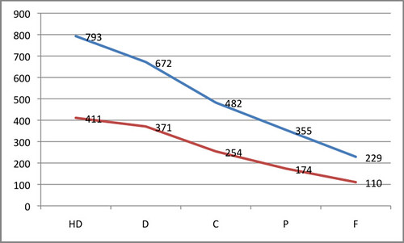
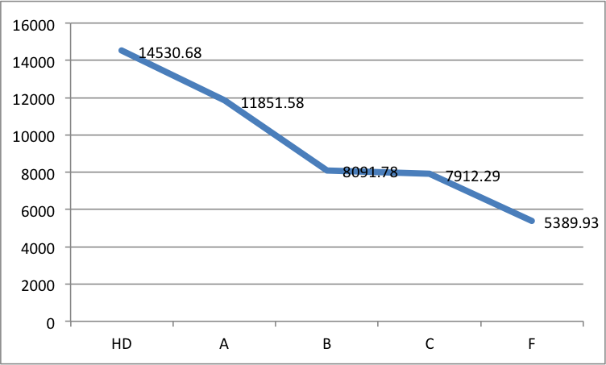
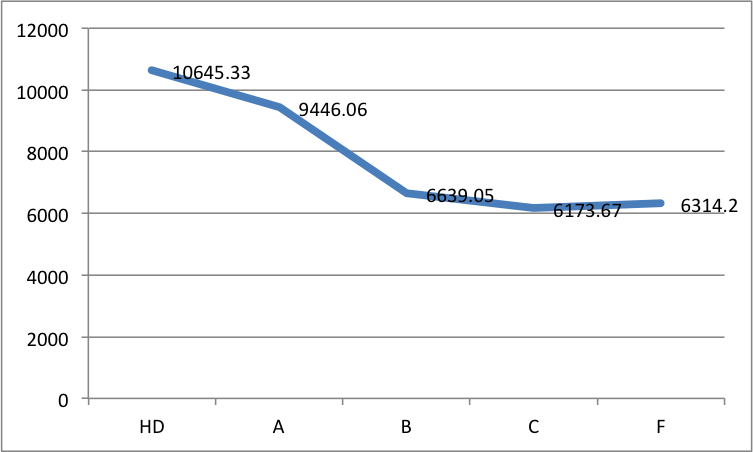

---
categories:
- bad
- indicators
date: 2016-03-18 06:10:59+10:00
next:
  text: '"OEP and Initial Teacher Education: Moving on from the horsey, horseless
    carriage"'
  url: /blog2/2016/03/18/oep-and-initial-teacher-education-moving-on-from-the-horsey-horseless-carriage/
previous:
  text: Setting up an Excel checklist
  url: /blog2/2016/03/10/setting-up-an-excel-checklist/
tags:
- learninganalytics
title: Early analysis of Moodle data
type: post
template: blog-post.html
---
A small group of teacher educators that I work with are starting to explore some research ideas around engagement, initial teacher education, and in particular the questions that arise out of the [Quality Indicators for Learning and Teaching (QILT)](https://www.qilt.edu.au/)

For that project and others I need to get back into analysing institutional Moodle data. The following is a recording of some initial forays on a longer journey. It's all basically [data wrangling](https://en.wikipedia.org/wiki/Data_wrangling). A necessary first step to something more interesting.

## To do

Much of the following is just remembering how I've configure my local system (a need the points to bad and interrupted practice)

1. Do I have the data in a database? Yes. Postgres9.1 | Databases | studydesk2015 | moodle | tables
2. Can I access this via Perl/PHP etc. Woohoo!  Yes.  Perl is a go (yes, I'm old).  ~Research/2016/QiLTEers/Analysis/myScripts
3. Can I run some initial simple analysis Time to borrow some of Col's work

## Hits and grades

Let's try the old standard, the pattern between hits on a course site and grades.

### Still using the same tables for same purpose

Col's work was from a while ago. The Moodle database schema - especially logs - has moved on.  Are his scripts work with the current data I have? Does that data I have even come with the tables his scripts use?

mdl\_logstore\_standard\_log - tick

Ahh, but Moodle has changed its approach to logging.  My data has two tables.  The one mentioned and mdl\_log (old version). That led to some wasted time - thanks for cluing me in Randip

### Clicks

Experiment with 3 courses (some with 2 offerings) and see if I can get total clicks for that course.

Results are

- 139,392 - 4th year course, S1
- 220,362 - Big 1st year course, S1
- 639,750 - Biggish 3rd year course, S1
- 308,399 - Big 1st year course, S2
- 185,675 - Biggish 3rd year course (but smaller offering), S2

### Clicks per student

Raw total clicks isn't that useful. What about the clicks per student average?

The 4th year course was showing too many students. What's the go there?  Ahh, the query to identify students is returning duplicates.

| Course | Total Clicks | \# Students | Clicks / Student |
| --- | --- | --- | --- |
| 4th year course, S1 | 139,392 | **175** | 796.5 |
| Big 1st year course, S1 | 220,362 | 215 | 1024.9 |
| Biggish 3rd year course, S1 | 639,750 | 323 | 1980.7 |
| Big 1st year course, S2 | 308399 | 451 | 683.8 |
| Biggish 3rd year course, S2 | 185675 | 90 | 2063.1 |

 

### Clicks and Grades

Next question is if I can produce the slightly more useful pattern between participation and grade. 

That seems to be working, and some success with caching.

Here's the first semester 2015 offering of the biggish 3rd year course from the table above (a course I teach).

And here's the second semester 2015 offering of the same course.  The S1 offering has both on-campus and off-campus students.  The S2 offering is online only.

## What's left to do

A lot.  But doing the above has started building the foundation scripts that will help transform the raw institutional data into something that more people can do more analysis with.

Bigger picture tasks to do are (not necessarily in this order)

1. Polish and build out the data wrangling foundation.
    1. Identify the formats most useful for the next level of the process
    2. Improve the implementation of the scripts
    3. Build out the functionality of the scripts
2. Identify the questions we want to explore
    1. Break down by student type
    2. Investigate the impact of timing on students
    3. LMS usage frameworks/course signatures
    4. Explore Moodle Book usage
    5. Include discussion forum participation
    6. Explore the use of links by staff and impact.

And many, many more.