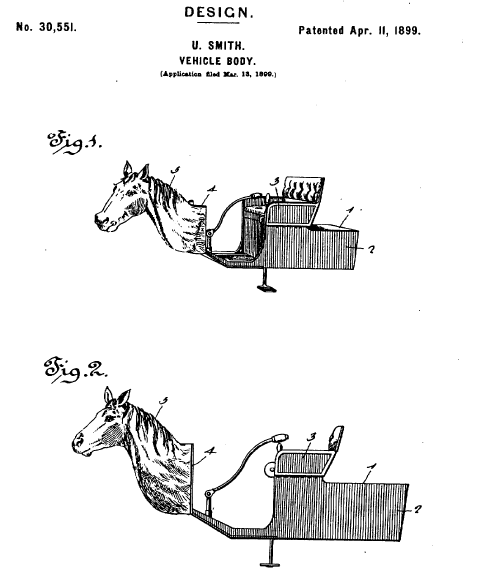

Earlier this week four colleagues from three different Universities submitted an application to an [internal grant scheme around Open Educational Practice](http://www.usq.edu.au/learning-teaching/excellence/2016landtgrants/opened). What follows is an excerpt from that application.This idea evolved out of [some earlier thinking](/blog2/2016/02/22/open-educational-practice-beyond-the-institution/). We find out how we went in April.

If the project is successful, it needs to be open and connected. Hence pointers to interesting and related folk and work more than welcome.  Especially suggestions for potentially provocative "thought leaders, disruptors and other ragamuffins".

## Why?

The project team are all teacher educators. We come from three different institutions and bring to the project three courses from different institutions focused on the [Technologies learning area](http://www.australiancurriculum.edu.au/technologies/introduction).

We believe that open educational practices (OEP) have the potential to help teacher educators transform learning and teaching and respond to challenges unique to initial teacher education. We believe that OEP can help improve course development for USQ's new Bachelor of Education. We believe that, successfully implemented, OEP can help create a generation of teachers for whom OEP is embedded in who they are and what they do.

But OEP has a horsey horseless carriage problem (Bigum, 2012). Most use of OEP is designed not to "disrupt the smooth running routines" (Bigum, 2012, p. 35) of existing educational practices and institutions. Open textbooks are still textbooks. Open courses are still courses.

We want to escape the established practices associated with OEP and initial teacher education. We want to answer questions such as:

- What might ITE look like if it were transformed with OEP?
- What are the challenges and potential benefits to such a radical transformation?
- How might those be addressed and harnessed in the development of courses in USQ's new Bachelor of Education?

##  Aim

We aim to develop a range of potential scenarios where every aspect of the USQ course [EDM8006](http://www.usq.edu.au/course/synopses/2016/EDM8006.html) might be radically transformed through OEP. A particular focus of that transformation is on how participants from EDM8006 and the other two courses taught by project members can fruitfully engage in OEP that will connect and engage pre-service teachers across courses within institutions; across tertiary institutions; with practising teachers; with the research community; and, with the broader education profession.

##  How?

To achieve this goal we plan to

1. Be provoked by thought leaders, disruptors and other ragamuffins. Lure with loads of moola people that have leapt off the bleeding edge of OEP and ITE to talk via video conference and engage with the project as they can and like. Task them specifically with identifying the "dogmas of the past" holding back OEP within higher education and proposing how we might think anew, and act anew.
2. Find out what's already going on around OEP and ITE. ITE has, to varying levels, already been engaging in OEP. It's been used in everyday practice and written about in the literature. We need to be aware of what has gone on and what is the current state of play. To try and get some idea of the [propensities and dispositions](http://cognitive-edge.com/blog/scaling-avoiding-the-perversion-of-order/) within ITE.
3. Develop an initial set of scenarios for EDM8006. Focused on this specific course and drawing on the inspiration of the previous two steps develop a range of different scenarios around how OEP can transform EDM8006.
4. Share the scenarios with different stakeholders. Via a range of methods share the scenarios with anyone and everyone involved with the EDM8006 course, the institution, ITE, OEP, and anything else we can identify. The aim is to have the scenarios undergo critical review to identify where they will clash with established assumptions, who else might be interested in these scenarios, how they might be implemented, and hopefully much better suggestions.
5. Distill what has been learned into a set of findings and recommendations.

**References**

Bigum, C. (2012). Edges , Exponentials and Education : Disenthralling the Digital. In L. Rowan & C. Bigum (Eds.), _Transformative Approaches to New Technologies and student diversity in futures oriented classrooms: Future Proofing Education_ (pp. 29–43). Springer. doi:10.1007/978-94-007-2642-0