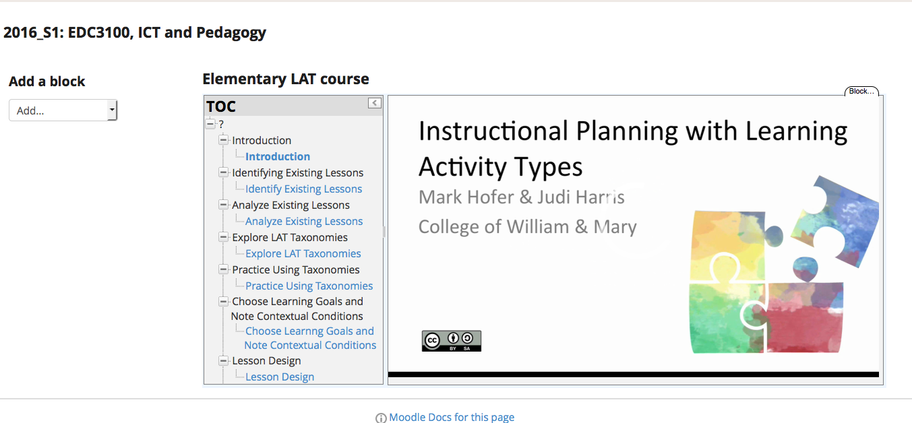
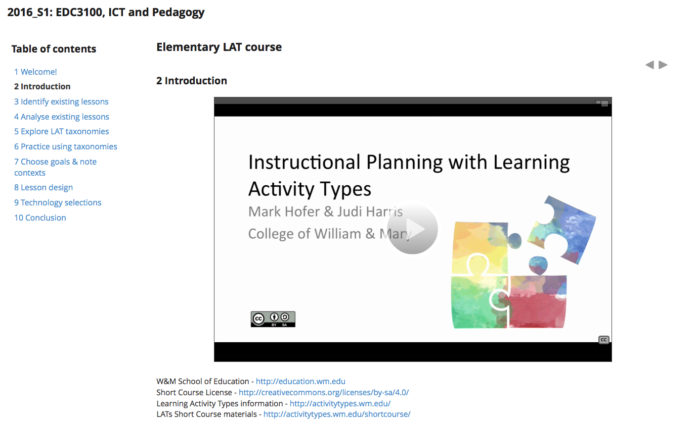
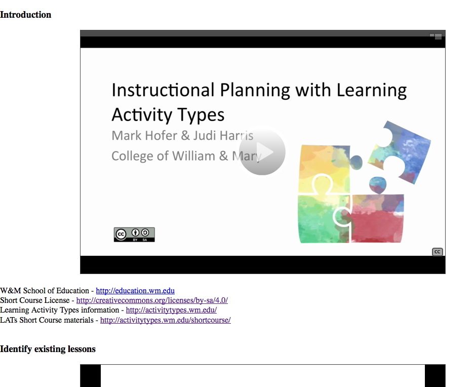

The following documents initial explorations into leveraging the [two Learning Activity Types (LATs) short courses](http://activitytypes.wm.edu/shortcourse/) that have been released as Open Educational Resources (OERs) by [Hofer and Harris (2016)](https://www.academicexperts.org/conf/site/2016/papers/49080/). As outlined in a [prior post](/blog2/2016/03/26/lats-oer-tpack-and-github/) my plan is to use these OERs as a test case for [the Moodle open book project](/blog2/the-moodle-open-book-module-project/). The aim being to

1. Test and identify areas for improvement for the Moodle open book code using a real OER.
2. See how/if this OER could be leveraged for [the course](http://www.usq.edu.au/course/specification/2016/EDC3100-S1-2016-ONC-SPRNG.html) I teach and related courses coming down the line.
3. Eventually exploring how and if this work might connect with broader work around OERs, potential work here around [Open Educational Practices and teacher education](/blog2/2016/03/18/oep-and-initial-teacher-education-moving-on-from-the-horsey-horseless-carriage/), and work to encourage adoption and adaptation of the LAT OER.

### What's **been done**

1. The [Elementary Short Course LMS package](http://activitytypes.wm.edu/shortcourse/learning-activities-taxonomies-elementary-export.imscc) (IMS) has been successfully imported into Moodle (first image below)
2. The [Web-based Elementary course](http://latselemteachered.weebly.com/) has been converted into a Moodle Book resources (second image below).
3. The Moodle Book version of the Elementary course has been [exported to GitHub](https://github.com/djplaner/edc3100/blob/master/LAT_OER/Elementary_Course.html) using [the Moodle open book tool](/blog2/the-moodle-open-book-module-project/) (third image below).

All that was done quite easily. A couple of minor bugs to report, but nothing major.

Next steps are (not necessarily in order)

1. Improve the structure/scaffolding of some of the pages with multiple videos.
2. Explore if the video transcripts can be usefully integrated into the pages.
3. Modify the Moodle book tool to produce a HTML version that is more immediately usable (e.g. a nice "book" interface, rather than a single long web page).
4. Figure out when/if we might use this in EDC3100.

### Random questions, outcomes, and future work

1. Could a resource like this be integrated into multiple courses within the BEdu? Hofer and Harris (2016) suggest that this is a possibility with the LAT OER.
2. How might the collection of student written lesson plans be more broadly contributed to and used?
3. Can the experience students go through be captured, shared, and leveraged in some useful way?

## What's in the LAT short course OERs?

First step is to figure out the content and format of the LAT OERs to gain some idea of how and if it fit with the Moodle open book and my course.

The aim of the broader [Learning Activity Type (LAT) work](http://activitytypes.wm.edu/s) and the OER short courses is to help pre-service teachers develop the knowledge required to integrate digital technologies into their teaching. Learning Activity Types offer a taxonomy of learning activities that are linked to specific learning areas that are used during lesson planning.

One short course each for primary (elementary) and secondary pre-service teachers. Each  course is divided into eight sequential modules that includes videos and transcripts. Sequence is

1. Reflect on prior experience with digital technologies in learning and teaching and what worked/didn't.
2. Select three lessons from a collection of lesson plans written by other pre-service teachers.
3. Analyse these sample lessons and their learning objectives, learning activities used, student assessment, and use of digital and non-digital technologies.
4. Given a single demonstration lesson plan, replacing learning activities that don't match the objectives with those that do.
5. Consider and explain the replacement of technologies in the demonstration lesson plan with others.
6. Review portions of interviews with experienced teacher when making similar activities.
7. Returning to the sample lessons, chose the LAT taxonomy that matches and explore.
8. Use that to think about substitution of learning activities and technologies in the sample lessons, considering a range of factors and engaging in discussions.
9. Create their own lesson plan based on a range of considerations.
10. Evaluate their lesson plan with two self-tests called "Is it worth it?"

Related resources include

1. Blackboard produced content package file - [Elementary](http://activitytypes.wm.edu/shortcourse/learning-activities-taxonomies-elementary-export.imscc) and [secondary](http://activitytypes.wm.edu/shortcourse/learning-activities-taxonomies-secondary-export.imscc).
2. Websites with the short courses - [Elementary](http://activitytypes.wm.edu/shortcourse/learning-activities-taxonomies-secondary-export.imscc) and [secondary](http://latssecteachered.weebly.com/).
3. Various media files - [Elementary](http://activitytypes.wm.edu/shortcourse/elementarymodules.html) and secondary. This includes powerpoint, video, caption, script, sample lesson, and various student guide files.
4. [Instructor guide](http://activitytypes.wm.edu/shortcourse/LATShortCourseInstructorGuide.doc).
5. Related [share-alike materials](http://activitytypes.wm.edu/shortcourse/share-alikematerials.html).
6. Collection of student written lesson plans.

### Let's try the IMS package

The LAT OER are provided as IMS packages, these should import directly into Moodle.  Not exactly what I want to do here, but worth a look.

Well that worked quite smoothly.  Add the resource, import the file and there it is.

The layout/interface isn't that nice (very subjective and I'm likely biased).  Starts with an introductory video with context/background on the courses.   The interface (at least in Moodle hides the "play" button.

Nice, video makes mention of instructor provided discussion forums.  Mmm, video play back issue, is the video remote or local?

Ahh, broken link.  The IMS version links back to Blackboard.  The [equivalent web version](http://latssecteachered.weebly.com/3-analyze-lessons.html) has the open link.  That seems to apply for all of the pages.

Each page has a video. The transcript is available. Wonder if I can do integrate both and whether there's any value in doing so.  I know I've probably prefer the text version.

The [lesson design page](http://latssecteachered.weebly.com/7-lesson-design.html) is a bit busy

**Tasks and questions**

1. Where are the videos located here? Part of the Moodle LMS? Perhaps same as the web site versions?
2. Is the "hidden" play button a Moodle interface problem? Can it be fixed?
3. Report the UMW Blackboard link for the sample lesson plan on "Analyse existing lessons" in elementary
4. Do some form of automated link check etc?
5. Can/should the various guides be converted into HTML?
6. Might some of the pages (e.g. lesson design) be better scaffolded/labelled?

## What might it look like?

Converting the two courses into a Moodle book looks like it would be fairly straight forward.  Each book could be integrated into the EDC3100 study desk fairly easily. One modification might be the integration of the script of the videos into each page to support those who want to read, but also to enable use of search engines.

### Initial plan - straight cut-and-paste

Create a bog standard Moodle book with just the current content of [the elementary course](http://latselemteachered.weebly.com/).

Provide a better feel for the content and how it goes in the book. Identify any issues and ideas. Provide a concrete version on github for later experimentation.

### Add the video transcripts

Can this be done?

## Did it work?

### Straight cut-and-paste

Process is

1. Use Firebug to copy and paste the content from [the Elementary course](http://latselemteachered.weebly.com/).
2. Import it into the Book module
3. Link it to github.

Here's the Moodle book equivalent of the above.

Misc observations

- HTML isn't using headings. Welcome page changes font size.
- Nor is it using paragraphs, lots of line break tags
- The web versions and the IMS version use different titles for pages
- Do I need to include the welcome? If so, need to fix the images for the college and license
- Fix the warnings with the github tool.
- Couldn't create a folder with a space.

### GitHub version

Background: The [Moodle open book tool](/blog2/the-moodle-open-book-module-project/) enables the [Moodle Book module](https://docs.moodle.org/28/en/Book_module) to export/import content to/from GitHub. Adding all the benefits of GitHub. It does this by combining all the pages in a Moodle book into a single HTML file that is placed onto GitHub. A file that can be split up again and used to modify a Moodle book.

The tool is still under development, but it does work.

Here's [the GitHub HTML file](https://github.com/djplaner/edc3100/blob/master/LAT_OER/Elementary_Course.html) produced by the Moodle open book tool that contains the LAT Elementary course. It's based entirely on the Moodle Book version of the course I created in the previous step. You can see the file as [a web page via this link](https://htmlpreview.github.io/?https://github.com/djplaner/edc3100/blob/master/LAT_OER/Elementary_Course.html). The image below is a screenshot of that web page. You  can just see the second page (Identify existing lessons) peeking up below.

