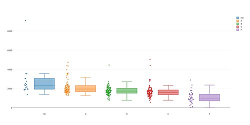

I'm part of a group that's trying to take a deep dive into our courses using "learning analytics". My contribution is largely the technology side of it and its time to generate some pretty pictures.  The following is a summary of some playing around with [D3.js](https://d3js.org/) and ended up with some success with Plot.ly.

### Example - box plots

Toe in the water time, can I get an example working. Start with [box plots](http://bl.ocks.org/mbostock/4061502) as I've got some data that could fit with that.

Rough process should be something like.

1. Set up some space on the local web server.
2. Install the library.
3. Get the example working.
4. Modify the example for my data

Step #4 is a bit harder given that I don't yet grok the d3 model.

### Work through some tutorials

Starting with [bar charts](https://bost.ocks.org/mike/bar/).

So some jQuery like basics: selections, selectors, method chaining.

Appears [joins](https://bost.ocks.org/mike/join/) might be the most challenging of the concepts.

data space (domain) -> display space (range)

Mmm, d3.js is too low level for current needs.

### Plot.ly

[Plot.ly](https://plot.ly/javascript/) is an online service driven by a Javascript library that is built upon d3.js and other services. Appears to be at the level I'd like.  Example works nicely.

Does appear to be a big project.

Ohh nice.  The example looks very appropriate.

Bit of data wrangling and the following is produced.

 Even that simple little test reveals some interesting little tidbits. Exploring a bit further should be even more interesting.