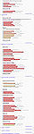
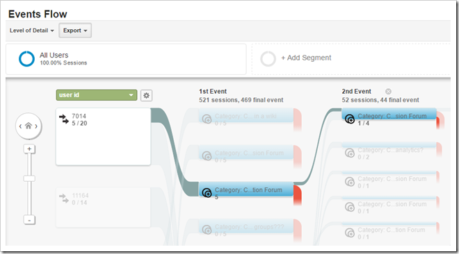

I'm working with a group of fellow teacher educators here at USQ to explore what is happening around student engagement with our online courses. It's driven by the apparent less than stellar responses on [the QILT site](https://www.qilt.edu.au/) from our prior students around "engagement". It's also driven by some disquiet about the limitations of aggregated and de-contextualised data like that reported on the QILT site and also that arising from most learning analytics (e.g. as found [by Gašević et. al. (2015)](/blog2/2016/04/03/learning-analytics-should-not-promote-one-size-fits-all-the-effects-of-instructional-conditions-in-predicting-academic-success/).

Hence our idea is to do something like

1. Take a collection of teacher education courses.
2. Iteratively apply a range of increasingly specific learning analytics to reveal what's happening around engagement in our course sites.
3. Reflect on what we learn and what that might have to say about
    - the use of aggregated and de-contextualised data/analytics;
    - what data/analytics might be useful for ourselves and our students; and
    - what's happening in our courses, and how that compares to what we thought was going on.

As the person most familiar with technology and learning analytics, I'm tasked with identifying the sequence of "increasingly specific learning analytics" that we'll use.

What follows is a first draft.  I'm keen to hear suggestions and criticisms. Fire away.

Specific questions to be to be answered

1. Does the sequence below make sense?
2. Are there other types of analytics that could be usefully added to the following and would help explore student/staff engagement and/or perhaps increase contextualisation?
3. What literature exists around each of these analytics, where did the apply the analytics, and what did they find?

## Process overview

Each of the ovals in the following diagram are intended to represent a cycle where some analytics are presented.  We'll reflect on what is revealed and generate thoughts and questions. The labels for the ovals a short-hand for a specific type of analytics. These are described in more detail below.

The sequence is meant to capture the increasing contextualisation. The first four cycles would use fairly generic analytics, but analytics that reveal different and perhaps more specific detail. The last two cycles - learning design and course specific - are very specific to each course. The course specific cycle would be aimed at exploring any of the questions we identified for our individual courses as we worked through the other cycles.  It won't be quite as neat as the above. There will be some iteration and refinement of existing and previous cycles, but the overall trend would be down.

The analytics below could also be compared and analysed a variety of ways, most of which would be responding to details of our context. e.g. comparisons against mode and specialisation etc.

## Click/grade & Time/grade

This cycle replicates some of the patterns from [Beer et al (2010)](http://ascilite.org.au/conferences/sydney10/procs/Beer-full.pdf) (somewhat shameless, but relevant self-citation) and related.  This is aimed at just getting the toe in the water, getting the process set up.  It's also arguably perhaps as removed from student learning/engagement as you can get. A [recent post](/blog2/2016/04/09/playing-with-d3/) showed off what one of these will look like. 

This would also include the heatmap type analysis such as the following diagrams.

- Which links on a course site do the students click most? e.g. the [Moodle Activity Viewer](https://github.com/damoclark/mav).
- What days/weeks of semester do they click most? e.g. the [Moodle activity calendar heatmap](https://infiniterooms.wordpress.com/2015/08/14/when-are-they-learning-a-moodle-activity-calendar-heatmap/)

  

## "Rossi" data sets

[Rossi et al (2013)](http://www.dehub.edu.au/wp-content/uploads/2013/07/CQU_Report.pdf) extended the Beer et al (2010) work and worked with the "Rossi" data sets drawing on the Interaction Equivalency Theorem ([Miyazoe and Anderson, 2011](https://href.li/?http://www.uwex.edu/disted/conference/Resource_library/proceedings/46332_2011.pdf)). Hence increasing the theoretical connection with interaction/engagement.

The additions in the "Rossi" data sets follow

**Proportion of clicks within LMS discussion forums (dhits)**

| CQU Moodle courses | Non-forum clicks | Forum clicks (dhits) |
| --- | --- | --- |
| n=12870 students | 68% | 32% |

**\# of forum hits (dhit), posts, and replies**

A "dhit" is a click on a forum. This includes navigation etc. The idea here is to compare dhits with posts and replies

> the posts and replies made within the forums are more representative of student and teacher engagement and interaction (Rossi et al 2013, p. 48)

| Moodle CQU T1, 2011 | dhits | Posts | replies |
| --- | --- | --- | --- |
| n=12870 | 385113 | 17154 | 29586 |

**learner-learner, learner-teacher and ratio**

\# of forum posts that are learners replying to a learner post (learner-learner) or a learning responding to a teacher or vice versa (learner-teacher).

| Average for T1, 2011 CQU courses | Learner-learner | Learner-teacher | Ratio of LT to LL |
| --- | --- | --- | --- |
| n=336 | 86 | 56 | .65 |

**Comparison of learner-learner, learner-teacher and learner content interactions**

 

## Networks and paths

These analytics focus on the relationships and connections between people and the paths they follow while studying. Moving beyond numbers to starting to understand connections.

This [2013 post](https://mashe.hawksey.info/2013/02/lak13-recipes-in-capturing-and-analyzing-data-using-sna-on-canvas-discussions-with-nodexl-for-when-its-not-a-snapp/) from Martin Hawksey (found via his other post mentioned below) gives an overview of a range of uses and tools (including [SNAPP](https://confluence.sakaiproject.org/pages/viewpage.action?pageId=84902193)) for social network analysis. It's the early SNAPP work that identifies some of what these visualisations can help identify

> - isolated students
> - facilitator-centric network patterns where a tutor or academic is central to the network with little interaction occurring between student participants
> - group malfunction
> - users that bridge smaller clustered networks and serve as information brokers

The following is one of my first attempts generating such a graph. It shows the connections between individual student blogs (from EDC3100 2013). The bigger the line between dots (blogs), the more links.

[Romero et al (2013)](http://www.sciencedirect.com/science/article/pii/S0360131513001607) offers one example.

A Sankey diagram is a method for representing flow in networks. It can be used to [understand usage of websites](http://www.phillipburger.net/wordpress/website-path-analysis-with-sankey-diagram/).  Martin Hawksey has just written [this post](https://mashe.hawksey.info/2016/04/pushing-canvas-lms-discussion-data-to-google-analytics-tips-on-google-analytics-api-integration-batch-collection-and-queue-time/) (showing how to take LMS discussion data and send it through Google analytics) which includes the following screen shot of "event flow" (a related idea).  It shows (I believe) how a particular use has moved through a discussion forum. Looks like it provides various ways to interact with this information.

Hoping we might be able to leverage some of the work Danny Liu is doing.

https://twitter.com/dannydotliu/status/719738094375686145

##  Sentiment, content, and broader discourse analysis

The previous cycles are focused on using clicks and links to understand what's going on. This cycle would start to play with natural language processing to analyse what the students and teachers are actually saying.

This is a fairly new area for me. Initially, it might focus on

- readability/complexity analysis; Unpublished work from CQU has identified a negative correlation between the complexity of writing in assignment specifications and course satisfaction.
- sentiment analysis How positive or negative are forum posts etc? The comments and questions on this [blog post](http://meefen.github.io/notes/2014/05/01/Wen2014a/) about a paper using sentiment analysis on MOOC forums provides one place to start.

## Learning design

The plan here is to focus explicitly on the learning designs within the courses and explore what can be revealed using checkpoint and process analytics as outlined by [Lockyer et al (2013)](/blog2/2013/08/14/aligning-learning-analytics-with-learning-design/).

## Course specific

Not explict planned here. The idea is that the explorations and reflections from each of the above cycles will identify a range of additional course specific questions that will be dealt with as appropriate.

## References

Beer, C., Clark, K., & Jones, D. (2010). Indicators of engagement. In _Curriculum, technology and transformation for an unknown future. Proceedings of ASCILITE Sydney 2010_ (pp. 75–86). Sydney. Retrieved from [http://ascilite.org.au/conferences/sydney10/procs/Beer-full.pdf](https://href.li/?http://ascilite.org.au/conferences/sydney10/procs/Beer-full.pdf)

Gašević, D., Dawson, S., Rogers, T., & Gasevic, D. (2015). Learning analytics should not promote one size fits all: The effects of instructional conditions in predicating learning success. _The Internet and Higher Education_, _28_, 68–84. doi:doi:10.1016/j.iheduc.2015.10.002

Lockyer, L., Heathcote, E., & Dawson, S. (2013). Informing Pedagogical Action: Aligning Learning Analytics With Learning Design. American Behavioral Scientist. doi:10.1177/0002764213479367

Rossi, D., Rensburg, H. Van, Beer, C., Clark, D., Danaher, P., & Harreveld, B. (2013). _Learning interactions: A cross-institutional multi-disciplinary analysis of learner-learner and learner-teacher and learner-content interactions in online learning contexts_. Retrieved from [http://www.dehub.edu.au/wp-content/uploads/2013/07/CQU\_Report.pdf](https://href.li/?http://www.dehub.edu.au/wp-content/uploads/2013/07/CQU_Report.pdf)