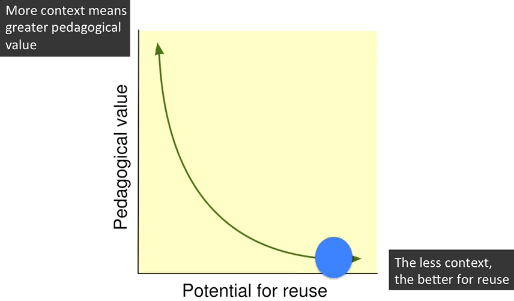

---
categories:
- bad
date: 2016-04-28 13:33:45+10:00
next:
  text: How does BIM allocate blog posts to prompts
  url: /blog2/2016/05/09/how-does-bim-allocate-blog-posts-to-prompts/
previous:
  text: The need for technopedagogues and will it ever go away?
  url: /blog2/2016/04/25/the-need-for-technopedagogues-and-will-it-ever-go-away/
title: Focus, innovation and university IT
type: post
template: blog-post.html
comments:
    - approved: '1'
      author: David Jones
      author_email: davidthomjones@gmail.com
      author_ip: 139.86.69.46
      author_url: https://djon.es/blog/
      content: '
Reblogged this on <a href="https://ictsandpedagogy.wordpress.com/2016/05/02/focus-innovation-and-university-it/"
        rel="nofollow">EDC3100: ICTs and Pedagogy </a> and commented: 

    
        
Just some testing
'
      date: '2016-05-03 07:04:36'
      date_gmt: '2016-05-02 21:04:36'
      id: '3347'
      parent: '0'
      type: comment
      user_id: '1'
    - approved: '1'
      author: jacquelinehowlett
      author_email: jac19701212@y7mail.com
      author_ip: 118.208.105.208
      author_url: http://jacquelinehowlett.wordpress.com
      content: 'Reblogged this on <a href="https://jacquelinehowlett.wordpress.com/2016/05/10/focus-innovation-and-university-it/"
        rel="nofollow">The Blog Belonging to Jacqueline</a> and commented:
    
        For the record, I am pretty sure I am the one who has reblogged other posts more
        than 5 times, so let''s make that 6 times, just for the hell of it!!
    
    
        Reblogging is not plagerism  ("o")/ , I am not passing this off as my own work
        - it links straight back to David! I reblog because I like it and I want to be
        able to find it again quickly!!'
      date: '2016-05-10 21:07:22'
      date_gmt: '2016-05-10 11:07:22'
      id: '3348'
      parent: '0'
      type: comment
      user_id: '0'
    
pingbacks:
    - approved: '1'
      author: Defending University ICT teams | Screenface
      author_email: null
      author_ip: 50.87.248.105
      author_url: http://screenface.net/defending-university-ict-teams/
      content: "[&#8230;] (it&#8217;s a word) with three widely applauded posts from Martin\
        \ Weller, Mark Smithers and\_David Jones\_about the problems with university ICT\
        \ teams. (I guess more precisely it is the problems with [&#8230;]"
      date: '2016-05-01 12:21:22'
      date_gmt: '2016-05-01 02:21:22'
      id: '3345'
      parent: '0'
      type: pingback
      user_id: '0'
    - approved: '1'
      author: Defending University I.T. teams | Screenface
      author_email: null
      author_ip: 50.87.248.105
      author_url: http://screenface.net/defending-university-i-t-teams/
      content: "[&#8230;] (it&#8217;s a word) with three widely applauded posts from Martin\
        \ Weller, Mark Smithers and\_David Jones\_about the problems with university I.T.\
        \ teams. (I guess more precisely it is the problems with [&#8230;]"
      date: '2016-05-02 14:24:23'
      date_gmt: '2016-05-02 04:24:23'
      id: '3346'
      parent: '0'
      type: pingback
      user_id: '0'
    
---
I'm currently reading ["Automate this"](https://en.wikipedia.org/wiki/Automate_This) by Christopher Steiner and came across the following

It's not often that the most important innovations in the world come from the GEs and the Microsofts, the authors point out. They come from entrepreneurs who are focused on that one area with an intensity that bigger companies simply can't bring. Most big firms see their time as best spent on making their current products and processes more efficient....Because of this fact, big companies tend to fall into traps of overmanaging and underinnovating

I don't think this observation is all that earth shattering, I've heard it expressed in many places before. For example, "the authors" Steiner mentions are Kedrosky and Stangler in [this report](http://www.signallake.com/innovation/financialization032311.pdf), which includes the following (also quoted by Steiner)

Startup firms specialize—in a way that larger and more-established companies can barely contemplate—in attacking complex problems in cheaper and more efficient ways

This argument contributes to the problems with University IT services talked about by [Mark Smithers](http://www.masmithers.com/2016/04/we-need-to-rethink-university-it-services/) and [Martin Weller](http://blog.edtechie.net/higher-ed/it-services-we-need-to-talk/). Both Mark and Martin pick up on the unique needs of Universities when it comes to IT, for example Martin writes:

We have to get back to having dialogue, and having IT people who understand the needs of universities (and equally academics who understand the demands of IT systems).

### Can incommensurate parties have dialogue?

In a previous post I argued that a "incommensurate barrier" exists between techno (University IT) and the pedagogue (University teacher). The quote Steiner illustrates the nature of this barrier. IT is focused on efficiency (and other criteria) across the entire organisation, while the teacher specialises (focuses) on the course(s)/student(s) they are teaching. Their focus is on attacking the complex problem of teaching their course in different ways.  Sometimes with a focus on cheaper and more, but also on more effective.

Which, for me, brings to mind Wiley's [reusability paradox](http://cnx.org/contents/2tQZVsKy@19/The-Reusability-Paradox).

Stephen Downes [makes the point](http://www.downes.ca/post/65267) that this divide isn't necessarily inherent in either the technology or education disciplines and I agree. However, at least in my experience (and others that I know) this divide does exist within the very limited confines of University education. Perhaps in any formal education involving large organisations.

###  What can be done?

Good question.  Tim Klapdor [talks about a significant part](https://timklapdor.wordpress.com/2016/04/25/administrivia-and-apis/) of the answer

So rather than seeking to constantly create smarter technologies, what if you simply allowed people more control over how they interacted with them? What if you provided tools that allowed users to move data between systems more easily? What if you got your internal systems to talk to each other in a shared language? What if you made systems more contextually aware? What if instead of investing millions in “better” technology you empowered your users?