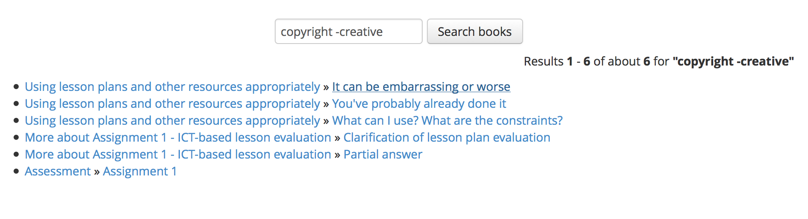

See also: [[blog-home | Home]]

Earlier this year - as part of the [Moodle Open Book project](/blog2/the-moodle-open-book-module-project/) - I [made some changes](/blog2/2016/01/17/finishing-tweaks-to-moodle-book-search-block/) to [Search Book block](https://github.com/stronk7/moodle-block_search_books) for Moodle. The hope being that my institution might install this on it's Moodle installation, which in turn would allow my students and I to search the ~70 Moodle books that make up the "learning path" for my course.

Well it is almost there. It's in the test environment and the following reports on some testing of the Search Book block. In summary, it all appears to be working.

It will be really interesting to see how this changes the behaviour and experience of the student in my course next semester. I believe the current (and past) students would have liked to have this functionality. I know it would have made my tasks a lot easier.

Much thanks to

- [Eloy Lafuente](https://github.com/stronk7) for developing the block in the first place.
- The Moodle devs at USQ who fixed further problems.

(and one other person who I'm sure made a contribution, but I can't find the details)

## Populate a course

First step is to back up my existing course and upload to the test environment. Mainly so that there is a collection of content to search.

## Add the block

By default the "search books" block doesn't appear in the test environment.  Need to add the block.

**Observations**

1. Is there a need to promote this change amongst people who use the Moodle book (and others)? The addition of a new block isn't going to be obvious to most people. There's no point in automatically adding it to all courses, as it's only useful for those people using the Book resource.
2. I'll need to modify my course prep material a bit to include mention of this facility so students actually know that it's there.
3. I wonder whether people will get confused between the "search forum" and "search books" blocks?

## Tests

### Search for something certain to be there: edc3100

As expected quite a few results.  Quick test of search results reveal finding pages that actually contain the search phrase.

Navigating amongst the different pages of search results appear to work.

**Observations:**

- Results are ordered by the order of the books in the course list. e.g. the Assessment material in my course is found near the end of the search because they are located in the final section of the course site.  This will cause some problems with searching for assignment related information.
- Need to rethink/experiment with structure of EDC3100 material

### Search for exactly a phrase: **"creative commons"**

Significantly more results than I initially expected, and some of the search results (e.g. the second result from the above list - shown below) doesn't actually include the search string in the visible text.

But that's because the HTML for the image includes the following HTML. The search string **"creative commons"** appears in the title tag for the image.

\[code lang="html"\]  \[/code\]

 

**Observations**

- This might cause some confusion for users. I wonder how prevalent this might be. How much of the HTML in Moodle books contains meaningful descriptions?
- Potential feature request for an advanced search facility - exclude/include HTML in the search

### Search for a phrase: **creative commons**

As expected returns a few extra results.

### Search for phrase mixed up: **creative copyright**

Appears to work as expected.

### Search for "must include word": **copyright +creative**

Doesn't make any difference to search results to the above.

### Search for content missing a word: **copyright -creative**

 As expected

### Exploratory search: **"assignment 3"**

Searched first for **assignment 3** and got 231 results. Search for **"assignment 3"** return 102 results.

**Observation**

- As expected above the assignment specification for Assignment 3 was search result 100 or so.  This is due to the structure of my course site and the search block's ordering of results by the order they appear in the course.
- Raises questions of whether it's possible or worth it to integrate some form of ranking of results. At the very least if the search phrase appears in the title of  the page, should it be ranked higher?