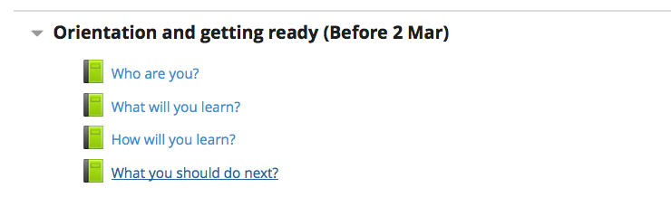

---
categories:
- bad
date: 2016-05-13 12:19:52+10:00
next:
  text: Organizing for Innovation in the Digitized world
  url: /blog/2016/05/16/organizing-for-innovation-in-the-digitized-world/
previous:
  text: Testing out the Moodle search book block
  url: /blog/2016/05/10/testing-out-the-moodle-book-search/
title: '"Testing out the Heatmap #moodle block"'
type: post
template: blog-post.html
---
Following is a quick report on installing and playing with [the Moodle Heatmap block](https://moodle.org/plugins/block_heatmap) by Michael de Raadt. It's inspired by @damoclarky's [Moodle Activity Viewer (MAV)](https://github.com/damoclark/mav). Both tools modify Moodle web pages by overlaying [a heatmap](https://en.wikipedia.org/wiki/Heat_map).

Knowing Michael I'm assuming the block will work perfectly. But I'm particularly interested to see how broadly it works within Moodle. Based on my vague undestanding of Moodle, I believe it will have some limitations that MAV doesn't. This is of particular interest because the theoretical perspective offered by the [SET and BAD mindsets](/blog/2014/09/21/breaking-bad-to-bridge-the-realityrhetoric-chasm/#badset) predicts that Heatmap will have some limitations (and strengths), that MAV doesn't.

### Installation

Heatmap is a Moodle block, so installation should be just a case of downloading the code and installing via a standard Moodle web interface.

Easy and straight forward.  3 settings to configure - I'll stick with the default and done.

### Use

To actually use the block all I should have to do is add the block to a course page and away we go.I'm testing this on a local server that only I use.

Here's the before "Heatmap is turned on" shot covering a small part of the site

Turn editing on, add the block and hey presto the heatmap is displayed.

"Who are you" is more "popular". Been clicked on 67 times by 1 user.  Where as "What you will learn" has only been clicked on 6 times.  The one use is me, the only user that can use this Moodle server.

The Heatmap block looks like this - providing a few extra stats

### On other pages

The question I have is will it work on other pages? Apparently blocks can be made sticky throughout a site.  Actually, have turned it on across the entire Moodle install.

What I'm hoping is that when I view the "Who are you book" I'll see the heatmap appear there. But no.

 

### But there is truth in advertising

The [Heatmap block page](https://moodle.org/plugins/block_heatmap) has the following description

The Heatmap block overlays a heatmap onto a course to highlight activities with more or less activity to help teachers improve their courses.

The links on the book above are not activities.  So, Heatmap is not designed to do this

Where as MAV works on links.

Which highlights some confusion around the naming of MAV. The A for Activity has two possible meanings. In Moodle it means a particular type of plugin. Outside of the Moodle community it could be seen to cover where ever and whatever the students click on.