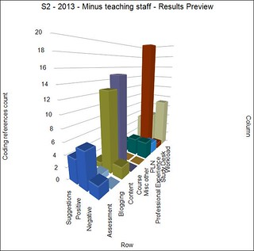
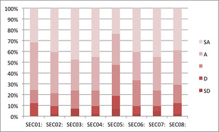

---
categories:
- bad
- casa
date: 2016-05-18 09:09:52+10:00
next:
  text: Automating a SET leaderboard
  url: /blog2/2016/05/23/automating-a-set-leaderboard/
previous:
  text: Organizing for Innovation in the Digitized world
  url: /blog2/2016/05/16/organizing-for-innovation-in-the-digitized-world/
title: Building a CASA for student evaluation of teaching results
type: post
template: blog-post.html
---
I have a problem with my Student Evaluation of Teaching (SET) data!

No. It's not that the results are terrible. Some are good, some not so much. (see the two images in this post)

The problem is that I (and every other academic at my institution) is unable to get access to the data in a form that we can analyse. For example, back in early 2014 I manually extracted the free text comments from the SET data and [analysed them using NVIVO](/blog2/2014/01/15/analysing-some-course-evaluation-comments/) to produce the graph to the right. Click on it to see a larger version. Yea, **manually**.

The following documents the development of what might be called [a kludge](https://en.wikipedia.org/wiki/Kludge) or a work around to this problem. Though being an academic I prefer to define and use my own term of [Context Appropriate Scaffolding Assemblage (CASA)](/blog2/2015/10/01/university-e-learning-removing-the-context-and-adding-the-sediment/#casa). Expect to hear a bit more about that.

The aim is to produce a bit of technology that I can slot into my context that will scaffold my ability to perform a required task in a way that is appropriate. Rather than the current situation where performing the task requires stupid jumping through of unnecessary, manual hoops. Not to mention an organisational structure that over many years has been unable to see the need, let alone do something.

The following outlines (briefly) the process used to create a Greasemonkey script that when I visit a web page containing SET data for my courses, automatically convert that data into a CSV file that I can download. From there I can import that data into which ever anlaysis tool I deem appropriate.

Given all this data has to be stored in a database, it would appear incredibly straight forward for the institution to have already done this. Especially given the emphasis being placed on teaching staff being seen to do something with student feedback. But apparently it's not that simple.

Perhaps this is where I get into trouble for breaking some policy, protocol, or expectation.

## Current situation

The institutional SET system produces a collection of web pages for each offering of a course. Different student cohorts get different pages.

The institutional survey consists of a combination of Likert-type scale questions and free-text questions. In addition, each of the Likert-type scale questions include the option for students to add free-text comments.

The display of the Likert-type scale questions is either in tables or bar graphs, including a comparison against school and university averages. The free text questions are grouped by question and simply listed. Comments added to the Likert-type scale questions are displayed along with the student's response Likert question.

The problems that arise, including:

- Combining, comparing and analysing data between cohorts is difficult.
- Analysing relationships between the responses to different questions is impossible.
- Passing any of the data - especially the free-text comments - into other systems (e.g. Leximancer, NVIVO etc) for further analysis is next to impossible.

##  Ideas for CASA

1. Greasemonkey script to parse the web page
2. Publish to a Google spreadsheet using ideas such as ([this](https://mashe.hawksey.info/2014/07/google-sheets-as-a-database-insert-with-apps-script-using-postget-methods-with-ajax-example/) or [this](http://blog.nparashuram.com/2009/08/screen-scraping-with-javascript-firebug.html)) Could use the name of the course in the web page to add to a different sheet. The spreadsheet could become a single place with all the data.
3. Perl scripts etc could pull the data from there

A potential idea here for Google spreadsheets to become a broad

## Structure of the data

The system provides a number of different views. I'm going to focus on the "print view" which produces a web page that contains all of the information in one page.

The data on that page includes

- Comparative means; Table with various stats from Likert style questions (# ans, response rate, std dev, % positive) and the average for each question for the class, course, school, faculty, campus, and USQ.
- Frequency of responses; For each of the 5 possible responses to a Likert style question the count and percentage when that response was chosen.
- Free text responses For each question (text of question is a heading) where the student could provide a free text response, a list of all the free text responses, including the comment, and if the comment is associated with a Likert style question the response the student chose.

Time to convert that into the HTML elements used.

### Comparative means

The table doesn't have an id.  It's the first table with the class **reportDataTables**. The table consists of rows alternately of class **reportRow** or **reportRowAlt**. Each row has the following cells

1. Question id (in a span) and question text
2. Number of answers
3. Response rate
4. Class average
5. Course average
6. School average
7. Faculty average
8. Campus average
9. USQ average
10. Std Dev
11. % positive

### Frequency of responses

The second table with class **reportDataTables**. Same basic structure. The cells on each row are

1. Question id and text
2. Number of answers
3. Response rate
4. Number of "1" responses
5. Percentage of "1" responses
6. Number of "2" responses
7. Percentage of "2" responses
8. Number of "3" responses
9. Percentage of "3" responses
10. Number of "4" responses
11. Percentage of "4" responses
12. Number of "5" responses
13. Percentage of "5" responses

### Free text responses

Are contained within a div with id **commentCont**. Contains a sequence of divs

1. class **reportCommentsQuestionTitle** contains the question title
2. a follow on div with no class just a style setting padding-right to 10px that contains an unordered list where each element has
    1. The text of the student comment (including their response if associated with likert style question)
    2. A bit of javascript that allows the display of all of the students other responses. **In theory, this could be used to generate each individual student's complete survey response.**

When the user clicks on the "bit of javascript" some additional content gets added.

Actually it appears that there are a collection of divs (hidden) with ids of the format **singleStudentComments7** where 7 seems to be a unique id.  This gives access to all the comments from that student.

Of course, it's not unique.  With 47 responses there are actually 80+ **singleStudentComments#** divs. Going to need to filter.

### Extract the data and share

At this stage, I could quite easily write a Perl script that would extract the data. The problem is that I could share that particular CASA (kludge). The aim here is to put in a bit of extra work and develop a CASA that others could (fairly easily) adopt. So [Greasemonkey](http://www.greasespot.net/) it is.

Using Greasemonkey to extract that data is fairly simple (once I refresh my memory), but doing something with the data is a little more difficult, but there appear to be solutions such as [this one](https://github.com/eligrey/FileSaver.js/) that will allow a Greasemonkey script to generate a text file to download.

###  Use the data

A text file is being produced that contains three sets of data in CSV file format.  The intent is that this is a simple default format that people can re-purpose into other systems for another analysis.

Time to test it by importing into Excel.  Fix up the delimiting characters and replace some others.

And hey presto it works. The graph to the right is the simplest example of finally being able to analyse this data directly. Of course, for the likert style questions I still don't have access to the raw data. But at the very least I can start comparing summary data from different modes and offerings of the same course. More interestingly, I can now finally easily get access to the student responses to the free text questions.

But that's a task for another day. (FYI: SEC05 is the question "I found the assessmen tin this course reasonable")