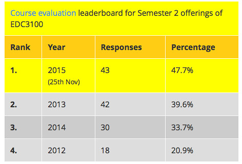
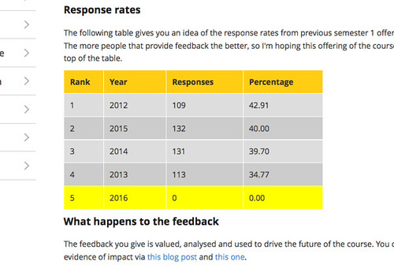

See also: [[blog-home | Home]]

End of semester 1 is fast approaching. One of the end of semester tasks is encouraging students in courses to complete the institutional Student Evaluation of Teaching (SET) surveys. Last year I experimented with a "SET leaderboard" (see the following image). It's a table that lists the response rates on the SET surveys for the current and previous offerings of the course ranked according to the percentage response rate.

At my institution the SET surveys open quite a few weeks before end of semester and remain open until just before the release of final results. While the surveys are open teaching staff cannot see any of the responses. However, we can see the number of responses (**Update:** at least until this year when they introduced a new system that removed this functionality **Update on the update:** Nope, looks like the new system does support it, [PEBKAC](/blog2/2016/03/02/pebkac-mental-model-mismatch-and-ict/)). This was how I was able to update the leaderboard for the current offering every couple of days. The leaderboard was visible to students whenever they visited the course website. Making the current response rate visible.

As the above image shows, it seems to have been a fairly successful approach.

### Automating the process

That success means has generated some interest from others in replicating this approach. The problem is that doing so requires some familiarity with HTML and tables. The standard GUI HTML editors don't do a great job of supporting the re-ordering of table rows. To help others adopt this practice, and also to reduce my load a bit, the following explores if/and how the process can be slightly automated.

The plan is to write some Javascript that can be included in a Web page that will automatically generate a table like the above (with the correctly ordered rows) based on data from a Google spreadsheet.

The implication being that all I (or some other academic) needs to do is to keep the Google spreadsheet updated and the script will take care of the rest. It also means that I can create multiple copies of the leaderboard in different locations, but only need to modify the data in one source.

In a perfect world, the institutional SET survey system would have an API that could be used to extract the data. Thereby removing the need for the academic to manually copy the response rate to a Google spreadsheet.

Of course, after implementing all of the work below, it appears that the new institutional system for administering the SET surveys has removed the functionality that allowed course examiners to see how many students had responded so far.

### Reading data from a Google spreadsheet

There are a variety of ways this can be done, [the Sheetrock library](http://chriszarate.github.io/sheetrock/) looks like an useful approach.

Got the sample working locally.  Connect it to my spreadsheet. Need to make the spreadsheet public and use the same URL I use, not the "shareable link" to allow others view.

The neat thing is that the Google query language allows the data to be pre-ordered. So the table is automatically in the right order.

### Make it look pretty

Next step is to style it, in particular to highlight the current offering.

Applying the existing styles is a first step. Highlighting the current year. All good.

### Make it real

Now update it with the data that I'll be using this term, and use the Google spreadsheet to auto-calculate the percentage.  Simple, the hardest part of this was the manual process for gathering the data to put in the spreadsheet.

Time to test it in Moodle. All seems to work. Here's a version within a Book chapter. This should work on any web page. Each time the page below is reloaded the Javascript will update the table based on the latest data in the Google spreadsheet.  The current semester is always highlighted, but it will move up and down the ranking based on its response rate.

 

###  What's required

To get this to work, you need to have

1. A Google spreadsheet that has been made public. This allows anyone (including the script) to read the contents, but they can't change anything.  The spreadsheet should have a row for each offering of the course with the following columns:
    1. Year - of offering
    2. Responses - number of responses
    3. Percentage - the % of total enrolment that has responded I've implemented this using a spreadsheet formula using an extra column Total Enrolment.
    4. Current - a **yes** should go in the row that matches the current year.
2. A link to a modified version of the sheetrock library. The modification is a function that generates the table.
3. A table element that has the id **SETleaderboard** and has four columns: Rank, Year, Responses, Percentage
4. The following javascript (Which is still a little rough)

 

\[code lang="javascript"\] var mySpreadsheet = 'some\_url\_here'; $('#switch-hitters').sheetrock({ url: mySpreadsheet, query: &quot;select A,B,C,D order by C desc&quot;, callback: myCallback }); \[/code\]