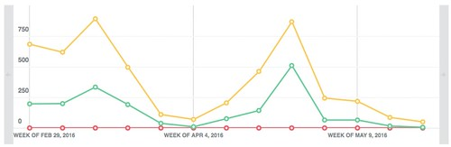

First semester for 2016 is just about over. Time to reflect back on what's happened with EDC3100, ICT and Pedagogy for this semester.

Overall, I feel the course is in a better place than it was last year. But there remains some significant room for improvement.

It will be interesting to see what the students think. It will be a couple of months until I see their feedback.

## Changes made this semester

A range of different changes were made this semester.

### New module 1 and assignment 1

Historically, EDC3100 starts with a bang and a lot of work - too much work - for students. The old assignment 1 required students to expend a fair bit of time getting to now a new technology. The return on that investment wasn't as much as it might have been, hence students disliked it. This semester Assignment 1 and the supporting Module 1 was completely re-designed with an intent to reduce student workload and focus on a few particular outcomes.

In short, that appears to have worked okay. Workload reduced.  The content and activities for Module 1 could use some enhancement to make their purpose clearer and more engaging. The weekly release of Module 1 was't great.

### Assignment 1 as an Excel spreadsheet

Assignment 1 was designed with students using an Excel spreadsheet for at least three reasons:

1. Provide students with more experience using an application type they appear not to have used a great deal.
2. Ensure that the insights generated by both students and markers could be analysed via computer programs.
3. Using Excel to reduce the workload for markers.

The spreadsheet worked reasonably well. The checklist within the spreadsheet requires some refinement. As does some aspects of the rubric. The duplication of a Word-based coversheet needs to be removed.

Analysing the submitted spreadsheets via software has commenced, but hasn't been completed.  In part this is due to Moodle not providing a good way of extracting all marked files. This has been worked around - thanks to the good folk at LSS - but time is an issue. More work needs to be done on the analysis and sharing of insights gained from it.

### The return of Toowoomba lectures

In 2015 there were no Toowoomba lectures and as a result the SET results for 2015 suffered. Students missed the lectures. In 2016 they were back and were streamed live using Zoom. The lectures and way stations were also more effectively integrated into the Study Desk structure.

The lectures were okay and there were folk attending via Zoom.  Overall, however, the lectures need work. The exact relationship between the lectures and the learning paths need to be thought about. Should it be duplicate? A complement?

Recordings of the lectures (hosted on Vimeo) show a greater amount of usage than I expected to see. 

### Refinements to later modules

A range of minor to more major refinements were made, especially for Module 3. These are generally an improvement over what went before.

## The not so good

A list of the not so good experience this semester include:

- The weekly release of Module 1.
- My absence in Week 4 due to a conference.
- The difficulty in finding material within the learning paths. The availability of the Moodle book search block from next semester will help massively with this problem.
- Assignment 2 has the students thinking more about unit design than ICT and pedagogy.
- A couple of major "marking outages" leading to late return of marked assignments.
- The quality and quantity of feedback provided to students. This is a two-edged sword. Feedback on assignments was variable. Feedback via some of the study desk activities and discussion forums was quite good.
- The on-going confusion amongst at least quite a few students around the learning journal and the marking of it.
- Marking of assignments still requires too much work from the markers.

## To do

All of this (including the following) will need to be revisited once the student feedback has been given, released to me, and considered.

Beyond some of what is mentioned above and based on what I current know, the following need to be done:

1. Use analytics to explore how students are engaging with the learning paths, including the ability to produce an ePub version and/or print them.
2. Analyse the Assignment 1 data and identify what new activities/resources this might be useful for.
3. Better integrate the recorded lectures and other components with the learning paths.
4. Think about a re-design of Module 2 and Assignment 2.