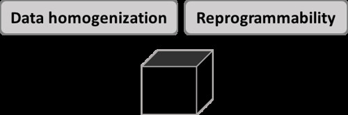
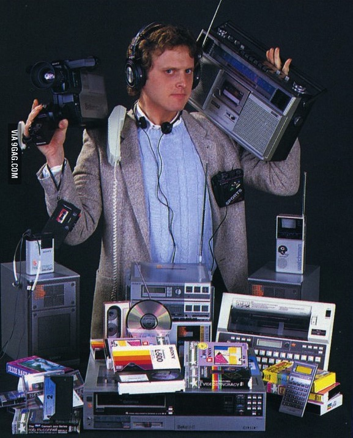

---
categories:
- bad
- digitalignorance
date: 2016-06-27 09:35:23+10:00
next:
  text: The nature of digital technology? Part 2
  url: /blog2/2016/06/28/the-nature-of-digital-technology-part-2/
previous:
  text: Learn to code for data analyis - step 1
  url: /blog2/2016/06/19/learn-to-code-for-data-analyis-step-1/
title: What is the nature of digital technology? Part 1
type: post
template: blog-post.html
comments:
    - approved: '1'
      author: lenandlar
      author_email: lenandlar@gmail.com
      author_ip: 190.108.211.115
      author_url: null
      content: "Thanks for starting this. Looking forward to more. One thing I'd say is\
        \ that most of digital technologies remain a black box for many many educators\
        \ because they simply use it as is largely because well most of the technologies\
        \ do not allow reprogramming.\n\n I'm not suggesting educators make their own\
        \ technology tho that'd be cool. But when I see the stuff you do with noodle for\
        \ example I think that's a model that could work very well."
      date: '2016-06-27 20:33:10'
      date_gmt: '2016-06-27 10:33:10'
      id: '3368'
      parent: '0'
      type: comment
      user_id: '0'
    - approved: '1'
      author: David Jones
      author_email: davidthomjones@gmail.com
      author_ip: 101.177.172.248
      author_url: https://djon.es/blog/
      content: We're in firm agreement then, about the value of tinkering.  That is one
        of the arguments I'm going to make in the next post.  It will also touch on the
        black box problem.
      date: '2016-06-28 07:05:14'
      date_gmt: '2016-06-27 21:05:14'
      id: '3369'
      parent: '3368'
      type: comment
      user_id: '1'
    - approved: '1'
      author: elketeaches
      author_email: elkeclarissa@hotmail.com
      author_ip: 101.183.230.143
      author_url: http://elketeaches.wordpress.com
      content: 'Hey David.
    
    
        Thanks for explaining data homogenisation here, this is the best explanation I''ve
        read in a while.
    
    
        For far too long I suspect that there have been too many ''middle men'' between
        digital programmers and system''s users, thereby developing a disconnect between
        them through a general attitude of disrespect. I have read that in the IT industry
        there has been a growing trend of removing the traditional ''Business Analyst''
        role and moving to a Programmer (speaks to) User model. However, educational organisations
        are usually behind industry trends and given the general mistrust shown to the
        users (teachers) the ''middle men'' still exist and still help create systems
        that don''t work for ''every'' user &amp; can''t be updated by the user.'
      date: '2016-07-02 14:27:04'
      date_gmt: '2016-07-02 04:27:04'
      id: '3371'
      parent: '0'
      type: comment
      user_id: '0'
    - approved: '1'
      author: David Jones
      author_email: davidthomjones@gmail.com
      author_ip: 101.177.172.248
      author_url: https://djon.es/blog/
      content: 'Each time I practice it''s getting better.  By the time of the presentation
        it might be polished a bit more.  Need to get some of the later parts of this
        completed, some more interesting stuff comes up there.
    
    
        For a long time I''ve thought that the business analyst role is a problem. Adds
        another layer of interpretation that can cause problems.  That''s a general observation,
        there are always examples of where that doesn''t always work - simply because
        of the distance between the user and the programmer.
    
    
        What I find a little frightening is that some organisations are doing away with
        programmers all together. They''ve forgone the protean nature of digital technology.'
      date: '2016-07-02 16:29:22'
      date_gmt: '2016-07-02 06:29:22'
      id: '3372'
      parent: '3371'
      type: comment
      user_id: '1'
    
pingbacks:
    - approved: '1'
      author: The nature of digital technology? Part 2 &#8211; The Weblog of (a) David
        Jones
      author_email: null
      author_ip: 192.0.100.241
      author_url: https://davidtjones.wordpress.com/2016/06/28/the-nature-of-digital-technology-part-2/
      content: '[&#8230;] is a followup to yesterday&#8217;s Part 1 post and a continuation
        of an attempt to describe the nature of digital technology and to think about
        [&#8230;]'
      date: '2016-06-28 11:38:18'
      date_gmt: '2016-06-28 01:38:18'
      id: '3370'
      parent: '0'
      type: pingback
      user_id: '0'
    - approved: '1'
      author: What is the nature of digital technology? Part ...
      author_email: null
      author_ip: 185.82.148.10
      author_url: http://www.scoop.it/t/21st-century-school-libraries-by-sarah-betteridge/p/4067109768/2016/08/03/what-is-the-nature-of-digital-technology-part-1
      content: '[&#8230;] Formal education in most of its forms is still struggling to
        effectively harness digital technology to enhance and transform learning and teaching.
        Even with a history for 40+ years of various attempts. The reasons for this are
        numerous and diverse. The following is an attempt to look at one of the reasons.
        A reason, at&hellip;&nbsp; [&#8230;]'
      date: '2016-08-03 14:08:32'
      date_gmt: '2016-08-03 04:08:32'
      id: '3373'
      parent: '0'
      type: pingback
      user_id: '0'
    
---
Formal education in most of its forms is still struggling to effectively harness digital technology to enhance and transform learning and teaching. Even with a history for 40+ years of various attempts. The reasons for this are numerous and diverse. The following is an attempt to look at one of the reasons. A reason, at least to me, which seems to have be somewhat ignored.

The technology. Does digital technology have a unique nature/set of capabilities/affordances that sets it apart from other types of technology? If so, what is it? What might understanding the nature of digital technology have to say about how formal education is attempting to use it to transform learning and teaching?

The following is a first attempt to frame some thinking that is moving towards [a presentation](/blog2/2016/05/30/digital-technology-ignorance-and-its-implications-for-learning-and-teaching/) I'll be giving in a couple of weeks.  This is only the first step, there'll be follow up posts over the coming week or two. These posts will aim to develop my own understanding of a model that aims to capture the nature of pervasive digital technology. It's a model that will draw largely on the work of Yoo, Boland, Lyytinen, and Majchrzak (2012) combined with a few others (e.g. Papert, 1980; Kay, 1984; Mishra & Koehler, 2006). That model will then be used to look at current attempts within formal education to use digital technology for learning and teaching.

## Views of Digital Technology

For most people digital technology is a black box. Regardless of what type of digital technology, it's a black box.

 Orlikowski and Iacono (2001) label this the tool view of technology which

represents the common, received wisdom about what technology is and means. Technology, from this view is the engineered artifact, expected to do what its designers intend it to do. (p. 123)

They go onto cite work by Kling and Latour to describe this view and its' limitations before going on to examine 4 other views of the IT artifact. The motivation for their work is that "The IT artifact itself tends to disappear from view, be taken for granted, or is presumed to be unproblematic once it is build and installed" (Orlikowski & Iacono, 2001 p. 121). They go proceed to describe 4 additional "broad metacategories" of the IT artifact "each representing a common set of assumptions about and treatments of information technology in IS research" (Orlikowski & Iacono, 2001 p. 123). Metacategories or views of technology that draw on a range of perspectives outside of their discipline such as Actor-Network Theory etc.

My attempt here at opening up the black box of digital technology perhaps best fits with Orlikowski & Iacono's (2001) fourth view of technology - the _computational_ view - where the interest is "primarily in the capabilities of the technology to represent, manipulate, store, retrieve, and transmit information, thereby supporting, processing, modeling, or simulating aspects of the world" (Orlikowski & Iacono, 2001 p. 127). My focus here is on trying to explore what is the unique nature of digital technology. Not as an end in itself, but as a starting point that will draw on (at least) the other four views of technology suggested by Orlikowski & Iacono (2011) in attempting to understand and improve the use of digital technology within formal education.

## Fundamental properties of digital technology

Yoo, Boland, Lyytinen, and Majchrzak (2012) argue that the "fundamental properties of digital technology are reprogrammability and data homogenization" (p. 1398) 

### Data homogenization

Whether a digital technology is allowing you to talk to friends via Skype (or smartphone or...); capture images of snow monkeys; listen to Charlie Parker; measure the temperature; analyse the the social interactions in a discussion forum; or, put your students to sleep as you read from your powerpoint slides (which they're viewing via some lecture capture system) all of the data is represented as a combination of 0s and 1s. All the data is digital. Since all digital technologies deal with 0s and 1s, in theory at least, all digital technologies can handle all data.The content has been separated from the medium (Yoo, Henfridsson & Lyytinen, 2010).

Analog technologies, on the other hand, have a tight coupling between content and medium. If you had bought "Born in the USA" on a record, to play it on your Walkman you had to record it onto a cassette tape. Adding it as background to that video you recorded with your video camera involves another translation of the content from one medium to another.

Data homogenization is the primary reason why you - as per the standard meme - can now carry all of the following in your pocket.

 

### Reprogrammability

It's not just the content that is represented digitally with digital technology. Digital technology also stores digitally the instructions that tell it how and what to do. Digital technologies have a processing unit that will decode these digital technologies and perform the task they specify. More importantly those instructions can - in the right situations - be changed. A digital technology is reprogrammable. What a digital technology offers to the user does not need to be limited by its current function.

## Questions  for formal education?

The above is but the first step in building a layered model for the nature of digital technology. The intent is that each layer should include a couple of questions related to how formal education is using digital technology. The following are a rough and fairly weak initial set. Really just thinking out loud.

### Where is the convergence?

If data homogenisation is a fundamental property of digital technology, then why isn't there more convergence within formal education's digital technologies? Why is the information necessary for learning and teaching kept siloed in different systems?

When I'm answering a student question in the LMS, why do I need to spend 20 minutes heading out into the horrendous Peoplesoft web-interface to find out in which state of Australia the student is based?

### Should we buy? Should we build?

I wonder if there is a large educational institution anywhere in the world that hasn't at some stage, somewhat within the organisation had the discussion about whether they should buy OR build their digital technology? I wonder if there's a large educational institution anywhere in the world that hasn't felt it appropriate to lean heavily toward the buy (and NOT build) solution?

What is gained and/or lost by ignoring a fundamental property of digital technology?

## References

Orlikowski, W., & Iacono, C. S. (2001). Research commentary: desperately seeking the IT in IT research a call to theorizing the IT artifact. _Information Systems Research_, _12_(2), 121–134.

Yoo, Y., Henfridsson, O., & Lyytinen, K. (2010). The new organizing logic of digital innovation: An agenda for information systems research. _Information Systems Research_, _21_(4), 724–735. doi:10.1287/isre.1100.0322

Yoo, Y., Boland, R. J., Lyytinen, K., & Majchrzak, A. (2012). Organizing for Innovation in the Digitized World. _Organization Science_, _23_(5), 1398–1408.