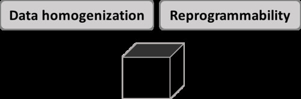
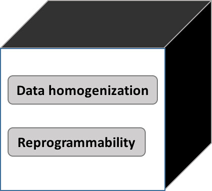
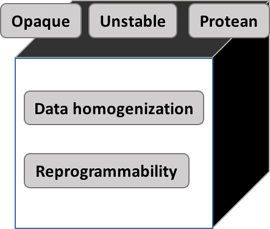
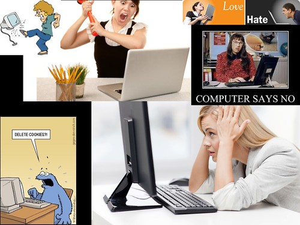

This is a followup to yesterday's [Part 1 post](/blog2/2016/06/27/what-is-the-nature-of-digital-technology-part-1/) and a continuation of an attempt to describe the nature of digital technology and to think about what this might reveal about how and what is being done by formal education has it attempts to use digital technology for learning and teaching. This post moves from the fundamental properties of digital technologies (yesterday's focus) to what some suggest is that nature of digital technologies.

**Note:** this is not the end of this series. There's a fair bit more to go (e.g. this is all still focused on a single black box/digital technology, it hasn't touched on what happens when digital technology becomes pervasive). I'm not entirely comfortable with the use of "nature" at this level, but the authors I'm drawing on use that phrase.

## Recap and revision

[Yesterday's post](/blog2/2016/06/27/what-is-the-nature-of-digital-technology-part-1/) aimed to open up the black box of digital technology a touch by explaining the two fundamental properties (data homogenization and reprorammability) of digital technology proposed by Yoo, Boland, Lyytinen, and Majchrzak (2012).  This was original represented using this image.

I don't think the image makes the point that these are fundamental properties of the black box, the digital technology. Hence, the following revised image. The idea being is that data homogenization and reprogrammability are properties that are "baked into" digital technology.  Identifying these properties has opened up the black box a little. This is going to be useful as I attempt to develop the model of digital technology further. 

## Nature of digital technologies

The aim here is to move up a bit from the fundamental properties to look at the "nature" of digital technologies.  As mentioned above, I'm not entirely happy with the use of the phrase "nature" at this level, but I don't have a better term at the moment, and I'm drawing on Koehler and Mishra (2009) here who argued (emphasis added)

By their very nature, newer digital technologies, which are **protean**, **unstable**, and **opaque**, present new challenges to teachers who are struggling to use more technology in their teaching. (p. 61)

As they argue the combination of protean, unstable, and opaque makes the use of digital technology by teachers (and others) difficult. The following seeks to expand and explore that a bit more.

The following representation (I'm not a designer by any stretch of the imagination) is attempting to illustrate that this "nature" of digital technology sits above (or perhaps build upon or become possible due to) the fundamental properties introduced in the last post.

### Unstable

In this context, Koehler and Mishra (2009) define unstable and "rapidly changing" (p. 61). Which version of the iPhone (insert your preference) do you have? The combination of data homogenization and reprogrammability mean that digital technologies can be changed, and other external factors tend to make sure that they do. Commercial pressures mean that consumer digital technologies keep changing. Other digital technologies change to improve their functionality.

But beyond that is the argument that digital technology shows exponential growth. Bigum (2012) writes

To most, the notion of an exponential is something that belongs in a mathematic’s classroom or perhaps may somehow be related to home loan repayments. Exponential change is not something with which we have had to become familiar, despite the fact of Moore’s Law and other Laws that map the growth of various digi- tal technologies and which tell us that the price of various digital technologies is halving roughly every 18 months to 2 years and that their performance is doubling on about the same time scale....The fact is that the various digital technologies that end up in laptop computers, mobile phones, and an increasing number of things that we tend not to associate with computers, are still doubling their performance and halving their cost in fixed time periods, i.e. we are seeing exponential growth. (p. 32-33)

### Opaque

Koehler and Mishra (2009) draw on Turkle (1995) to define opaque as "the inner workings are hidden from users". Turkle (1995) talks about people having "become accustomed to opaque technology". Meaning that as the power of digital technologies have increased we no longer see the inner workings of the technology. She suggests that computers of the 1970s "presented themselves as open, 'transparent', potentially reducible to the underlying mechanisms". Perhaps more importantly she argues that

their computer systems encouraged them to represent their understanding of the technology as knowledge of what lay beneath the screen surface. They were encouraged to think of understanding as looking beyond the magic to the mechanism. [(p. 23)](https://books.google.com.au/books?hl=en&lr=&id=auXlqr6b2ZUC&oi=fnd&pg=PA9&dq=the+inner+workings+are+hidden+from+users+Turkle+1995&ots=zXp9QNYo42&sig=4k7KNNhROggwXzP1bQr4L2k4eYU#v=onepage&q=opaque&f=false)

Earlier this year, as part of an introductory activity, I asked students to find and share an image (or other form of multimedia) that captured how they felt about digital technologies. The following captures just some of the images shared, and also captures a fairly widespread consensus of how these pre-service educators felt about digital technology. I'm guessing that it resonates with quite a few people.  The increasingly opaque nature of digital technology combined with our increasing reliance on digital technologies in most parts of our everyday life would seem to have something to do this sense of frustration. Ben-Ari and Yeshno (2006) found that people with appropriate conceptual models of digital technologies were better able to analyse and solve problems. While learners without appropriate conceptual models were limited to aimless trial and error. I suggest that it is the aimless trial and error, due to a inappropriate conceptual model of how a digital technology works, is what creates the feelings of frustration illustrated by the above image.

### Protean

This is the characteristic that I've written the most about.  The following two paragraphs are from the first version of [Jones and Schneider (2016).](/blog2/2016/02/02/what-if-our-digital-technologies-were-protean-implications-for-computational-thinking-learning-and-teaching/)

The commonplace notions of digital technologies that underpin both everyday life and research have a tendency to see them “as relatively stable, discrete, independent, and fixed” (Orlikowski & Iacono, 2001, p. 121). Digital technologies are seen as hard technologies, technologies where what can be done is fixed in advance either by embedding it in the technology or “in inflexible human processes, rules and procedures needed for the technology’s operation” (Dron, 2013, p. 35). As noted by Selwyn and Bulfin (2015) “Schools are highly regulated sites of digital technology use” (p. 1) where digital technologies are often seen as a tool that is: used when and where permitted; standardised and preconfigured; conforms to institutional rather than individual needs; and, a directed activity. Rushkoff (2010) argues that one of the problems with this established view of digital technologies is that “instead of optimizing our machines for humanity – or even the benefit of some particular group – we are optimizing humans for machinery” (p. 15). This hard view of digital technologies perhaps also contributes to the problem identified by Selwyn (2016) where in spite of the efficiency and flexibility rhetorics surrounding digital technologies, “few of these technologies practices serve to advantage the people who are actually doing the work” (p. 5). Digital technologies have not always been perceived as hard technologies.

Seymour Papert in his book Mindstorms (Papert, 1993) describes the computer as “the Proteus of machines” (p. xxi) since the essence of a computer is its “universality, its power to simulate. Because it can take on a thousand forms and can serve a thousand functions, it can appeal to a thousand tastes” (p. xxi). This is a view echoed by Alan Kay (1984) and his discussion of the “protean nature of the computer” (p. 59) as “the first metamedium, and as such has degrees of freedom and expression never before encountered” (p. 59). In describing the design of the first personal computer, Kay and Goldberg (1977) address the challenge of producing a computer that is useful for everyone. Given the huge diversity of potential users they conclude “any attempt to specifically anticipate their needs in the design of the Dynabook would end in a disastrous feature-laden hodgepodge which would not be really suitable for anyone” (Kay & Goldberg, 1977, p. 40). To address this problem they aimed to provide a foundation technology and sufficient general tools to allow “ordinary users to casually and easily describe their desires for a specific tool” (Kay & Goldberg, 1977, p. 41). They aim to create a digital environment that opens up the ability to create computational tools to every user, including children. For Kay (1984) it is a must that people using digital technologies should be able to tailor those technologies to suit their wants, since “Anything less would be as absurd as requiring essays to be formed out of paragraphs that have already been written” (p. 57). For Richard Stallman (2014) the question is more fundamental, “To make computing democratic, the users must control the software that does their computing!” (n.p.).

## Implications for formal education

The above - at least for me - opens up a range of questions about how formal education uses digital technology for learning and teaching. A small and rough list follows.

### Unstable changes everything

If digital technologies are fundamentally different and if they are unstable (rapidly - even exponentially - changing) then everything will change.  Bigum (2012)

Taken together and without attempting to anticipate how any of these technologies will play out, it is nevertheless patently clear that doing school the way school has always been done or tweaking it around the edges will not prepare young people who will grow up in this world (p. 34)

Bigum (2012) then draws on this from Lincoln

The dogmas of the quiet past, are inadequate to the stormy present. The occasion is piled high with difficulty, and we must rise - with the occasion. As our case is new, so we must think anew, and act anew. We must disenthrall ourselves, and then we shall save our country

The increasing neo-liberal/corporatisation fetish within formal education on efficiency etc. appears to be placing an emphasis on refining what we already do. Dropping the dogmas of the quiet past would mean admitting that people had it wrong....etc.  It's difficult to see how such change will happen.

### Moving beyond recipe followers?

Since digital technology is increasingly opaque, it is increasingly difficult for people to develop conceptual models of how digital technology works. As a result, many people have developed recipes that they follow when using digital technology. i.e. they know that if they press this button, select that menu, and check that box this will happen. They don't know why, they just know the recipe.

Increasingly, a lot of the training and documentation provided to help users use digital technologies are recipes. They are step-by-step examples (with added screen shots ) of the recipe to follow to achieve this specific goal. If they don't have the recipe, or the recipe doesn't work then they are stuck. They don't have the conceptual models necessary to analyse and solve problems.

What can be done to digital technologies and the methods used to support them to help people develop better conceptual models? If you do that, does that improve the quality of learning and teaching with digital technology?

If your documentation and training is a collection of recipes, why aren't you automating those recipes and building them into the technology? i.e. making use of the protean nature of digital technology?

### What or whom drives the change? What is the impact?

My institution has adopted Moodle, an open source LMS. One of the benefits of open source is that it is meant to be more protean. It can change. The [Moodle release calendar](https://docs.moodle.org/dev/Releases#General_release_calendar) shows the aim of releasing a major upgrade of Moodle every six months. It appears that my institution aims to keep reasonably up to date with that cycle. This means that every 6 months a change process kicks in to make staff and students aware that a change is coming. It means that every 6 months or so it is possible that staff and students will find changes in how the system works. Changes they didn't see the need for.

To make matters worse, since most people are recipe followers, even the most minor of changes cause confusion and frustration. Emotions that make people question why this change has been inflicted upon them. An outcome not likely to enhance acceptance and equanimity.

Perhaps if more of the changes being made responded to the experiences and needs of those involved, change might be more widely accepted. The problem is that because most institutional digital technologies aren't that protean, changes can only be made by a small number of specific people who are in turn constrained by a hierarchical governance process. A situation that might lead a [problem of starvation](/blog2/2015/06/16/types-of-e-learning-projects-and-the-problem-of-starvation/) where the priority is given to  large-scale, institutional level changes, rather than changes beneficial to small numbers of specific situations.

Would mapping who and why changes are being made to the digital technologies reveal this starvation? How can institutional digital technologies be made more protean and more able to respond to the needs of individuals? What impact would that have on learning and teaching? Is this sort of change necessary to respond to exponential growth?

### Opaque technology creates consumers, not producers

Kafai et al (2014) talk about the trend within schools of transforming "computer class" into the study of how to use applications such as  word processors and spreadsheets. Approaches which they argue

These technology classes promote an understanding of computers and software as black boxes where the inner workings are hidden to users. (p 536)

In contrast they argue that

working with e-textiles gives students the opportunity to grap- ple with the messiness of technology; taking things apart, putting them back together, and experimenting with the purposes and functions of technology make computers accessible to students

Which importantly has the effect of

by engaging learners in designing e-textiles, educators can encourage student agency in problem solving and designing with technologies. This work can disrupt the trend that puts students on the sidelines as consumers rather than producers of technology

Currently, most digital learning environment within formal education tend to lean towards being _opaque_ and **not** _protean_. Does this contribute toward a cadre of learners and teachers that see themselves as consumers (victims?) of digital technologies for learning and teaching? Would the provision of a digital learning environment that is transparent and protean help encourage learner and teacher agency? Would this transform their role from consumer to producer? Would this improve the use of digital technology for learning and teaching within formal education?

## References

Ben-Ari, M., & Yeshno, T. (2006). Conceptual Models of Software Artifacts. _Interacting with Computers_, _18_(6), 1336–1350. doi:10.1016/j.intcom.2006.03.005

Kafai, Y. B., Fields, D. A., & Searle, K. A. (2014). Electronic Textiles as Disruptive Designs: Supporting and Challenging Maker Activities in Schools. _Harvard Educational Review_, _84_(4), 532–556,563–565. doi:10.17763/haer.84.4.46m7372370214783

Koehler, M., & Mishra, P. (2009). What is Technological Pedagogical Content Knowledge (TPACK)? _Contemporary Issues in Technology and Teacher Education_, _9_(1), 60–70. Retrieved from http://www.editlib.org/p/29544/

Yoo, Y., Boland, R. J., Lyytinen, K., & Majchrzak, A. (2012). Organizing for Innovation in the Digitized World. _Organization Science_, _23_(5), 1398–1408.