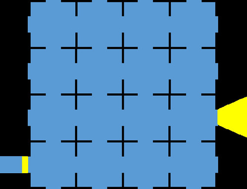
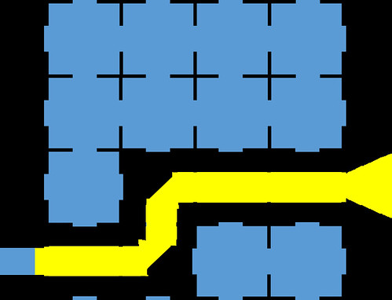

See also: [[blog-home | Home]]

Way back in 1986 I started studying undergraduate computer science at the University of Queensland. One of our first year programming assignments was to use the fancy, new Macintosh computers to add some code to a game.  I'm looking for pointers to the name of the game and any online resources about it. A working version on some contemporary platform would be great.

Any help more than welcome.

### The game

The game was played with a grid. Typically 4 by 4 grid that looked something like this.

The idea is that there were random mirrors hidden throughout the grid. The aim of the game was to figure out what type of mirrors were located where within the grid. To do this you had a flashlight that you could shine through one of the holes on the outside. The light would exit the grid at another location, depending on the location and type of mirrors it would encounter. A bit like this 

There were three types of mirrors. Two diagonal mirrors / and ; and, a X mirror.  The diagonal mirrors would change the direction of the light depending on how the light struck the mirror. The X mirror would direct the light back the way it came.

The following image shows one potential layout of mirrors to explain how the light behaved in the above image.

The light travels straight ahead until it hits the first diagonal mirror. This mirror causes the to change direction directly up. Where it immediately hits another diagonal mirror which send the light traveling right again until it exits the grid.