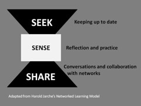

See also: [[blog-home | Home]]

The following documents the planning of an ["installfest"](https://en.wikipedia.org/wiki/Installfest) for the course EDC3100. Implementation and reflection will come later.

## Rationale

 "[My Three Words for 2011](https://www.flickr.com/photos/cambodia4kidsorg/5318577541/)" ([CC BY 2.0](https://creativecommons.org/licenses/by/2.0/)) by  [cambodia4kidsorg](https://www.flickr.com/people/cambodia4kidsorg/) 

The course encourages/requires that students to modify their learning process in the course to engage in [Jarche's seek/sense/share framework](http://jarche.com/2014/02/the-seek-sense-share-framework/) using a combination of a personal blog, Diigo, and the Feedly feed reader.

This is a radical departure for most students and a challenge for most. It results in a lot of time expended at the start of semester. For example, a past students [shared her experience](/blog2/2016/05/30/early-thoughts-on-s1-2016-offering-of-edc3100/#comment-7657)

I spent a lot of time trying to work out blogging, Diigo and Feedly and to be honest I am still only using the bare minimum with blogging

Not a good outcome and apparently what has been used previously, doesn't work. So an alternative is required.

As it happens, the same student also suggested a possible solution

My thoughts on changes or additions to the course that I would have found useful, would have been to come to a workshop near the start.

I've been pondering this suggestion and how it might work with the next offering of the course that has around 100 online students. Being of a certain age I remember installfests and have been wondering if that might be a useful model.    Leading to questions such as..

Can something like an installfest be run in a online video-conference space? Will students participate? Will it help? How to organise it within existing constraints?

## Design thoughts

### Linux Installfest HOWTO

Interestingly, I came across the Linux Documentation Project's [Linux Installfest HOWTO](http://www.tldp.org/HOWTO/Installfest-HOWTO/introduction.html), the following starts from that document.

The location will be virtual, not physical. So advice about preparing [the physical location](http://www.tldp.org/HOWTO/Installfest-HOWTO/beforeduringandafter.html) doesn't quite apply. However, the features of the [Zoom service](https://zoom.us/) will need to considered.

**Consideration:** Might the "other room" feature of Zoom be useful for organising people at different stages?

Bringing up the major constraint, there's likely to be only me to fulfill the various [suggested roles](http://www.tldp.org/HOWTO/Installfest-HOWTO/roles.html). With more time I might have been able to organise additional help, but let's not talk about the one week missing between semester 1 and semester 2.

**Consideration:** Can the session structure be informed by the identified roles? e.g. a receptionist role could be taken by the initial part of the session which focuses on welcoming people to the space. Might also be useful to explicitly ask for volunteers who are a little further ahead than others, volunteers who might take on a Tier 1 support role.

**Consideration:** Can a Google document/sheet be used to get an idea of people's knowledge, experience and comfort level with the various tools? Is completing this sheet part of the entry process? Perhaps something based on [the data sheet](http://www.tldp.org/HOWTO/Installfest-HOWTO/datasheet.html)?

**Consideration:** Have a space at the end for reflection? Perhaps in part people could do this on their blog?  It might even be a good exercise to start them making connections etc.  To see all the tools working together.

### Fit with the course requirements

Course requirements to consider include

- Blog
    - Which blog?
    - Posts and their model.
    - Feeds
- Trying to help students develop an appreciation of the value of developing conceptual models of how a technology works, moving beyond [recipe following](/blog2/2016/06/28/the-nature-of-digital-technology-part-2/#recipeFollower).
- Challenge of explaining how these three tools fit together.
- What about seek/sense/share, and what that means for how they learn. **Question:** Do the why first? Too abstract.  Leave it until the end? Don't know why and perhaps too late and too tired by everything else.  Perhaps show them how it all looks at the end?
- Identity
    - anonymous or not
    - Professional identity
    - Not being an egg
- How to demonstrate to people the process Select a volunteer and I help guide them through the process using some sort of scaffold (e.g. the slides or study desk)
- How to give people the time to try it by themselves and perhaps get support
- How to encourage/enable reuse of sections of the video to integrate into the learning paths

Questions to ask (form/spreadsheet)

- Name
- Are you will to volunteer to be guided
- Blog
    - Do you have one set up?
    - Rate your knowledge about the blog?
    - have you written a blog post?
    - Have you customised your blog?
- Diigo
    - Do you have a Diigo account?
    - Do you have a Diigo extension installed?
    - Have you book marked something using Diigo
    - Have you shared it to the EDC3100 Diigo group
- Feedly
    - Have you logged into Feedly?
    - Have you imported the EDC3100 OPML files?
    - Have you tried following anyone else?

 

## Initial design

### Welcome

First 5+ minutes focus on welcoming everyone and asking them to fill out the form.

Outline the purpose of the session.

Outline the structure

- Welcome
- Where are we up to, where are we going
- Doing it
    - Diigo
    - Feedly
    - Blog
- Pulling it all together

### Where are we up to? Where are we going?

Explain the three tools and the seek/sense/share approach to learning, only briefly on why, focus on concrete illustration showing my use of the tools. **Link this to professional identity and the idea of being anonymous.** Which tools need to be anonymous?

We want you to be able to do this by the end of the session.

Show the sheet behind the form - link to an idea they can use, mention the Google spreadsheet links in the EDC3100 Diigo group.  Find out where people are up to, think about approaches, ask for volunteers to be Tier 1 support - perhaps on the chat?  Or perhaps in a breakout room.

Outline structure (easy first, to more difficult)

- Feedly
- Diigo
Blog

### Diigo

1. [Sign-up for account](https://www.diigo.com/sign-up). Make sure go to [learn more](https://www.diigo.com/premium/pricing_table_details). -- username and email (which email - personal or USQ)
2. Join the [EDC3100 group](http://groups.diigo.com/group/icts-and-pedagogy).
3. Show the emails I get and the approval process
4. Install a [Diigo tool](https://www.diigo.com/tools) Recommend Diigo extension - but Diigolet will do
5. Bookmark a page for yourself
6. Bookmark a page to the group????
7. Do minute paper

### Feedly

1. Which account - link to professional identity
    1. Umail if only for University - this okay because it's not visible.
    2. Facebook or other account if using for personal
2. Visit [Feedly -](http://feedly.com) Hit the get started button - login
3. Import the [OPML files](http://usqstudydesk.usq.edu.au/m2/mod/book/view.php?id=587024&chapterid=39766).
4. Add some content - get them to search in Feedly for something they are interested in
5. Make point about not reading the actual page, but a copy, show how to access the actual page
6. minute paper

### Blog

1. Which blog service
2. Which identity - anonymous etc.
3. Go to your choice of blog provider
4. Hit the equivalent of "Create website"
5. Follow the process
6. Choose your configuration
7. Write your first blog post -- maybe suggest it should be linked to this post and reflect upon it.  Work in some ideas about reflection.
8. Register the blog on the Study Desk --- **probably shouldn't show this in Zoom.**
9. Talk about Wordpress reader and it's relationship with Diigo
10. Minute paper

### Pulling it all together

1. Can I get them to download the OPML file and into Feedly.
2. Come back to the seek/sense/share processe
    1. Seek - Start with Feedly
        1. See discussion forum posts
        2. See posts from other students
    2. Sense - on blog
    3. Share - on blog and Diigo
3. Another minute paper???

## Tasks

1. Powerpoint scaffold for the session
2. Google forums
    1. Where are you up to?
    2. Minute papers
        1. Feedly
        2. Diigo
        3. Blog
3. Set up data system for EDC3100 S2
    1. Blog registration counter
    2. Creating OPML files