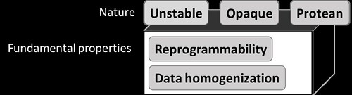
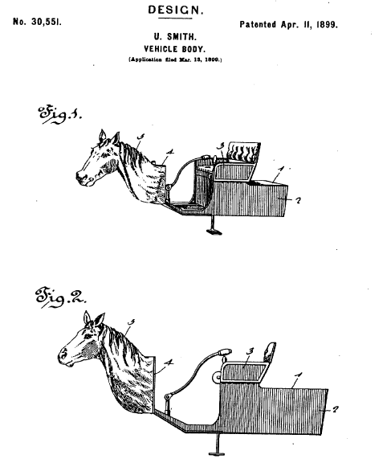
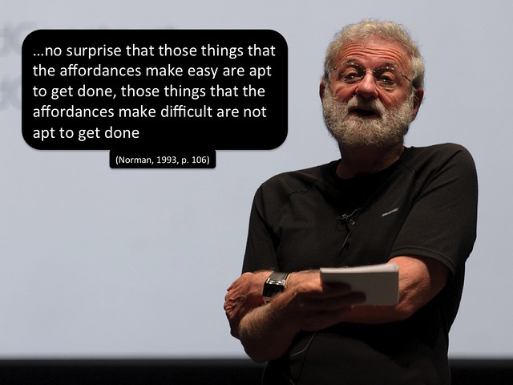

See also: [[blog-home | Home]]

Due to a combination of personal and institutional flaws (the information systems and enterprise processes within Universities continue to be "interesting") that last month or so has been pretty horrendous from a work perspective. Only now starting to get some space to reflect on what's been happening and engage more students and research. My apologies to the students who have been impacted.

One of the major tasks during this time has been designing learning experiences for the course [EDM8006, Curriculum and Pedagogical Studies 2: Arts & Technologies](http://www.usq.edu.au/course/specification/2016/EDM8006-S2-2016-WEB-TWMBA.html). In particular, two weeks of learning experiences intended to introduce students to [Australian Curriculum: Technologies learning area](http://www.australiancurriculum.edu.au/technologies/introduction) and its two subjects: Design and technologies, and Digital technologies. This is part of work that was connected with [attempts earlier in the year](/blog2/2016/03/18/oep-and-initial-teacher-education-moving-on-from-the-horsey-horseless-carriage/) to explore open educational practices (OEP) within initial teacher education (ITE).

That grant application was unsuccessful (largely due to me), however, another member of the group has been successful in getting a small grant that will restart that work over the coming months. The following is an attempt to get my head back into this space, reflect on the experience with the EDM8006 materials including making them "open" (the boring way), and suggest that there are more interesting ways to engage in OEP.

In part, the following also draws on the nascent model of the properties and nature of digital technologies initially proposed in [this presentation](http://bit.ly/dtignorance). A version of that model (see image below) was actually [used within the content](https://htmlpreview.github.io/?https://github.com/djplaner/digtech-subject/blob/master/004%20What%20are%20digital%20technologies.html) I wrote for the EDM8006 course. It also wonders much further from what I'd originally intended to write.

## The boring way

The [failed grant application](/blog2/2016/03/18/oep-and-initial-teacher-education-moving-on-from-the-horsey-horseless-carriage/) from earlier this year included the following

But OEP has a horsey horseless carriage problem (Bigum, 2012). Most use of OEP is designed not to “disrupt the smooth running routines” (Bigum, 2012, p. 35) of existing educational practices and institutions. Open textbooks are still textbooks. Open courses are still courses.

And for me this remains the boring (and perhaps even wrong) way to think of open education resources/practice. i.e. spend the time and effort to polish course materials into a book and make that book openly available to all.

Of course, it's not really a "wrong" way, if it becomes a stepping stone toward doing something more interesting. The Zone of Proximal development and a range of other perspectives explain why it is difficult for any individual to make a huge leap from something they already know (and are expert in) to practices that are completely different. I know, I've been through that. The image to the right (with the penguin) is the cover from the [open text book](/blog2/2008/12/22/an-introduction-to-linux-systems-administration-4th-edition/) some colleagues and I wrote in the late 1990s. Creating an open text book might actually be a stepping stone to a less boring application of open, but I wonder if it can be for most people in most educational institutions.

For example, last year I had an interesting session where the institution brought in the "reference" panel for the Open Textbook grants scheme. That panel included a research professor who had just recently generated lots of publicity by producing an open textbook and a MOOC based on his teaching. Consequently, being "open" meant producing an open textbook using the same assumptions and practices he had used. Assumptions and practices that mirrored the work I'd done almost 20 years ago. Many others have identified and bemoaned the on-going prevalence of open textbooks in higher education. For example, [Clint LaLonde's post](http://clintlalonde.net/2015/11/23/the-open-future-is-here-its-just-not-evenly-distributed/) from late last year reflecting on OpenEd15 and includes a range of related observations, including (emphasis added)

Additionally, there is a divide as to whether open textbooks mark an entry point into open education for new people (and there was a massive number of people at OpenEd for the first time), or whether open textbooks are the beginning, middle and end of the open journey for some...

Problematically, **textbooks are so deeply ingrained in our education systems that trying to find others ways of doing education for many is very difficult**, especially in an education world where we continually remove capacity for those faculty who DO want to change and experiment and try different things. Rarely will you ever find a faculty member who says they have enough time to do their job, let alone undertake a radical overhaul of their pedagogy. Often faculty are p/t, or only brought in at the last minute to teach a course and grab at that teacher-proofed course-in-a-box

The last touches on Bigum's (2012) argument that the "persistent patterns of relations that are performed in schooling" (p. 30) are limiting what can and can't be done with digital technologies. Part of the argument being developed from [this presentation](http://bit.ly/dtignorance) is that educational institutions (and the individuals within them) not only aren't aware of how these "persistent patterns of relations" are limiting what they do with digital technologies. They don't even understand the nature of the very digital technologies that they are trying to harness.

Looking for evidence of these limitations is one of the reasons behind [this work](/blog2/2016/08/07/how-and-why-do-people-use-the-moodle-book-module/) that is seeking to explore how and why people are using the Moodle Book module. My suspicion is that learners and teachers are seeing the Book module as a way to produce a print-based book. That they aren't seeing it as a way to create a collection of web pages, nor are they seeking to leverage the affordances that medium offers. Arguably, the same problem applies at the institutional level.

## A less boring way

It is in leveraging the affordances of web pages  that a less boring approach to open educational practices may lay. Early on in my use of the Book module I was [trying to move beyond](/blog2/2012/07/15/redesigning-the-weekly-ramble/) seeing it as a book. Even though my suspicion is that most students continued to print them out (something I'm hoping to test real soon now), and I suspect that most within the institution still see the Moodle Book as a way to produce books to be printed. For example, [back in July 2012](/blog2/2012/07/15/redesigning-the-weekly-ramble/) I identified this as the 3rd problem from student feedback.

Both sets of students tended to mention the difficulty of finding that great idea or resource that was mentioned in one of the rambles that they’d seen previously.

Even though a [solution to this problem](https://github.com/stronk7/moodle-block_search_books) had been developed in 2009, the institution didn't have it installed. It wasn't until July 2016 [that it was installed](/blog2/2016/05/10/testing-out-the-moodle-book-search/).

In terms of making this content open, the slightly less boring way I've been exploring is the [Moodle Open Book project](http://bit.ly/moodleObook). Modifying the Moodle Book module so that the content of books can be shared via GitHub. For example, this [GitHub repository](https://github.com/djplaner/digtech-subject) contains the "book" content I wrote for EDM8006. An approach that builds on [the data homogenisation property](https://htmlpreview.github.io/?https://github.com/djplaner/digtech-subject/blob/master/005%20Data%20homogenisation.html) (which is a link to one of the "books" hosted on GitHub) of digital technologies.

I'm not sure that this approach is going to have a great impact, for the following reasons.

1. The technology involved (Moodle Books and my mod to connect to GitHub) aren't that fantastic. Authoring for the Moodle Book module is a right pain and requires significant technical abilities. Using GitHub is also challenging, especially as integrated with the Moodle Book.
2. A less than successful technical change is not likely to have any significant impact on the "persistent patterns of relations" around course content and courses themselves. Are other educators going to re-organise their patterns of operations to use the material I share on GitHub? I don't think so, at the very least due to the first reason.
3. The way these resources are written - embeded within the course site for EDM8006 - means that they have too much contextual information to be easily reused. This is [Wiley's reusability paradox](http://cnx.org/contents/dad41956-c2b2-4e01-94b4-4a871783b021@19/The_Reusability_Paradox) and something that's [been touched on before](/blog2/2015/04/27/an-overview-of-the-moodle-open-book-project/#paradox). On the plus side, the use of GitHub at least promises the capability to "allow and enable for contextual modification", but the integration with Moodle Book doesn't yet do that well.
4. The foundation of this approach is still the "expert" (me) crafting a path through the learning for other people to follow. I try to design it to encourage going off path, but I still design the path. Something touched on in work on [customisable pathways design](http://www.edugeekjournal.com/2016/06/14/evolution-of-the-dual-layercustomizable-pathways-design/).

In particular, it's an approach that separates learning from doing. Perhaps the fundamental "persistent pattern of relations" in education.  For a teacher (pre or in service) teacher to learn about using the Digital technologies subject, it is expected that they will come to [the course/book](https://github.com/djplaner/digtech-subject), read about and perhaps do some stuff, and then take it back to the classroom where they will actually do something with their new learning.

Perhaps not surprising then that there is an apparent practice/theory divide in initial teacher education.

## A more interesting way

The last activity in [the "book" on data homogenisation](https://htmlpreview.github.io/?https://github.com/djplaner/digtech-subject/blob/master/005%20Data%20homogenisation.html) from EDM8006 includes a link to [this page](http://course.albion.id.au/edp4130/2016_s1/assess/di_resources.html) titled "Digital technologies resources". It contains a collection of resources produced by students in another similar course [EDP4130 Technology Curriculum and Pedagogy](http://www.usq.edu.au/course/specification/2016/EDP4130-S1-2016-ONC-SPRNG.html). As part of an [assessment task](http://course.albion.id.au/edp4130/2016_s1/assess/project.html) for the course, students are asked to engage in a project that has them

designing, developing, reviewing, and sharing resources to support implementation of the [Australian Curriculum: Technologies](http://www.australiancurriculum.edu.au/technologies/) in primary school classrooms

This task is an example of what Wiley calls [renewable assessments](http://opencontent.org/blog/archives/4691), defined as

A “renewable assessment” differs in that the student’s work won’t be discarded at the end of the process, but will instead add value to the world in some way.

I can attest to the value that the resources produced by these pre-service teachers have added value to the world. The material I wrote for EDM8006 is so much better (I believe) because of the availability of these resources. I've been able to integrate use of those resources in EDM8006 and hopefully broaden the learning of the EDM8006 students. Time will tell.

Part of the problem I have is that the way in which I've integrated those resources into EDM8006 is fairly limited. First, because this is the first time I've developed material for this course and I did it quickly. Second, because of the digital tools I have access to reuse these resources are very limited.

Time will give me tie to learn and solve the first problem. I don't believe time is going to solve the second problem.

## An even more interesting way

Mike Caufield identifies one of the big problems with the technologies currently widely available for renewable assessment (and open educational practice in general) in [the post](https://hapgood.us/2015/10/30/why-renewable-assignments-must-be-recyclable-as-well/) - Why renewable assignments must be recyclable as well. With a particular focus on collaborative renewable assessments he identifies the following dichotomy

> - Small class sites (such as wikis) have a hard time bootstrapping to something useful, and even when they do get there they start to rot right after finals.
> - Large collaborative sites like Wikipedia make student work durable and provide a scaffold to build on, but require that the needs of the class bend to the needs of the site.

The context within which I'm working reveals related problems, including:

1. The EDP4130 resources cannot be shared on an institutional system, because the institution doesn't have any technology that could support this type of practice. The institutional folk are so focused on supporting the institutional systems (because it's efficient and safe) that anything that doesn't fit, can't work.
2. The EDP4130 resources are shared on a website (it provides links, it doesn't host the resources) setup by the teacher involved. A teacher who is will be retiring soon. While the resources will likely continue to be available....
3. The resources themselves are produced by students and placed on freely available websites like Weebly and Wix. I was slightly amazed that I didn't find any that had already expired.
4. All of this information is provided through web pages. It's not available in a form that can leverage the capability of digital technologies to provide additional, context specific affordances that would actually help people use these resources in teaching. Some examples might include:
    - show a representation of all the content descriptions in the curriculum and how many resources have been produced for each;
    - create a path of resources that could form the basis for a unit plan or a year of teaching;
    - support version control on resources to allow people to update and modify the resources;
    - allow people to comment and evaluate resources.

If someone within the institution became aware of these problems (gaining awareness is the first stumbling block) the most likely solution would be similar to what Caufield identifies

The first impulse of people who haven’t lived through the past decade and a half of OER initiatives is “Wait, why don’t we just build a _central site_ of student work!”. You don’t need federation at all, right? “You could make — a STUDENT WIKIPEDIA! Or, or, or — a _central OER repository_!”

Locally, I'm guessing the most likely suggestions wouldn't be as foward thinking as a Student Wikipedia. It would be one of either of the following:

1. get them all to use the institutional e-portfolio; or,
2. worse yet get them to use the institutional learning object repository (Equella).

The first problem with these suggestions is that both of these systems are horrendous to use and aren't designed to support the type of activity being envisaged here.

The second problem is that neither approach implements the type of federation that Caufield argues for in [his post](https://hapgood.us/2015/10/30/why-renewable-assignments-must-be-recyclable-as-well/) and elsewhere.

The third problem - and the one I think would be really interesting to solve - is that this type of approach does nothing to help embed the use, modification, and re-mixing of these resources into the what it is that teachers do from day to day.

Someone involved with teachers and teacher education might think that a good solution to this problem might be to integrate this type of assessment [into Scootle](http://www.scootle.edu.au/ec/p/home) or related services. There is some value to this idea, already Scootle is reasonably well integrated into the Australian Curriculum. But there remain (at least) two limitations with using Scootle

1. It is not federated and thus suffers the problems identified by Caufield.
2. It is still not connected (and perhaps not connectable) enough into what teachers (pre and in service) do. A simple example (there are more) would be a lesson/unit plan template that automatically links to sample resources that are relevant to the learning objectives I've just selected.

The last problem is related to the following quote from Norman.

I think it would be really interesting to design an environment that leverages the nature of digital technologies to make it easy for teachers (of all types) to engage in activities, help them do their job effectively, and enable them to learn and break out of the persistent pattern of relations that currently exist. And by the by, have them engage in open educational practices. 

 

### References

Bigum, C. (2012). Edges , Exponentials and Education : Disenthralling the Digital. In L. Rowan & C. Bigum (Eds.), _Transformative Approaches to New Technologies and student diversity in futures oriented classrooms: Future Proofing Education_ (pp. 29–43). Springer. doi:10.1007/978-94-007-2642-0

Norman, D. A. (1993). _Things that make us smart: defending human attributes in the age of the machine._ _Cambridge, Mass: Perseus_. Reading, MA: Addison Wesley.