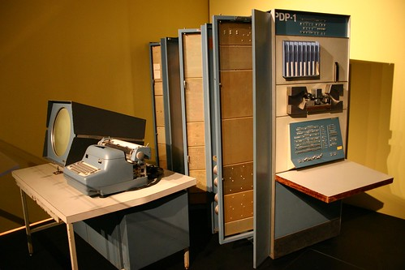
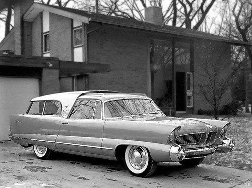

See also: [[blog-home | Home]]

In a couple of the courses I teach I ask students (for slightly different purposes) the question from the title of this post, "How many digital devices do you have?".  In one of the courses that question takes the form of a quiz and looks something like the following.

#### Question text

How many different digital technologies do you own?

Select one:

a. 0

b. 1 to 5

c. 6 to 10

d. 11 to 20

e. More than 20

###  What answer would you give?

Count them up folks. What answer would you give. I'll give you some space to think about that before talking about what some other folk have said.

 

 "[DEC PDP-1](https://www.flickr.com/photos/dreisiger/2201861464/)" ([CC BY-NC-SA 2.0](https://creativecommons.org/licenses/by-nc-sa/2.0/)) by  [Peter Dreisiger](https://www.flickr.com/people/dreisiger/) 

 

### What others have said

Some of the students in another course (where the question is framed somewhat differently) have offered the type of answers I expected, based on the framing of the question.

[Jay identifies](https://jaymedc3100.wordpress.com/2016/07/20/your-devices-and-use/) 3 devices. [Neema lists](https://nnictblog.wordpress.com/2016/08/11/digital-devices-and-its-use/) 2.

Thinking a bit further afield than that I can probably count quite a few more than that in my house. I'll ignore devices personal to other members of my family. This gets me the following list: laptop, 2 smart phones, digital camera, printer, various external drives, Apple TV device, T-Box, X-Box One.  That's 9.

 

 "[1956 ... wagon a-da- future!](https://www.flickr.com/photos/x-ray_delta_one/16689390882/)" ([CC BY-NC-SA 2.0](https://creativecommons.org/licenses/by-nc-sa/2.0/)) by  [x-ray delta one](https://www.flickr.com/people/x-ray_delta_one/) 

 

###  But that doesn't really start to count them

Fleming (2011) writes that it is

estimated that today’s well-equipped automobile uses more than 50 microcontroller units (p. 4)

Wikipedia defines a [microcontroller](https://en.wikipedia.org/wiki/Microcontroller) as "a small computer) on a single [integrated circuit](https://en.wikipedia.org/wiki/Integrated_circuit "Integrated circuit") containing a processor core, memory, and programmable [input/output](https://en.wikipedia.org/wiki/Input/output "Input/output") peripherals.

So your car alone potentially has you well into double figures. Remember that Fleming was writing in 2011. If you have recently purchased the latest Mercedes E-Class, chances are the number of microcontroller units in your car goes well beyond 50.

And of course, with your thinking re-calibrated by this example, you can probably quite easily identify additional devices in your house that are likely to control microcontrollers.

### Implications

Digital devices are increasingly [ubiquitous](https://en.wikipedia.org/wiki/Ubiquitous_computing). Digital isn't limited to a separate device like a computer, tablet, or smart phone. It's [wearable](http://www.digitaltrends.com/wearables/) and in [every thing](https://en.wikipedia.org/wiki/Internet_of_things).

I expect most people not to be aware of just how reliant they are on digital technologies in everything they do. Hence it's uncertain that they understand or are prepared for what this might mean for what they do. For example, I don't think many people in higher education or education more broadly quite understand the implications this has for how those organisations operate, perform, or exist. I'm not convinced that the patterns they use to make sense of the world are ready yet to deal with these changes effectively.

But then I'm not convinced the technologists are either.

Interesting times ahead.

### References

Fleming, B. (2011). Microcontroller units in automobiles. _IEEE Vehicular Technology Magazine_, _6_(3), 4–8. doi:10.1109/MVT.2011.941888