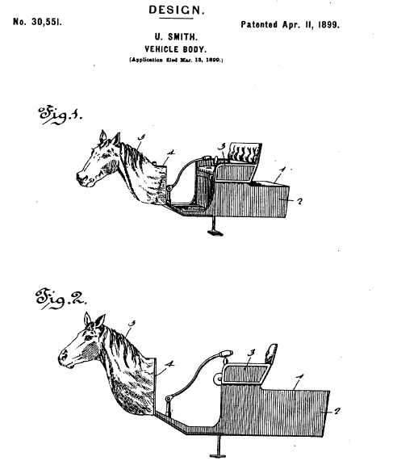

See also: [[blog-home | Home]]

I'm due to have the slides for a [Moodlemoot Australia presentation](/blog2/2016/08/07/how-and-why-do-people-use-the-moodle-book-module/) in a few weeks. Time to get organised. The following is (perhaps) the first of a sequence of posts reporting on progress toward that presentation and the related research.

## Background

My interest in research is primarily driven by the observation that most educational usage of digital technology to enhance learning and teaching is fairly bad. Typically the blame for this gets laid at the feet of the teaching staff who are digitally illiterate, not qualified to teach, or are laggards. My belief/argument is that the problem really arises because the environment within formal education institutions just doesn't understand what is required to make a difference. Much of what they do (e.g. institutional standards for course sites, checklists, training, support documentation, design and support of technlogies...) does little to help and tends to make the problem worse.

A contributing factor to that is that institutional attempts to improve digital learning actually fails to be based on any insights on how people (in this case teaching staff and all those involved with digital learning) learn. How institutions implement digital learning actually gets in the way of people learning how to do it better.

### Schema and the grammar of school

The ideas of schema and the grammar of school offer one example of this failure. [This earlier post](/blog2/2009/04/24/models-of-growth-responding-to-the-grammar-of-school/) includes the following quote from Cavallo (2004) establishes the link

David Tyack and Larry Cuban postulated that there exists a grammar of school, which makes deviation from our embedded popular conception of school feel as nonsensical as an ungrammatical utterance \[1\]. They describe how reform efforts, whether good or bad, progressive or conservative, eventually are rejected or denatured and assimilated. Reform efforts are not attempted in the abstract, they are situated in a variety of social, cultural and historical contexts. They do not succeed or fail solely on the basis of the merit of the ideas about learning, but rather, they are viewed as successful based upon their effect on the system and culture as a whole. Thus, they also have sociological and institutional components — failure to attend to matters of systemic learning will facilitate the failure of the adoption of the reforms. (p. 96)

The grammar of school problem is linked to the idea of [schema](http://changingminds.org/explanations/theories/schema.htm) which links to the following quote that I first saw in [Arthur (2009)](https://books.google.com.au/books?id=1IxKf-gat2cC&pg=PT152&lpg=PT152&dq=vaughan+%22a+frame+of+reference+constructed+from+integrated+sets+of+assumptions,+expectations+and+experiences.%22&source=bl&ots=FbFO-_Nnlm&sig=UixME1DP9ph_OxHRawWwL3Q55GA&hl=en&sa=X&redir_esc=y#v=onepage&q=vaughan%20%22a%20frame%20of%20reference%20constructed%20from%20integrated%20sets%20of%20assumptions%2C%20expectations%20and%20experiences.%22&f=false) and which is taken from [Vaughan (1986, p. 71)](https://books.google.com.au/books?id=_HfG94gUkIsC&pg=PA71&lpg=PA71&dq=vaughan+%22a+frame+of+reference+constructed+from+integrated+sets+of+assumptions,+expectations+and+experiences.%22&source=bl&ots=YGvShqdvtJ&sig=Tts-PLlW-UjxEmtbHRgNc_0hnGQ&hl=en&sa=X&redir_esc=y#v=onepage&q=vaughan%20%22a%20frame%20of%20reference%20constructed%20from%20integrated%20sets%20of%20assumptions%2C%20expectations%20and%20experiences.%22&f=false)

\[In the situations we deal with as humans, we use\] a frame of reference constructed from integrated sets of assumptions, expectations and experiences. Everything is perceived on the basis of this framework. The framework becomes self-confirming because, whenever we can, we tend to impost it on experiences and events, creating incidents and relationships that conform to it. And we tend to ignore, misperceive, or deny events that do not fit it. As a consequence, it generally leads us to what we are looking for. This frame of references is not easily altered or dismantled, because the way we tend to see the world is intimately linked to how we see and define ourselves in relation to the world. Thus, we have a vested interest in maintaining consistency because our own identity is at risk.

### Evidence of schema in how digital technologies are used

The schema idea means that people will perceive and thus use digital technologies in ways that fit with their "integrated sets of assumptions, expectations and experiences". This is an explanation for the horsey, horseless carriage way people respond to digital technologies. It's why courses where the majority of students are online students and will never come onto a campus are still designed around the idea of face-to-face lectures and tutorials.

It also explains why when I finally returned to teaching a course I adopted the idea of [a ramble](/blog2/2012/02/19/designing-the-weekly-ramble/) for the structure of the course.  It explains why the implementation of the ramble evolved into using the [Moodle Book module](https://docs.moodle.org/31/en/Book_module) the way it does today. The images below (click on them to see larger versions) illustrate the connection between my practice 20 years apart, more detail follows.

| 1996 | 2016 |
| --- | --- |
|  |  |

The 1996 image is a [page](http://web.archive.org/web/19970809020334/http://mc.cqu.edu.au/subjects/85321/study-guide/chap4/sec1p2.html) from  the [study guide](http://web.archive.org/web/19971017052720/http://mc.cqu.edu.au/subjects/85321/study-guide/index.html) (wonder how many people can play the au file containing the Wayne's World II quote) for the Systems Administration course I taught in 1996. The 2016 image is a page from the "study guide" I developed for an [Arts & Technologies C&P course](http://www.usq.edu.au/course/specification/2016/EDM8006-S2-2016-WEB-TWMBA.html).

I believe/suggest that the influence of schema also plays a significant contributor in the practice of other teaching staff as they transition into digital learning. It's a factor in why most course sites remain dumping grounds for lecture slides and the subsequent widespread growth in the use of lecture capture systems.

And it's not just the teaching staff. Students have developed schema about what it means to be taught, and what it means to be taught at university. A schema developed either through direct experience, or via the experience of others and various media. The typical schema for university education involved large lecture halls and tutorials.

 "[ne da se mi](https://www.flickr.com/photos/tadeeej/3228729514/)" ([CC BY-NC-SA 2.0](https://creativecommons.org/licenses/by-nc-sa/2.0/)) by  [Tadeeej](https://www.flickr.com/people/tadeeej/) 

 

### So what?

The above suggests that whenever students and teachers engage with a digital technology (or any change around) and its use for learning and teaching, there are three main possibilities:

1. It seen as nonsensical and rejected. e.g. whatever was said doesn't make sense from existing grammar rules and seen as just being wrong.
2. It sounds like something familiar and is modified to fit within the confines of that familiar practice. e.g. whatever was said sounds an awful lot like an existing use of grammar (even though it is different), and thus is interpreted as matching that existing use.
3. The significant difference is seen as valued and existing practice is modified to make use of that difference. e.g. the different use of grammar is both understood as different and the difference is valued, and is subsequently existing practice is modified to incorporate the new grammar.

If this is the case, then examining the use (or not) of a digital technology in learning and teaching should reveal evidence of these possibilities.  This seems very likely, given widespread common complaints about the use of digital technology to enhance learning and teaching. Complains that see most practice stuck at possibility #2 (at best).

If this is the case, then perhaps this way of thinking might also identify how to address this.

But first, I'm interested in seeing if use of a particular digital technology matches this prediction.

## Use of the Moodle Book module

Due to a 2015 grant from the [USQ OpenTextbook Initiative](https://www.usq.edu.au/learning-teaching/excellence/2016landtgrants/2015landtgrants/OpenTextbooks/2015recipients) I'm going explore the use the [Moodle Book module](https://docs.moodle.org/31/en/Book_module). The plan is to analyse the use of the Moodle Book module (the Book) at USQ to see how both learners and teachers are engaging with it, see if the above expectations are met, and figure out what might be done in terms of the support and development of the Moodle Book module to help improve this.

What follows is an initial map of what I'll be exploring.

A major aim here is to explore whether a student or teacher using the Book have made the transition from possibility #2 (treating the Book as a print-based book) to possibility #3 (recognising that this is an online book, and using that difference). I've highlighted some of the following questions/analysis, which I think be useful indicators of this transition. The darker the yellow highlight, the more strongly I think it might indicate someone making the leap to an online book.

**Question for you:** What other practices might indicate use that has moved from #2 to #3?

### Which courses use the Book

First step is to explore whether the Book is being used. How many courses are using it? How many books are being produced with the module.

As the abstract for the talk suggests, early analysis revealed a growth in use, but I'm wondering how sound that analysis was. Hence there is a need to

1. Correctly identify the number of course offerings using the Book each year.
2. Identify the number of different teaching staff are responsible for those courses. Longer term, it would be useful to ask these staff about their background and reasons for using the Book.
3. Identify the type of courses using the Book.
4. How many books are being produced by each course?
5. How do the books fit into the structure of the course?
    1. Is the structure the same from offering to offering?
    2. How much does the number and content of the books change from offering to offering?

### Characteristics of the book content

1. Statistics around the level of readability of the text (e.g. Flesch-Kincaid etc).
2. The structure of the book - are sub-chapters used.
3. Are images, video, Moodle activities included?
4. What about links?
    - Are there any links at all?
    - What is linked to?
    - Are links purely to external resources? 
    - How many links connect back to other parts of the course's Books?

### Patterns in how the books are authored

1. How are the books authored?
    - From scratch?
        1. Using the web interface?
        2. Via an import process?
    - Copied from previous offerings?
    - ?? other??
2. How are they edited?  My expectation that a teacher who sees the Book as a replacement for a print book will not be editing the books during semester.

### Patterns in how the books are read/used

1. Are students reading the books online or printing them out?
2. Does printing always happen at the start of semester? Does it continue through semester? Does it drop off?
3. When are students reading the books?
4. What is the nature of the paths they take through the books?
    1. Do they read the books and the chapters in order?
    2. How long do the spend on each chapter?
    3. Do they revisit particular books?
5. How many times do discussion forum posts in a course include links to chapters/sub-chapters within the books
    - Posts written by teaching staff
    - Post written by students

## References

Arthur, W. B. (2009). _The Nature of Technology: what it is and how it evolves_. New York, USA: Free Press.

Cavallo, D. (2004). Models of growth - Towards fundamental change in learning environments. _BT Technology Journal_, _22_(4), 96–112.