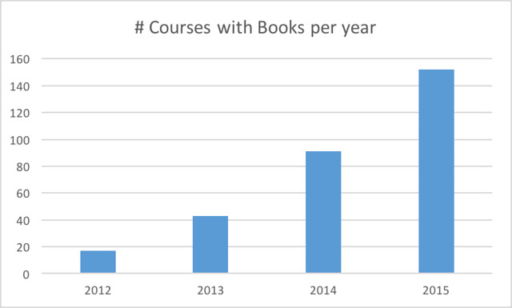
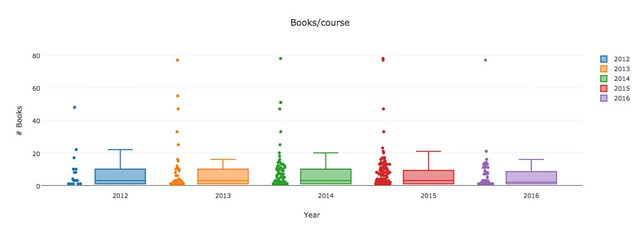
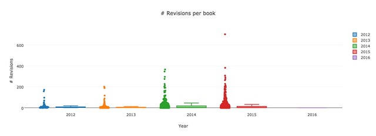

This is the second in a series of posts exploring the usage of the [Moodle Book module](https://docs.moodle.org/31/en/Book_module) at my current institution. The [first post](/blog2/2016/08/13/exploring-moodle-book-module-usage-part-1/) gave some background and outlined an initial series of questions about Book usage that I'm aiming to explore. This post reports on initial findings related to the following

- Correctly identify the number of course offerings using the Book each year.
- How many books are being produced by each course?
- How are they edited, in particular how many times they are edited.

The hope is that the next post will explore the following

- Identify the number of different teaching staff are responsible for those courses.
- Identify the type of courses using the Book.
- How do the books fit into the structure of the course?

**Note:** Click on any of the following images to see larger versions.

### Number of course offerings using the Book module

The following graph shows the number of different course offerings (my course - EDC3100 - is offered twice a year, so it's counted twice) using the Book module each year.

It shows the growth in use of the Book that initially sparked my interest in this analysis. One of the reasons I was interested in this is due to the authoring process around the Book module being quite difficult to do a reasonable job. I put in place a range of additional support to make it meaningful, and I've observed other people give up on using the Book because it's too hard. Raising the questions,

- Did I just miss out on some simple way to author Book content?
- Are the teaching staff in these courses out-sourcing the authoring of the Book content?
- Is there some other driver that is encouraging them to overcome the hassle?

### Number of Book resources per course

The Moodle Book module is used to produce individual resources (aka books or book resources). How many books did each course produce with the Book module? The following graph gives an answer.

**Note:** The next two graphs include data from 2016, but this only includes data up until February 2016. Hence the data really only shows results for a few early course offerings getting set up for first semester.

In the graph below the median number of books per course doesn't exceed 3. The maximum - excluding outliers - gets no bigger than 22 books per course.

### Number of revisions per Book

Resources produced by the Moodle Book module can be edited and updated. The Moodle database keeps a simple counter _revision_ that indicates the number of times such a resource has been updated.

My guess is that the growth in usage of the Book module at my institution has been driven by people moving the course study guides into the Book module. Previously these were available as stand-alone PDF documents, but the technology used to produce these was phased out. Since these PDF documents were generally not updated during semester, I was predicting that there would be a relatively low frequency of revisions to Book resources.

The graph below shows that the median number of revisions per book resource is no more than 2 (i.e. 50% of the books aren't edited more than twice). The maximum (minus outliers) peaks at 45 and 32 in 2015 respectively.

It also shows a large number of books with 0 revisions. A quick check of the data reveals that the percentage of books that were never revised each year was:

- 2012 - 72.9% from a low number of courses (less than 20)
- 2013 - 33.2%
- 2014 - 48.5%
- 2015 - 46.3%

