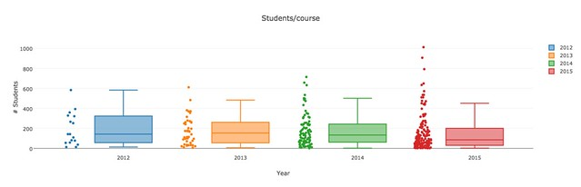
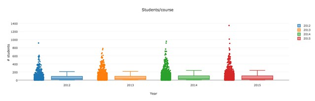

---
categories:
- exploring
- moodleopenbook
date: 2016-08-17 11:38:40+10:00
next:
  text: Understanding and using the idea of "network learning"
  url: /blog/2016/08/17/understanding-and-using-the-idea-of-network-learning/
previous:
  text: Exploring Moodle Book usage - part 2 - overall use
  url: /blog/2016/08/16/exploring-moodle-book-usage-part-2-overall-use/
title: Exploring Moodle book usage - part 3 - who and how much
type: post
template: blog-post.html
comments:
    []
    
pingbacks:
    - approved: '1'
      author: Exploring Moodle book usage &#8211; part 4 &#8211; students and initial
        use &#8211; The Weblog of (a) David Jones
      author_email: null
      author_ip: 192.0.100.180
      author_url: https://davidtjones.wordpress.com/2016/08/23/exploring-moodle-book-usage-part-4-students-and-initial-use/
      content: '[&#8230;] Yesterday&#8217;s part 3 in this series of posts continued the
        higher level examination of book usage. i.e. what types of courses use the Moodle
        Book module (the Book). This post is going to continue that a little and then
        start to make some forays into looking more closely at how resources produced
        using the Book are actually used. In particular, it&#8217;s going to look at the
        following: [&#8230;]'
      date: '2016-08-23 15:35:08'
      date_gmt: '2016-08-23 05:35:08'
      id: '3403'
      parent: '0'
      type: pingback
      user_id: '0'
    
---
Continuing on from [yesterday's post](/blog/2016/08/16/exploring-moodle-book-usage-part-2-overall-use/) this post seeks to explore a bit further how the [Moodle Book module](https://docs.moodle.org/31/en/Book_module) (the Book) is being used at my current institution.

The plan is that this post will explore:

- What percentage of all courses are using the Book?
- How big are the courses using the Book?

Follow up posts should look to explore

- Compare the number of online students between courses using the Book and those that don't.
- Which staff are using/creating resources with the Book?
- How many students actually use the Book - leading into questions of how they use it?
- Exploring the content of the Books might also be useful.

### Percentage of courses using the Book

Yesterday's post showed the number of courses using the Book per year has grown from 17 in 2012 to 152 in 2015. To put that into perspective what percentage does that represent of all courses offered.

There's a difficulty in calculating the percentages. I'm not entirely certain what makes an "official" course. The following is based on the criteria of being a course with at least one student enrolled, that also has a Moodle course site.

| Year | % courses using the Book |
| --- | --- |
| 2012 | 2.02% |
| 2013 | 3.01% |
| 2014 | 6.36% |
| 2015 | 10.35% |

###  How big are the courses using the Book?

Flowing from that, I'm wondering whether the courses using the Book are big courses or small courses?

The next graph shows the number of students per course, for each course using the Book. The following graph shows the number of student per course, for all courses. The aim is to see if there is any difference in the size of the courses using the Book.

The indication is that the courses using the Book tend to be larger than the typical course. Overall the median course has between 11 and 13 students. Compared to a median between 85 and 142 for the courses using the Book.

Possible implications might include:

- The larger courses see the need to make use of the Book, perhaps as a source of information distribution.
- The larger courses are more likely to have existing study guide material.
- The larger courses are more likely to have significant numbers of online/distance education students.
- The larger courses may be more likely to have assistance in using the Book.

     