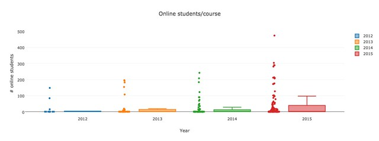
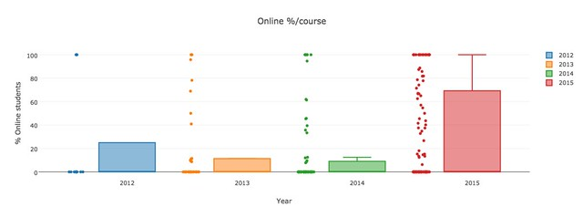
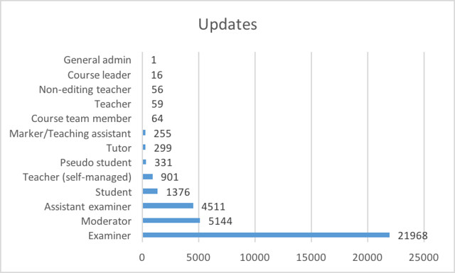

---
categories:
- exploring
- moodleopenbook
date: 2016-08-23 15:35:02+10:00
next:
  text: Exploring frameworks to understand OER/OEP
  url: /blog/2016/09/01/exploring-frameworks-to-understand-oeroep/
previous:
  text: On the value or otherwise of SAMR, RAT etc.
  url: /blog/2016/08/23/on-the-value-or-otherwise-of-samr-rat-etc/
title: Exploring Moodle book usage - part 4 - students and initial use
type: post
template: blog-post.html
comments:
    []
    
pingbacks:
    - approved: '1'
      author: Exploring Moodle Book usage &#8211; Part 5 &#8211; more staff and student
        use &#8211; The Weblog of (a) David Jones
      author_email: null
      author_ip: 192.0.83.90
      author_url: https://davidtjones.wordpress.com/2016/09/03/exploring-moodle-book-usage-part-5-more-staff-and-student-use/
      content: '[&#8230;] the exploration of how the Moodle Book module is being used,
        this post picks up from the last and [&#8230;]'
      date: '2016-09-03 09:28:42'
      date_gmt: '2016-09-02 23:28:42'
      id: '3404'
      parent: '0'
      type: pingback
      user_id: '0'
    
---
[Yesterday's part 3](/blog/2016/08/17/exploring-moodle-book-usage-part-3-who-and-how-much/) in this series of posts continued the higher level examination of book usage. i.e. what types of courses use [the Moodle Book module](https://docs.moodle.org/31/en/Book_module) (the Book). This post is going to continue that a little and then start to make some forays into looking more closely at how resources produced using the Book are actually used. In particular, it's going to look at the following:

- Compare the number of online students in courses that use the Book, versus those that don't use the Book.
- Who is actually creating and revising the Book resources?

At this stage, I'm not sure if I can answer these questions with the data I have to hand.

Yep, that worked.  Still a fair bit to do, the next post(s) will

- Revisit the staff usage of the Books to include more recent data and fix some of the other limitations of what's below.
- Start exploring how (if?) students are using the Books.

### Identifying type of students in courses

[The last post](/blog/2016/08/17/exploring-moodle-book-usage-part-3-who-and-how-much/) identified that the Book is generally used in larger courses. A possible implication of this is that the Book is more likely to be used if the course has distance education/online students. The thinking here is that such courses have historically had print-based study guides, which could be converted into the Book module. Also, that on-campus courses are more typically going to rely on lectures and tutorials as the primary form of teaching method. This links directly back to [the idea of horsey, horseless carriage thinking](/blog/2016/08/13/exploring-moodle-book-module-usage-part-1/#horsey).

To explore this further I need to identify whether or not the current data set will allow me to identify the types of students....turns out group allocation allows this.

Plotting the number of online students enrolled in courses using the Book gives the following graph.  It shows that the number of online students in courses using the Book was initially quite low. For example, in 2012 50% of courses using the Book had less than 4 online students. Many of that 50% had no online students. In fact, the only courses using the Book in the first half of 2012 had no online students.

However, over time the number of online students in courses using the Book increased. In 2015, though there remained a large number of these courses that few if any online students.

Rather than focusing on the number of online students in courses using the Book, the following graph focuses on the percentage of online students in those same courses. It shows that in 2015 there was a significant increase in courses with higher percentages of online students starting to use the Book. Before that a majority of courses using the Book had less than 20% online students. 2012 appears have included only 1 course that had online students - the big outlier with 100%.

For me this raises a couple of interesting questions

- How and why did the courses with 0% online students use the Book? The use of the Book by these courses challenges my assumption.
- Why does 2015 appear to have been a turning point for using the Book by courses with higher percentage of online students? My current guess is that this correlates with the cessation of the previous method for placing traditional print-based study guides online. That tool stopping meant the courses had to look for an alternative.

###  Who is creating the book resources?

[My experience](/blog/2015/02/08/kludging-an-authoring-process-with-moodle-books-etc/) is that creating resources using the Book module is not necessarily a straight forward process. I've kludged together various tools and practices to reduce the difficulty, but I've heard other staff give up on using the Book because they couldn't. This has me wondering who and how these Book resources have been created in other courses.

Answering this question requires taking a closer look at who is doing what with the Book resources, which requires a bit of work. It's also the foundation for most of the subsequent interesting analysis.

As a result of getting this working, an interesting question suggested itself

- For each course, how many "events" happen around the books in those courses?
- What percentage of events for the whole course, do those book events represent?
- What about breaking those events down into read, change, and print?

The first rough cut at answering the question is given in the following graph. It shows the number of update events associated with Book resources grouped by each user role. It apparently shows that the core teaching staff (examiner, moderator and assistant examiner) are making most of the updates.  Interestingly, the student role is next in line in terms of number of updates. But there are some insights/limits/caveats to this graph.  The insights/limits/caveats include

- The 1376 updates made by students are from two courses only. One course with 1335 (~97%) of the updates. Indicating a specific pedagogical choice for that course.
- There was one course offering where the idiot examiner (i.e. me) almost doubled the number of updates by examiners. This offering has been excluded from the above graph.
- The notion of an "update" event doesn't provide any indication of how much was updated/created.  It might be as simple as deleting a character, or perhaps importing a whole new book.
- The above data (so far) does not include data from second half of 2015 when the new Moodle event logging was implemented.
- The mapping between old and new style logging needs to be smoothed out
- There are events that aren't logged for the book (e.g. this [tracker item](https://tracker.moodle.org/browse/MDL-45741)).
- The mapping of logged events to changes to the book need to be rechecked.