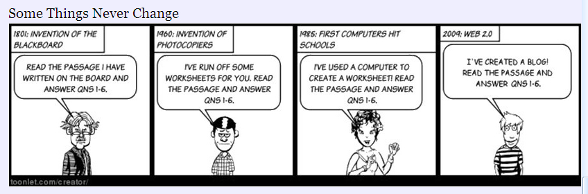

---
categories:
- edu8117
date: 2016-08-23 15:22:26+10:00
next:
  text: Exploring Moodle book usage - part 4 - students and initial use
  url: /blog2/2016/08/23/exploring-moodle-book-usage-part-4-students-and-initial-use/
previous:
  text: Understanding and using the idea of &quot;network learning&quot;
  url: /blog2/2016/08/17/understanding-and-using-the-idea-of-network-learning/
title: On the value or otherwise of SAMR, RAT etc.
type: post
template: blog-post.html
comments:
    []
    
pingbacks:
    - approved: '1'
      author: SAMR and RAT Models | EdTech Hot Technologies
      author_email: null
      author_ip: 192.0.83.191
      author_url: https://edtechhottechnologies.wordpress.com/2016/08/24/samr-and-rat-models/
      content: '[&#8230;] Follow me [&#8230;]'
      date: '2016-08-25 00:42:30'
      date_gmt: '2016-08-24 14:42:30'
      id: '3406'
      parent: '0'
      type: pingback
      user_id: '0'
    - approved: '1'
      author: On the value or otherwise of SAMR, RAT etc. | E...
      author_email: null
      author_ip: 185.82.148.10
      author_url: http://www.scoop.it/t/educational-discourse/p/4068729643/2016/09/06/on-the-value-or-otherwise-of-samr-rat-etc
      content: '[&#8230;] Updated 30 August, 2016: Added mention of @downes&#039; pointers
        to peer review literature using SAMR. Evolved into a small section There definitely
        seems to be a common problem when it comes to thinking about evaluating the use
        of digital technology in learning and teaching. Actually, there are quite a few,
        but the one I&#039;m interested&hellip;&nbsp; [&#8230;]'
      date: '2016-09-07 03:10:41'
      date_gmt: '2016-09-06 17:10:41'
      id: '3407'
      parent: '0'
      type: pingback
      user_id: '0'
    - approved: '1'
      author: SAMR - Tech Tips | Pearltrees
      author_email: null
      author_ip: 93.184.35.43
      author_url: http://www.pearltrees.com/shellyterrell/samr/id13997502/item206378002
      content: "[&#8230;] After watching a math lesson evolve with the use of technology\
        \ I put together the following model, based on my understanding of SAMR. Below\
        \ my model is my explanation. Do you agree with the model? Is my thinking correct?\
        \ For reference, I\u2019ve included Dr. Www.hippasus.com/rrpweblog/archives/2013/03/28/SAMRandTPCK_AnIntroduction.pdf.\
        \ SAMR Model - Technology Is Learning. Ruben R. Puentedura&#039;s Weblog. SAMR.\
        \ On the value or otherwise of SAMR, RAT etc. \u2013 Tilting at windmills? [&#8230;]"
      date: '2017-08-10 15:52:25'
      date_gmt: '2017-08-10 05:52:25'
      id: '9165'
      parent: '0'
      type: pingback
      user_id: '0'
    
---
**Updated 30 August, 2016:** Added mention of [@downes' pointers](http://www.downes.ca/post/65733) to peer review literature using SAMR. Evolved into a small section

**Update: June 23: 2023** See also [PICRAT](https://citejournal.org/volume-20/issue-1-20/general/the-picrat-model-for-technology-integration-in-teacher-preparation/) an extension to RAT. The PIC representing the student's representation to a technology (**p**assive, **i**nteractive, **c**reative)

There definitely seems to be a common problem when it comes to thinking about evaluating the use of digital technology in learning and teaching. Actually, there are quite a few, but the one I'm interested in here is how people (mostly teachers, but students as well - and perhaps should throw organisations in here as well) perceive what they are doing with digital technology.

This is a topic that's been picked up recently by some NGL folk as the course has pointed them to [the SAMR model](https://sites.google.com/a/msad60.org/technology-is-learning/samr-model) (originally), but now to [the RAT model](http://techedges.org/r-a-t-model/). Both are acronyms/models originally intended to be used by people introducing digital technology into teaching to self-assess what they've planned. To actively think about how the introduction of digital technology might change (or not) what learners and teachers are doing. The initial value of these models is to help people and organisations avoid falling into this pitfall when applying digital technology to learning and teaching.

### SAMR has a problem

SAMR has received a lot of positive attention online, but there is also some negative reactions coming to the fore. One example is [this open letter](http://spelvetenskap.blogspot.com.au/2013/10/open-letter-to-dr-ruben-puentedura.html) written to the SAMR creator that expresses a range of concerns. This open letter is picked up also in [this blog post](http://charlielove.org/?p=10025) titled _SAMR: A model without evidence_. Both these posts and/or the comments upon them suggest that SAMR appears to have been based/informed by the work of Hughes, Thomas and Scharber (2006) on [the RAT framework/model](http://techedges.org/r-a-t-model/).

A key problem people have with SAMR is the absence of a theoretical basis and peer-reviewed literature for SAMR. Something with the RAT model does have. This is one of the reasons I've moved away from using SAMR toward using the RAT model. It's also the reason why I'll ignore SAMR and focus on the RAT model.

**SAMR and literature**

**Update:** [@downes points](http://www.downes.ca/post/65733) to a collection of literature the includes the SAMR model. This addresses the question of whether or not there is peer reviewed literature using SAMR, but whether this addresses the perceived (and arguable) need for a "theoretical basis" to underpin SAMR. Most of the literature I looked at made use of the SAMR model for the same purpose I've use it, the RAT model and the [Computer Practice Framework (CPF)](http://edfutures.net/The_Computer_Practice_Framework_\(CPF\)). As a method for evaluating what was done, for example

- [Making the case for BYOD instruction in teacher education](http://iisit.org/Vol11/IISITv11p191-201Sardone0505.pdf). Uses SAMR to evaluate classroom assignments using BYOD/QR codes.
- [Substitution to augmentation: faculty adoption of iPad mobile learning in higher education](http://www.emeraldinsight.com/doi/abs/10.1108/ITSE-01-2013-0001?journalCode=itse). Evaluates stories of iPad usage from college educators who volunteered to share their practices. TPACK and SAMR used to evaluate.
- [The SAMR model as a framework for evaluating mlearning](http://eric.ed.gov/?id=EJ1036281).
- [Developing a mobile social media framework for creative pedagogies](http://aut.researchgateway.ac.nz/handle/10292/7371).

A related Google Scholar search ([_samr Puentadura_)](https://scholar.google.com.au/scholar?as_sdt=1,5&q=samr+Puentadura&hl=en) reveals a range of additional sources. But that search also reveals the problem of misspelling the SAMR author's surname. A better search would be ([_samr Puentedura_](https://scholar.google.com.au/scholar?hl=en&as_sdt=1,5&q=samr+Puentedura)) which reveals material from the author and their related citations.  However, this search also reveals the weakness identified in the open letter mentioned above. The work developing/sharing the SAMR model by Puentedura is only visible on his website, not in peer-reviewed publications

Whether this is a critical weakness is arguable. Personally, it's sufficient to prompt a search for something that performs a similar job, but doesn't suffer this weakness.

### What is the RAT model for?

The ["model without evidence" post](http://charlielove.org/?p=10025) includes the following

SAMR is not a model of learning. There is no inherent progression in the integration of technology in learning within SAMR. Using SAMR as a model for planning learning and the progression of learning activities is just plan wrong

The same could be said for the RAT model, but then the RAT model (and I believe SAMR) were never intended to be used as such. On her [#ratmodel page](http://techedges.org/r-a-t-model/) Hughes offers this

The original purpose of the RAT framework was to introduce it as a self-assessment for preservice and inservice teachers to increase critical technological decision-making.

The intended purpose was for an educator to think about how they've used digital technologies in a learning activity they've just designed. It's a way for them to think about whether or not they've used digital technologies in ways that echo the above cartoon. It's a self-reflection tool. A way to think about the use of digital technologies in learning

It's not hard to find talk of schools or school systems using SAMR as an evaluation framework for what teachers are doing.  I'm troubled by that practice, it extends these models beyond self-reflection.  In particular, such use breaks the "best practices and underlying assumptions for using the R.A.T model" [from Hughes](http://techedges.org/r-a-t-model/) (emphasis added)

> 1. **The R.A.T. categories are not meant to connote a linear path to technology integration**, such as teaching teachers to start with R activities, then move to A and ultimately T. Rather, my research shows that teachers will have an array of R, A, and T technology integration practices in their teaching. However, T practices seem more elusive.
> 2. The key to **T**ransformative technology integration is opportunities for teachers to learn about technology in close connection to subject matter content. For example, supporting subject-area teachers learning in a PLC across a year to explore subject area problems of practice and exploration of digital technology as possible solutions.
> 3. Discrete **digital technologies** (e.g., Powerpoint, an ELMO, GIS software) **can not be assessed alone using the R.A.T. model**. **One needs rich instructional information about the context of a digital technology’s use in teaching and learning to begin a RAT assessment**. Such rich information is only known by the practitioner (teacher) and explains why the model supports teacher self-assessment. For use in research, the RAT model typically requires observations and conversations with teachers to support robust assessment.

### It's not the technology, but how you use it

Hughes' 3rd point 3 from the above (the one about discrete digital technologies) is why I've grown to dislike aspects of diagrams like [the Padagogy Wheel](http://www.globaledmatters.com/effectively-using-technology-to-transform-teaching-learning/) pointed to [by Miranda](http://www.globaledmatters.com/effectively-using-technology-to-transform-teaching-learning/).

Whether you are replacing, amplifying, transforming (RAT model) OR you are remembering, analysing, creating, understanding etc (Blooms Taxonomy) does not arise from the technology. It arises from how the technology is used by those involved, it's what they are doing which matters.

For example, one version of the padagogy wheel suggests that Facebook helps "improve the user's ability to judge material or methods based on criteria set by themselves of external sources" and thus belongs to the Evaluate level of Blooms' taxonomy. It can certainly be used that way, but whether or not how I've used it in my first lesson from today meets that criteria is another matter entirely.

### The problem with transformation

Transformation is really, really hard. For two reasons.

The first is to understand the difference between amplification and transformation. Forget about learning, it appears difficult for people to conceive of transformation in any context. I try to help a bit through the use of print-based encyclopedia versus Encarta (replacement) versus Wikipedia (transformation).  Both Encarta and Wikipedia use digital technologies to provide an "encyclopedia", however, only Wikipedia challenges and transforms some of the fundamental assumptions of "encyclopedia".

The second is related to [the horsey horseless carriage problem](/blog2/2016/08/13/exploring-moodle-book-module-usage-part-1/#horsey). The more familiar you are with something, the harder it is to challenge the underlying unwritten assumptions of that practice. I'd suggest that the more involved you are with print-based encyclopedia's, the harder it was to see value in Wikipedia.

It's made that much harder if you don't really understand the source of transformation. It's hard for people who aren't highly digitally literate and have high levels of knowledge around learning/teaching/context to be able to conceive of how digital technologies can transform learning and teaching.

### What do you compare it against?

To decide if your plan for using digital technologies for learning is an example of replacement, amplification or transformation, most people will compare it against something. But what?

In my undergraduate course, I ask folk to think about what the learning activity might look like/be possible if there wasn't any digital technology involved. But I wonder whether this is helpful, especially into the future.

Given the [growing prevalence of digital technologies](/blog2/2016/08/12/how-many-digital-devices-do-you-have/), at what stage does it make sense to think of a learning activity as not involving some form of digital technology?

I wonder whether this is part of the reason [why Angela lists](https://angelamartlewedu8117.wordpress.com/2016/08/20/learning-and-the-samr-model/) as _Substitution_ the use of the Internet for research?

### Amplification, in the eye of the beholder?

[Brigitte connects](https://beelearningblog.wordpress.com/2016/08/22/samr-lenses/) to Angela's post and mentions a recent presentation she attended where SAMR (and the Technology Acceptance Model - I believe) were used to assess/understand e-portfolios created by student teachers. A presentation in which - Brigitte reports - that how students perceived themselves in terms of technical skills influenced their self-evaluation against the SAMR model

For example, a student with low technical skills might place themselves at the Substitution level in terms of creating an e-porfolio, however what they produced might be classified as sitting at the Modification or even Redefinition level when viewed by the assessors. Conversely, a student might classify themselves as at Redefinition but their overconfidence in using the tool rather than their skill level meant they produced something only at Substitution level.

I wonder how Brigitte's identification of her use of a blog for reflecting/sharing as being substitution connects with this?

### Focus on the affordances

Brigitte identifies her blog-based reflective practice as being substitution. Typically she would have been using other digital technologies (email, discussion boards) and face-to-face discussions to do this, and for her there is no apparent difference.

However, I would argue differently. I would point to particular advantages/differences of the blog that offer at least some advantage, but also potentially change exactly what is being done.

A blog - as used in this case - is owned by the author. It's not hosted by an institution etc. Potentially a blog can help create a great sense of identity, ownership etc. Perhaps that greater sense of ownership creates more personal and engaged reflections. It also offers one way to react to the concerns over learning analytics and privacy [Brigitte has raised elsewhere](https://beelearningblog.wordpress.com/2016/08/12/learning-analytics-and-beyond/).

The blog is also open. DIscussion boards, email, and face-to-face discussions are limited in space and time to those people allowed in. The blog is open both in space and time (maybe). There's no limit on how, why and whom can connect with the ideas.

But this brings up an important notion of an affordance.  Goodyear, Carvalho and Dohn (2014) offer the following on affordances

An assemblage of things does not have affordances per se; rather, it has affordances in relation to the capabilities of the people who use them. These evolve over time as people become better at working with the assemblage. Affordance and skill must be understood, not as pre-given, but as co-evolving, emergent and partly co- constitutive (Dohn, 2009). (p. 142)

Just because I might see these affordances/advantages, it doesn't mean that Brigitte (or anyone else) will.

Does that mean I'm right and Brigitte is wrong? Does it mean that I've failed in the design of the NGL course to provide the context/experiences that would help Brigitte see those affordances? Does this meant that there is no right answer when evaluating a practice with something like the RAT model?

### Should you be doing it at all?

Of course, the RAT (or SAMR) models don't ask the bigger question about whether or not you (or the learners) should really be doing what you're doing (whether with or without digital technologies).

A good current example would appear to be the push within Australia to [put NAPLAN online](http://www.nap.edu.au/online-assessment/naplan-online).  The folk pushing it have clearly identified what they think are the benefits of doing NAPLAN with digital technologies, rather than old-school pen(cil) and paper. As such it is an example (using the RAT model) of amplification. There are perceived benefits.

But when it comes to standardised testing - like NAPLAN - there are big questions about the practice. Just one example is the question of [just how comparable](https://theconversation.com/naplan-data-is-not-comparable-across-school-years-63703) the data is across schools and years. The question about comparability is especially [interesting given research](https://dianeravitch.net/2016/06/13/kids-do-worse-on-computers-when-taking-tests/) that apparently shows

The results from our randomised experiment suggest that computer devices have a substantial negative effect on academic performance

 

### References

Goodyear, P., Carvalho, L., & Dohn, N. B. (2014). Design for networked learning: framing relations between participants’ activities and the physical setting. In S. Bayne, M. de Laat, T. Ryberg, & C. Sinclair (Eds.), _Ninth International Conference on Networked Learning 2014_ (pp. 137–144). Edinburgh, Scotland. Retrieved from http://www.networkedlearningconference.org.uk/abstracts/pdf/goodyear.pdf

Hughes, J., Thomas, R., & Scharber, C. (2006). Assessing Technology Integration: The RAT – Replacement, Amplification, and Transformation - Framework. In C. Crawford, R. Carlsen, K. McFerrin, J. Price, R. Weber, & D. A. Willis (Eds.), _Society for Information Technology & Teacher Education International Conference 2006_ (pp. 1616–1620). Orlando, Florida: AACE. Retrieved from http://www.editlib.org/p/22293/