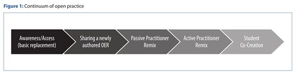
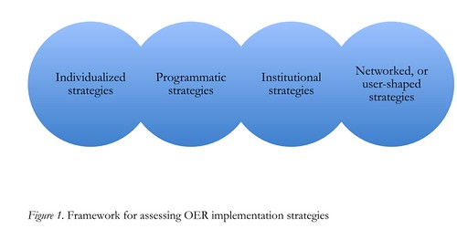
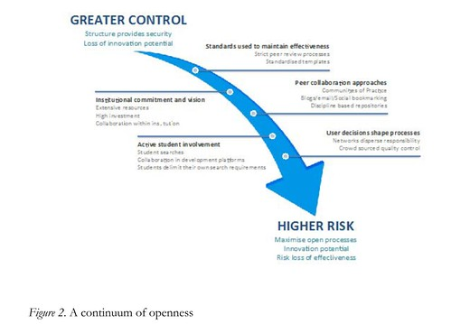
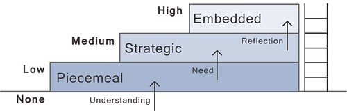

Some colleagues and are re-starting an exploration of OEP in Initial Teacher Education (ITE). A first task is an attempt to get a handle on what has been done/is known about OEP/OER. Yes, we're looking for spectrums/frameworks/models etc that help map out what might be done with OEP/OER.  We're interested in using this to understand what's been done around OEP within ITE and also what we've already done.

The following is a summary of a quick lit review. No real structure and includes a range of strange notes.

## OER adoption: a continuum for practice

Stagg (2014) offers the following continuum of practice

The proposed model seeks to acknowledge the complexity of applied knowledge required to fulsomely engage with open education by examining practitioner behaviours and the necessary supporting mechanisms. This conceptual model aims to be of use to both practitioners and also those responsible for designing professional development in an educational setting.

A [Google Scholar search](https://scholar.google.com.au/scholar?cites=11631507908739441823&as_sdt=2005&sciodt=0,5&hl=en) reveals some use this continuum.

Including Falconer et al (2016), which includes

We view our fourth category, enhancing pedagogy, as fundamentally different to that of producing high quality materials efficiently or cost effectively, in that it is underpinned by altruistic positions rather than a business model approach. It puts its emphasis on the value of the OER development process, rather than on the value of the OER content produced. (p. 99)

Through our analysis, some fundamental tensions have become apparent that will need to be resolved if the purposes of OER release are to be realised. (p. 101)

This limits imposed by a reputation-building motive are exacerbated at present as higher education institutions are encouraged to become increasingly competitive, elevating the importance of brand recognition. The consequence is a move away from risk-taking, towards a demand for predictable quality outcomes. This discourages innovation unless direct benefits can be proven in terms of new markets, student numbers, or shared costs of development and teaching. The benefits of OER in terms of institutional showcasing and attracting potential students, may prove attractive to institutional managers and gain institutional support for OER, but unless culture changes, they place inherent limitations on efficiency gains and the adoption of more open practices which are ultimately founded on a commitment to academic commons. (p. 102)

And develops some frameworks/continuums

and

### Assessing the potential for openness

Stagg (2014) is also cited by Judith and Bull (2016)

While this literature has been significant in driving forward the open agenda, there has been relatively little published about the practicalities of implementing openly licensed materials in higher education courses (p. 2)

which raises the question of just how much more difficult the idea of implementing open educational practices are going to be. i.e. if sharing materials is hard enough.

### OER engagement ladder

Masterman and Wild (2013) bring in the OER engaement ladder, which is talked more about in [this blog post](https://askawild.wordpress.com/2012/09/17/stairways-and-ladders-as-metaphors-for-oer-engagement/). (Interestingly the institutional repository URL for the full research report is now broken, but blog posts and [slideshare resources](http://www.slideshare.net/askawild/from-expert-to-novice-oer-user-the-oer-engagement-ladder) remain)

### References

Falconer, I., Littlejohn, A., McGill, L., & Beetham, H. (2016). Motives and tensions in the release of Open Educational Resources: the JISC UKOER programme. _Australasian Journal of Educational Technology_, _32_(4), 92–105. doi:10.14742/ajet.2258

Judith, K., & Bull, D. (2016). Assessing the potential for openness: A framework for examining course-level OER implementation in higher education. _Education Policy Analysis Archives_, _24_(42). doi:10.14507/epaa.24.1931

Masterman, L., & Wild, J. (2013). Reflections on the evolving landscape of OER use. Paper presented at OER13: creating a virtuous circle, Nottingham, UK

Stagg, A. (2014). OER adoption: a continuum for practice. _Universities and Knowledge Society Journal_, _11_(3), 151 – 164. doi:10.7238/rusc.v11i3.2102