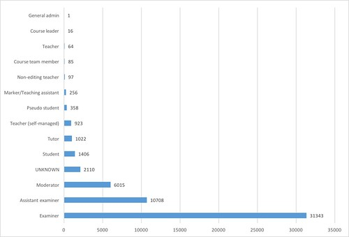

---
categories:
- exploring
- moodleopenbook
date: 2016-09-03 09:28:35+10:00
next:
  text: "Exploring Moodle Book usage \u2013 Part 6 \u2013 What do they contain?"
  url: /blog/2016/09/04/exploring-moodle-book-usage-part-6-what-do-they-contain/
previous:
  text: Exploring frameworks to understand OER/OEP
  url: /blog/2016/09/01/exploring-frameworks-to-understand-oeroep/
title: Exploring Moodle Book usage - Part 5 - more staff and student use
type: post
template: blog-post.html
---
Continuing the exploration of how the Moodle Book module is being used, this post picks up from the [last](/blog/2016/08/23/exploring-moodle-book-usage-part-4-students-and-initial-use/) and will

- Revisit the who is updating/creating posts, including data from the second half of 2015.
- Explore the balance of all actions (print/view/update) by staff.
- Explore the balance of all actions by students.

### Who is updating/creating posts

The last post included a graph that showed generally (apart from two course offerings) that the core teaching staff appear to be doing the creation of books.  That graph had a few problems, including

- Limited data from the 2nd half of 2015. Due to the switch in how Moodle logged events.  Need to handle the new log format.
- Didn't handle all roles. Appears there are some non-standard Moodle roles that the previous query didn't handle.
- Handling deleted books and chapters. I believe this is an issue for the new logging process which has connections back into the book and book chapters table. Which works nicely until books/chapters are deleted.

With those changes fixed, the following graph emerges show how many times each of the roles updated a Book resource in every course.  The changes between the following and the same graph in [the last post](/blog/2016/08/23/exploring-moodle-book-usage-part-4-students-and-initial-use/), includes:

- Significant increase in the number of updates for most roles (e.g. examiner up from 21968 to 31343; assistant examiner has almost doubled from 5144 to 10708)
- Addition of the UNKNOWN role not in the previous graph

It should be noted that the following graphs do not include ~20K updates that I did in one course in one semester.

And I thought it would be interesting to break down the updates by year to see what if there was any growth. Given the growth in the number of courses using the Book (17 in 2012 to 152 in 2015) there should always have been some growth.

The graph above shows examiners making 2152 updates in 2012 and 13649 in 2015.  That's a 6.3 times growth in number of updates for 12.6 times growth in the number of updates. Or, alternatively in 2012 a course examiner (on average) made 179 updates. In 2015 a course examiner (on average) made 90 updates.

Suggesting that the examiners are making less updates. Perhaps farming out the updating to other staff. The growth in edits by moderator and assistant examiner roles in 2014 and 2015 suggest that.  But more exploration is required.

### Role balance of actions

Updating/creating is not the only action that can be done with a Book, you can also view and print parts or all of a Book resource. This step aims to explore what balance of actions each of the roles are involved with

For this purpose I've grouped log events into the following actions someone can perform on a Book

- view - view a chapter or the entire book online
- print - print a chapter or entire book
- modify - delete or update a chapter/book
- create - create or add a chapter or book
- export - use the export to IMS option

The above updating/creating graphs including both modify and create actions.

The table shows the total events on all books by all roles from 2012 through 2015. It shows how viewing the book is by far the most prevalent action, accounting for 97.6% of actions.

Interestingly, at least for me, is that the percentage of modifications (1.1%) exceeds the percentage for printing (0.9%). I assume this is due to my outlier behaviour in 2015 in modifying a huge number.  Indeed it does.  The numbers in brackets in the table indicate a recalculation taking out that outlier.

| Action | \# actions | % |
| --- | --- | --- |
| View | 5040285 | 97.6  (98) |
| Print | 46162 | 0.9 (0.9) |
| Modify | 56754 (35867) | 1.1 (0.7) |
| Create | 18537 | 0.4 (0.4) |
| Export | 1 | 1.9373E-05 |

Given the preponderance of viewing, the graphs tends to be a little less than useful by role. But the following look at usage by students and examiners.

 

### Student usage

The graph below shows the spread of actions by students with the books. It shows that the most common action performed by students is viewing books. The table following the graph provides the raw data for the graph.

Both this table and the one below for examiners show no print actions.  This suggests a bug in the analysis.

Another interesting point is the dip in printing between 2014 and 2015.  Even though the number of courses using books, and the number of views by students on books increased from 2014 to 2015, the number of print actions dropped. I wonder if this has anything to do with the large number of modify/create actions by students in 2015. Were the students creating the books/books created by students less likely to be printed?

| Year | View | Print | Modify | Create |
| --- | --- | --- | --- | --- |
| 2012 | 386101 |  | 41 | 2 |
| 2013 | 812133 | 4487 |  |  |
| 2014 | 1447190 | 20310 |  |  |
| 2015 | 1967047 | 15198 | 1335 | 28 |

 

### Examiner usage

The graph below shows the spread of actions by examiners with the books. The table following the graph provides the raw data for the graph.

The relative increase of modify/create actions by examiners between 2014 and 2015 is another indication of the 20000 updates I performed in 2015.

The views and prints by examiners drop between 2014 and 2015

| Year | View | Print | Modify | Create |
| --- | --- | --- | --- | --- |
| 2012 | 7193 |  | 2072 | 80 |
| 2013 | 26774 | 105 | 4850 | 495 |
| 2014 | 35855 | 647 | 8364 | 1833 |
| 2015 | 35185 | 452 | 26790 | 7746 |

 

### Further questions to explore

- What are the UNKNOWN roles?
- How are the updates and other actions shown above distributed between users? Are there a small number of users making up the lion share of the actions (e.g. me and updates in 2015; and the one or two courses that had students updating books).
- How many chapters do each student read? What about printing? Do they print and read online?
- What is happening with print actions in 2012? Was there really no-one printing books?
- Were the books created by students less likely to be printed? Did this account for the drop in print actions by students between 2014 and 2015? If not, what did?
- Remove my 2015 outlier actions from the examiner actions graph and see what changes are made.