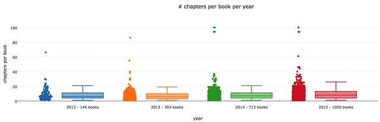
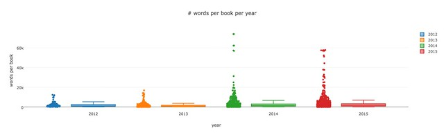
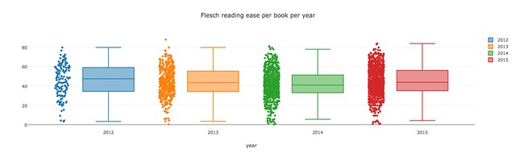
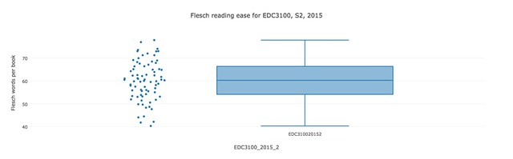
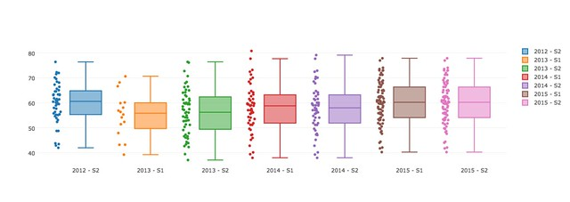
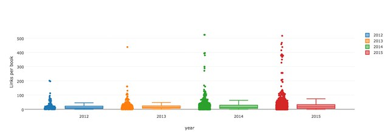
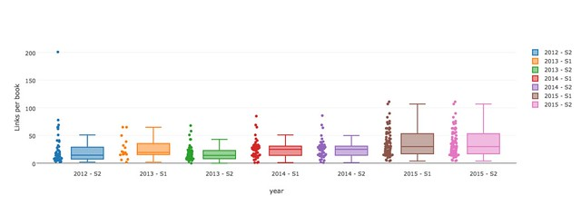

Part 6 of this series diverges a bit from [the last post](/blog2/2016/09/03/exploring-moodle-book-usage-part-5-more-staff-and-student-use/) and moves away from what people are doing with the Book resources to focus on the contents of the Book resources themselves.  Questions I'm hoping to explore in this post include:

- How long are the Book resources? Measured perhaps in number of chapters, bytes, and perhaps textual word count.
- Are the Book's web or print documents? Do they include links? To other books in the course? To external sites? Which sites? Do they include multimedia?
- What does one book with 500+ links actually link to?
- How readable is the text?

**NOTE:** Click on the graphs below to see larger versions.

## How long are the Book resources

A Moodle Book resource is a collection of "chapters" and "sub-chapters", which are essentially web pages. The following starts looking in more detail at these chapters and their contents.

### Where did they come from - import or create?

Looking more closely at the chapters provides an opportunity to find out how they were created.

Each chapter has a field _importsrc_ which specifies the name of a file from which the content was imported.  Indicating that the chapter was created by uploading a already written file, rather than using the Book online editing interface.

Analysis shows that only

- 9.8% (2397 out of 24408) of chapters are imported;
- these belong to 10.2% (287 out of 2801) of books; and,
- 11.8% (44 out of 374) of courses.

i.e. ~ 90% of chapters, books and courses are created by using the online Book interface.  Not a great way to create.

### How many chapters per book?

The next step is to have a look at how long each book is based on the number of chapters. This isn't a great indication of length because each chapter is simply a web page, it could be quite short, or quite long.

The following graph shows the number of chapters in every book grouped by year. Overall the number of chapters stays pretty much the same.  However, there are a couple of strange outliers tending toward 100 chapters in a book. The median number of chapters per book has increased from 6 in 2012 to 8 in 2015.

The total number of books shown in the above graph for each year is a bit out from earlier data. I will need to come back to these analysis and nail down what courses/books are counted in each analysis.

### How many words in each book?

To get a better idea of the size of books the aim here is to convert the chapter content to plain text and do some analysis of the text.  This is where the beauty of Perl (confirmation bias) comes to the fore.  There's a module for that.

The following graph maps the number of words for each book by year.  It shows that in 2014 and 2015 the number of words per chapter/book was certainly getting longer.  The median went from 1157 words per book to 1718 per book (with a dip in 2013 back to 1004 words per book). The upper limit moved from 5282 words in a book to 6930 words per book. Scarily, there are outlier books that are approaching (and in some cases bypassing) 60,000 words in length.

To give you some idea of read time, I'll use [Medium's method for calculating read time](https://help.medium.com/hc/en-us/articles/214991667-Read-time) (ignoring images) to convert the numbers into minutes to read:

- Around the median word count - 1700 words - equates to about 6.1 minutes.
- The maximum upper word count - 6930 words - equates to about 25.2 minutes.
- The outliers - around 60,000 words - equates to about 218.2 minutes, which is approaching 4 hours.

Adding to this is that I'm not sure the typography and design of your typical Moodle Book is going to match what you might expect on Medium. Not to mention that Medium don't mention if their average adult reading spead (275 words per minute) is for words on print or screen.

### Readability?

The module that calculates words also does readability tests, including [the Flesch reading-ease test](https://en.wikipedia.org/wiki/Flesch%E2%80%93Kincaid_readability_tests). The following graph shows the results on that test for each of the books grouped by year.

**Grain of salt -** The graph does exclude a number of books that achieved negative results on the test. Initially, it appears that this may be due to the conversion to text only not handling some special characters which worsen the readability.  (Apparently it is possible to get a negative value on the test). This may also be decreasing the "reading ease" of other books.  This will be examined more closely later.  But then again, [quoting Wikipedia](https://en.wikipedia.org/wiki/Flesch%E2%80%93Kincaid_readability_tests)

While [Amazon](https://en.wikipedia.org/wiki/Amazon.com "Amazon.com") calculates the text of _[Moby Dick](https://en.wikipedia.org/wiki/Moby_Dick "Moby Dick")_ as 57.9,[\[9\]](https://en.wikipedia.org/wiki/Flesch%E2%80%93Kincaid_readability_tests#cite_note-9) one particularly long sentence about sharks in chapter 64 has a readability score of −146.77.

The median moves between 43.7 and 47.3, which is apparently around the 45 that Florida law requires for life insurance policy (thank you again Wikipedia).  However, the lower bound loiters around 5 suggesting very difficulty to read.  Wikipedia suggestions 30 to 50 as being the range for "college" and being difficult to read.

### And my books?

Which has me wondering about mine. I think I've developed a tendency to reading difficulty.  The following graph shows the distribution for the latest offering of my main course that is contained in the data set.

That's a nice-ish surprise.  Median at 60. Worst is 40 and best is 77. With better than 75% of the books above 50 which is the lower bound of the 10th  to 12th grade boundary.

However, I believe these results may be a little padded by the fact that I write most of my books in straight HTML. Meaning there's no increase in complexity because of the difficulty of converting it into clean text.  Which has me wondering about the evolution of readability.  The following graph shows the results from all offerings of the course that use the Book. A bit of a dip at the start with a small upward trend over time.  Not bad - but then of limited use given the limitations of this type of thing.

### What about links - links per book?

One of the questions I'd like to answer is whether or not the people using the Book are using it as a poor-man's replacement for a collection of paper, and how many are using it as a collection of web pages.  First exploration of this question is the rough indicator of how many links per book?

The following graph shows the number of links per Book per year. "Link" is defined here as any type of link, excluding a link to a style sheet. That means links to images, youtube videos etc are all counted as links.

As the graph shows there are a large number of books that have no links.  The median number of links is increasing each year. Starting at 11 in 2012 and moving through 13, 14, and finally 17 in 2015.  As the graph shows there are some major outliers with some Books having hundreds of links, including some with over 500 links.  These might include some of the very long books included above, but it might also include other books that contain huge numbers of links

In terms of books with very few links in 2012, 15.4% of the books had less then 3 links (remember that includes images, links, embedded videos etc) with 2014 having 16.1% and 2015 having 15.3%

### 

### Links per book in EDC3100?

For a quick comparison, the following graph shows the number of links per Book for EDC3100 (the main course I use the Book in). Over time I  have been trying explicitly to think of the Book resources as collections of web pages.

The median # of links per book for all courses moved from 11 to 17. In EDC3100, the median has moved from 14 at its lowest (2013 S2 - a bad semester for links) up to 30 in 2015 (both semesters).  Similarly, the upper range for all courses ranged from 46 to 74 (driven by some truly large link numbers), for EDC3100 the upper range went from 43 in (2013 S2) up to 111 in 2015.

### Exploring types of links a bit more

The above couple of link graphs are limited because I really haven't yet explored the diversity of link types that are included.  I had removed CSS links, but not script links.  I also haven't split apart the different types of links. An examination which might shed some light on those strange books with 500+ links. Time than to explore.

Will try to identify the different types of links, generate stats for all the types, but when counting links, limit to more standard types (img/a)

Types of link to exclude from the count of links: iframe, embed, object, meta - handle link better.

The presence of _<tag meta="generator"_ looks like being one way of identifying chapters coming from Word.

Cleaning up the links does bring the numbers down a bit. e.g. the media for 2015 goes from 17 to 15, but the other medians stay the same. The upper for 2013 onward comes down by 1 to 3.

### What about the 500+ books? What are those links

I'm interested in the books that have 500+ links.  What are they linking to?

One with 517 links has 510 _<a_ links and 7 _<img_ links. What are those 517 _<a_ links?

Lots of internal links and all sorts of other links - other book chapters, readings. Looks like it might be a large book, is it?

29 chapters and 32,871 words - so a big, all in one book.