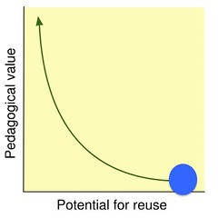

See also: [[blog-home | Home]]

The level of support provided by digital technologies to broad learning and teaching tasks within my little part of my current institution is extremely limited. The following is one explanation why this is the case, and one set of suggestions for what might be done, both immediately and longer term.

## The problems and a cause

There are lots of possible explanations for poor level of support offered by institutional digital technologies. The one I'm using here goes like this

1. Activities that are easy to do get done, activities that are hard to do are not apt to get done.
2. Learning, teaching and the activities that support learning and teaching are [situated - context matters](/blog2/2015/01/06/tpack-as-shared-practice-toward-a-research-agenda/#situated). For example, the most effective ways for 3rd year pre-service teachers to develop their abilities as teachers, are not likely to work effectively for 1st year mechanical engineers. The activities that someone teaching pre-service teachers wants to engage in, will not be entirely the same as someone teaching engineers, nurses, accountants, musicians etc.
3. The implementation of institutional digital technologies explicitly de-values context and specificity. For example, a fundamental principle of Enterprise information technology architecture is (emphasis added) "provide maximum benefit to the enterprise **as a whole**". Here's that principle expressed [by a UK university](http://blogs.plymouth.ac.uk/strategyandarchitecture/enterprise-architecture-with-plymouth-university/plymouth-university-architecture-repository-2/enterprise-architecture-principles/business-principles/principle-3-maximise-benefit-to-the-enterprise/), and [where it is](http://pubs.opengroup.org/architecture/togaf8-doc/arch/chap29.html) (see principle #2) mentioned in ["The Open Group Architecture Framework"](http://pubs.opengroup.org/architecture/togaf8-doc/arch/toc.html). Principle #5 adds this "Development of applications used across the enterprise is preferred over the development of similar or duplicative applications which are only provided to a particular organization". Check your organisation's enterprise architecture framework, you may well see a copy and paste of those principles.

While there is a logic behind those principles, these principles also create at least two problems:

- Lowest common denominator, or the if all you have is hammer problem; and,
- Starvation.

### Lowest common denominator

 "[Making Omelettes](https://www.flickr.com/photos/photograham/260939952/)" ([CC BY-NC-SA 2.0](https://creativecommons.org/licenses/by-nc-sa/2.0/)) by  [PhotoGraham](https://www.flickr.com/people/photograham/) 

If you work for my institution and you need to create a website for some purpose then you have two options: Moodle or [Sitecore](http://www.sitecore.net/). Moodle is the LMS and Sitecore is the content experience (really sitecore, experience?) management system used by marketing to manage the corporate website. This is what we have, so every request to have a website must use one of these.

This has lead to a huge number of Moodle courses sites being created for purposes that are so far removed from the intent of Moodle (or sitecore). Not surprisingly these sites tend to be largely inactive, largely because Moodle (or sitecore) does not make it easy to complete the sort of activities that the purpose required. Those activities become too hard, so they don't get done. They work as well as using a hammer to open a boiled egg.

The focus on the **whole** organisation means that enterprise IT suffers from a version of [the reusability paradox](http://cnx.org/contents/2tQZVsKy@19/The-Reusability-Paradox). As they focus more and more on making a digital technology reusable across the entire organisation, they must remove from that digital technology anything that provides value within specific contexts. Anything that helps pre-service teachers learn, gets removed because they don't represent the **whole** organisation.

### Starvation

Any attempt to develop/adopt/use a digital technology that is not common across the whole organisation (i.e. a digital technology that actually provides value) suffers [from starvation](/blog2/2015/06/16/types-of-e-learning-projects-and-the-problem-of-starvation/). The resources to develop/approve a digital technology within an organisation are limited. Priorities have to applied. A digital technology of value to a subset of the organisation is always going to be placed at a lower priority than a digital technology of value to the entire organisation. It will always be starved of resources.

This starvation is made worse by the observation that the people charged with supporting the use of digital technology within organisations tend to become experts in, and even employed explicitly to support specific digital technologies.  Whenever a requirement is raised, it can only ever be understood/responded to within the context of existing organisational digital technologies and thus returning to the "hammer" problem.

Enterprise IT has become too much about how "we can help you use the digital technologies we already have" and not enough about "what is important to you and how can we make it easier for you to do it well".

## Context specific solutions

Based on the above, if we want to actually add real value to what we do, then we have to figure out how to adopt/develop/use digital technologies that make it easy for us to do what is important. We have to figure out how to adopt/develop/use digital technologies that are more contextually specific.

The following suggestions a "simple" two-step process

1. Identify the activities that are important to use and are currently too hard.
2. Figure out how we can adopt/develop/user digital technologies that will help make those activities easy.

What follows is an attempt to illustrate what this might look like. It will have limitations due to my limited knowledge of both the activities and the digital technologies.

This two-step process and the suggestions below open up all sorts of research opportunities.

### Important, but difficult activities

What follows is a list of potentially important, but currently difficult to accomplish activities around Initial Teacher Education (ITE) at my institution. Some or all of them could be arguable, and there are likely far more important activities.

1. **Program-level activities:** Ensuring that students in our ITE programs
    - successfully complete specific tasks (e.g. have a valid Blue Card);
    - have a space to socialise with others within the programs;
    - start to develop their sense of professional identity as a teacher;
    - identify information about learners, courses etc at program level.
2. **Professional Experience:** All aspects of organising and supporting the placement of pre-service teachers on Professional Experience.
3. **Know thy students:** Have some idea about how and what are students are doing during semester in our own courses and beyond, and be able to respond appropriately based on  what we know.
4. **Learning and teaching:** Like most university e-learning our courses do not include widespread effective use of digital technology to amplify and transform student learning (not at all surprising if we're using generic tools).
5. **Standards, portfolios and outcomes:** Understand how well our students and the students learning maps against [the APSTs](http://www.aitsl.edu.au/australian-professional-standards-for-teachers).
6. **Program and course development:** Plan and manage the development of the proposed new programs and the raft of new courses those programs will require. Support the on-going evolution and management of those courses. For example, being able to see and query due dates or other details across the program.
7. **Teacher specific activities:** Teachers (and thus our pre-service teachers) have to develop and demonstrate capabilities around teacher specific activities (e.g. lesson and unit planning). Increasingly these activities should (but generally aren't) actively supported by digital technologies (a Word template for lesson planning is not active support by digital technologies).

Below there are some initial suggestions about how each of the above might be addressed.

### How we might support these activities

**Important:** The addition of digital technology will not magically help make these activities easier. It's only when the digital technology is integrated effectively into how we do things, that the magic will happen. Achieving that goal is not easy. The following are not magic silver bullets.

There are three broad strategies that can be used

1. Make use of existing organisational processes and technologies and push them further. e.g. the [ICT Technology Demonstrators project](https://www.usq.edu.au/news-events/news/2016/07/new-dimension-of-learning-3d-printing), digging deeper into the capabilities of Moodle for learning and teaching.
2. Complement, workaround, or replace existing organisational processes and technologies. e.g. existing use of cloud-based technologies (Google docs etc) and other forms of [digital technology modification](/blog2/2016/01/20/mapping-the-digital-practices-of-teacher-educators-implications-for-teacher-education-in-changing-digital-landscapes/#table1). (Jones, Albion & Heffernan, 2016).
3. Explore how and if digital technologies used by teachers, related organisations, and beyond can be leveraged. 20 years ago Universities provided banks of dial-up modems to provide Internet access to staff and students. We don't need to do this anymore. Increasingly there are more and better digital technology in society, than in universities. Not only in broader society, also in teaching. For example, [Scootle](http://scootle.edu.au/), the [Australian Curriculum site](http://australiancurriculum.edu.au/), AITSL, and [The Learning Place](http://scootle.edu.au/) are used to varying levels. If we wish to better prepare our pre-service teachers within the profession, then using the technologies used by teachers and broader society is important.

Personally, I believe the best outcomes will arise if we're able to creatively intermingle all three of these strategies. The problems will arise if we try to follow one or the other.

### Existing processes and technologies and push it further

Moodle now has support for [outcomes](https://docs.moodle.org/29/en/Outcomes). It is possible that these could be used to map student activities and assessment against APSTs and contribute toward **Standards, portfolios and outcomes**. If the program(s) wanted to take a more coordinated approach, there might be some value in this.

In terms of **Program-level activities** and, in particular, students one solution might be to request BEdu/BECH specific functionality in UConnect. UConnect is the portal which students use to gain access to USQ and its various other systems. UConnect is implemented using [Drupal](https://www.drupal.org/). Drupal is a content management system and thus it should be technically possible for it to be modified to present a BEdu/BECH specific view. Such a specific view could be used to present specific information (e.g. expiry date of the Blue card etc) and other functionality.

There are a lot of smart people in institutional IT (and elsewhere). Bringing that knowledge closer to use and our needs could result in lots of interesting ideas. Hence, something like [a hackathon](https://en.wikipedia.org/wiki/Hackathon) could be useful.

The current [ICT Technology Demonstrators project](https://www.usq.edu.au/news-events/news/2016/07/new-dimension-of-learning-3d-printing) is one existing process that can be leveraged to produce more specific outcomes.We should be looking being more aware of and leveraging existing work from this project, and also more actively identifying work that would be important for our part of the organisation.

For example (**know thy students**), I'm currently involved in a demonstrator project that should be bringing [MAV](https://damos.world/2013/08/30/the-moodle-activity-viewer-mav-heatmaps-of-student-activity/) to USQ for at least a short time. Using MAV to explore how students are engaging with course Study Desks could be beneficial. This use of MAV is connected to the Digital QILTers project, which arose out of the school 2015 planning day.

Related to this would be engagement with [Hazel's PhD study](http://learninganalyticslady.wordpress.com/), which would help leverage existing capabilities within Moodle to **know thy students**.

Also related to analytics and MAV is the potential introduction of CQUni's [EASI system](https://www.cqu.edu.au/cquninews/stories/general-category/2015/reeds-leadership-has-helped-boost-student-satisfaction) at USQ. EASI would help both **know thy students** and **program-level activities**.

Existing enterprise IT have yet to fully grasp, let alone respond to, the changing nature of digital technologies. Yoo et al (2012) give one view of the changing nature of digital technologies, which they label as _pervasive digital technologies_. Organisations and their IT departements are still operating from the perspective of digital technologies being scarce, not pervasive.  Yoo et al (2012) identify three traits of pervasive digital technologies

1. the importance of digital technology platforms; i.e. "the proliferation of dig- ital tools or digital components allows firms to build a platform not just of products but of digital capabilities used throughout the organization to support its different functions" (p. 1400)
2. the emergence of distributed innovations; and, i.e. "Not only are innovations increasingly moving toward the periphery of an organization, but the distributed innovation spurred by pervasive digital technology increases the heterogeneity of knowledge resources needed in order to innovate" (p. 1401)
3. the prevalence of combinatorial innovation. i.e. "Increasingly, firms are creating new products or services by combining existing modules with embedded digital capabilities. Arthur (2009) notes that the nearly limitless recombination of digital artifacts has become a new source of innovation" (p. 1402)

Our institution has yet to even think of developing a university **platform** that would support **distributed innovations** and **combinatorial innovation**. It is **distributed innovations** that offer the potential to solve the dual problems of lowest common denominator and starvation.

The MAV and "more student details" projects mentioned below are primitive first steps in developing an institutional (perhaps even teacher education) digital platform upon which to build truly interesting ideas. For a number of years Universities have been developing applications programming interfaces (APIs) that are made available to students, teachers and others. [This is one list](http://university.stack.network/universities/) of related resources. Here's a description from a US student titled ["How personal APIs let students design their universities"](http://andrewrikard.com/essays/2016/04/08/Personal-apis.html).

Pushing the institution out of its comfort zone into this area is important longer term and might actually allow the institution that it has the _digital acumen_ that is seen as ["a critical enabler"](https://www.caudit.edu.au/system/files/Media library/Resources and Files/Strategic Initiatives/CAUDIT Top Ten Report 2016 WEB.pdf) (CAUDIT, 2016).

### Complement, workaround, replace org systems

In terms of **Program and course development**, which at some level is a project management task, then a tool like [Trello](https://trello.com/tour) might be a good match. It allows groups of people to collaboratively visualise and manage tasks and progress. Using it conjunction with Google Drive or similar could offer a way to manage the development of the new programs.  Not to mention, Trello is also being used in [education (schools)](https://trello.com/education) in a [variety of different ways](https://www.fractuslearning.com/2014/08/25/trello-manage-school-projects/).

In terms of **Program-level activities** and  promoting social connections amongst students a system like [UCROO](https://www.ucroo.com.au/) potentially offers functionality more in line with social media (think Facebook) than current approaches that rely on using the LMS.

In [this paper](/blog2/2016/01/20/mapping-the-digital-practices-of-teacher-educators-implications-for-teacher-education-in-changing-digital-landscapes/) (Jones et al, 2016), Peter, Amanda and I share a range of different digital modification strategies we've undertaken to make it easier to do what we need to do as teachers. A project that actively identifies what others are doing, shares that work, and then seeks how we can distribute those practices across the school's courses would be interesting.

The ["more student details" workarounds](/blog2/2015/09/15/helping-teachers-know-thy-students/#more) I use could potentially be expanded and customised to other courses.  Especially if MAV sticks around (it's based on the same technology and infrastructure).

As mentioned above, MAV and "more student details" are primitive steps toward providing a platform that enables distributed innovation. The platform offers the chance to move beyond generic tools to specific tools. _Pedagogical skins_ are an idea that seek to put the context and the value back into the LMS to increase the pedagogical value and thus improve the quality of **Learning and teaching.**

### Integrate with teacher digital technologies and beyond

Perhaps the most immediate example of this from the **Standards, portfolios and outcomes** activity. Currently students are encouraged to have a USQ-hosted e-portfolio.  This is such a hackneyed approach of which I've [long been critical](/blog2/2014/02/27/a-story-about-the-failure-of-institutional-eportfolios/). A more contemporary approach is offered by the [Domain of One's Own (DoOO) project from UMW](http://umw.domains/) - ([see here](https://campustechnology.com/articles/2014/04/02/an-e-portfolio-with-no-limits.aspx) for some background or [here for a broader view](https://medium.com/@audreywatters/a-domain-of-ones-own-in-a-post-ownership-society-c3c24ee0917c#.wgbiaw3bz)). It's an approach that is spreading across multiple institutions in the US and Charles Sturt has been starting to play.

Beyond more general technologies, there is the idea of working more closely with teacher specific digital technologies such as Scootle etc. One possibility might be to develop processes by which our students are engaging with [renewable assessments](http://www.chronicle.com/blogs/profhacker/opting-for-renewable-assessments/62523) ([more here](http://opencontent.org/blog/archives/4727)).

It might mean integrating a lesson/unit planning tool that actively integrates with the [Australian Curriculum](http://www.australiancurriculum.edu.au/).

## References

CAUDIT. (2016). _CAUDIT 2016 Top Ten Issues_. Retrieved from [https://www.caudit.edu.au/system/files/Media library/Resources and Files/Strategic Initiatives/CAUDIT Top Ten Report 2016 WEB.pdf](https://www.caudit.edu.au/system/files/Media library/Resources and Files/Strategic Initiatives/CAUDIT Top Ten Report 2016 WEB.pdf)

Jones, D., Albion, P., & Heffernan, A. (2016). [Mapping the digital practices of teacher educators: Implications for teacher education in changing digital landscapes](/blog2/2016/01/20/mapping-the-digital-practices-of-teacher-educators-implications-for-teacher-education-in-changing-digital-landscapes/). In _Proceedings of Society for Information Technology & Teacher Education International Conference 2016_ (pp. 2878–2886). Chesapeake, VA: Association for the Advancement of Computing in Education.

Yoo, Y., Boland, R. J., Lyytinen, K., & Majchrzak, A. (2012). Organizing for Innovation in the Digitized World. _Organization Science_, _23_(5), 1398–1408.