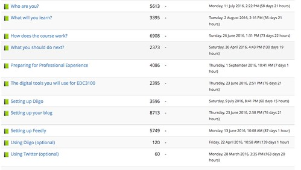
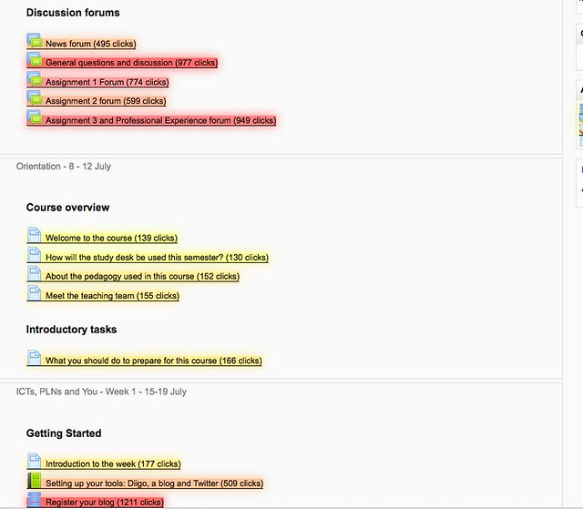
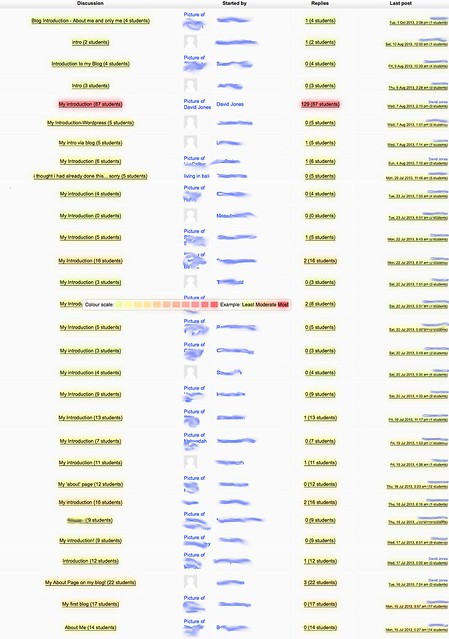

---
categories:
- bad
- pirac
date: 2016-09-08 13:04:01+10:00
next:
  text: Which comes first? Pedagogy or technology?
  url: /blog/2016/09/11/which-comes-first-pedagogy-or-technology/
previous:
  text: 'University digital technology: problems, causes, and suggested solutions'
  url: /blog/2016/09/07/university-digital-technology-problems-causes-and-suggested-solutions/
title: '"Making course activity more transparent: A proposed use of MAV"'
type: post
template: blog-post.html
comments:
    []
    
pingbacks:
    - approved: '1'
      author: Some MAV tasters &#8211; The Weblog of (a) David Jones
      author_email: null
      author_ip: 192.0.100.143
      author_url: https://davidtjones.wordpress.com/2016/10/28/some-mav-tasters/
      content: '[&#8230;] we&#8217;ll get an opportunity to use this type of process to
        support others to use MAV to explore what&#8217;s happening in their [&#8230;]'
      date: '2016-10-28 11:47:21'
      date_gmt: '2016-10-28 01:47:21'
      id: '3415'
      parent: '0'
      type: pingback
      user_id: '0'
    
---
As part of the USQ Technology Demonstrator Project (a bit more [here](https://www.usq.edu.au/news-events/news/2016/07/new-dimension-of-learning-3d-printing)) we'll soon be able to play with [the Moodle Activity Viewer](https://github.com/damoclark/mav-enterprise). As described the VC, the Technology Demonstrator Project entails

The demonstrator process is 90 days and is a trial of a product that will improve an educator’s professional practice and ultimately motivate and provide significant enhancement to the student learning journey,

The process develops a case study which in turn is evaluated by the institution to determine if there is sufficient value to continue or perhaps scale up the project.  As part o the process I need to "articulate what it is you hope to achieve/demonstrate by using MAV".

The following provides some background/rationale/aim on the project and MAV. It concludes with an initial suggestion for [how MAV might be used](/blog/2016/09/08/making-course-activity-more-transparent-a-proposed-use-of-mav/#using).

## Rationale and aim

In short, it's difficult to form a good understanding of which resources and activities students are engaging with (or not) on a Moodle course site. In particular, it's difficult to form a good understanding of how they are engaging within those resources and activities. Making it easier for teaching staff to visualise and explore student engagement with resources and activities will help improve their understanding of student engagement. This improved understanding could lead to re-thinking course and activity design. It could enhance the "student learning journey".

### It's hard to visualise what's happening

Digital technologies are opaque. Turkle (1995) talks about how what is going on within these technologies are hidden from the user. This is a problem that confronts university teaching staff using a Learning Management System. Being able to identify what resources and activities within a course website students are engaging with,which resources they are not, and identifying which students are engaging can take a significant amount of time.

For example, testing at USQ in 2014 (for this presentation) found that once you knew which reports to run on Moodle you had to step through a number of different reports. Many of these reports include waiting for minutes (in 2016 the speed is better) with a blank page while the server responds to the request. After that delay, you can't actually focus only on student activity (staff activity is included) and it won't work for all modules. In addition, the visualisation that is provided is limited to tabular data - like the following.

Other limitations of the standard reports, include:

- Identifying how many students, rather than clicks have accessed each resource/activity.
- Identify which students have/haven't accessed each resource/activity.
- Generate the same report within an activity/resource to understand how students have engaged within the activity/resource.

Michael de Raadt has developed [the Heatmap block](https://moodle.org/plugins/block_heatmap) for Moodle (inspired by MAV) which addresses many of the limitations of the standard Moodle report. However, it does not (yet) enable the generation of a activity report within an activity/resource.

### The alternative - Moodle Activity Viewer (MAV)

This particular project will introduce and scaffold the use of the Moodle Activity Viewer (MAV) by USQ staff. The following illustrates MAV's advantages.

MAV modifies any standard Moodle page by overlaying a heat map on it.  The following image shows part of a 2013 course site of mine with the addition of MAV's heatmap. The "hotter" (more red) a link has been coloured, the most times it has been clicked upon. In addition, the number of clicks on any link has been added in brackets.

A switch of a MAV option will modify the heatmap to show the number of students, rather than clicks. If you [visit this page](https://www.flickr.com/photos/david_jones/12259871663/sizes/o/), you will see an image of the entire course site with a MAV heatmap showing the number of students.

The current major advantage of MAV is that the heatmap will work on any standard Moodle links that appear on any Moodle page. Meaning you can view a specific resource (e.g. a Moodle Book resource) or an activity (e.g. a discussion forum) and use the MAV heatmap to understand student engagement with that activity.

The following image (click on it to see larger versions) shows the MAV heatmap on a discussion forum from the 2013 course site above.  This forum is the "introduce yourself" activity for the course. It shows that the most visited forum post was my introduction, visited by 87 students. Most of the other introductions were visited by significantly less students.

This illustrate a potential failure for this activity design. Students aren't reading many other introductions. Perhaps suggesting a need to redesign this activity. 

## Using MAV

At CQU, MAV is installed and teaching staff can choose to use it, or not. I'm unaware of how much shared discussion occurs around what MAV reveals. However, given that I've co-authored a paper titled ["TPACK as shared practice: Toward a research agenda"](/blog/2015/01/06/tpack-as-shared-practice-toward-a-research-agenda/) (Jones, Heffernan, & Albion, 2015) I am interested in exploring if MAV can be leveraged in a way that is more situated, social and distributed.  Hence the following approach, which is all very tentative and initial.  Suggestions welcome.

The approach is influenced by the [Visitor and Resident Mapping approach](http://daveowhite.com/vandr/vr-mapping/) developed by Dave White and others. We (I believe I can talk with my co-authors) found using an adapted version of the mapping process for [this paper](/blog/2016/01/20/mapping-the-digital-practices-of-teacher-educators-implications-for-teacher-education-in-changing-digital-landscapes/) to be very useful.

1. Identify a group of teaching staff and have them identify courses of interest. Staff from within a program or other related group of courses would be one approach. But a diverse group of courses might help challenge assumptions.
2. Prepare colour print outs of their course sites, both with and without the MAV heatmap.
3. Gather them in a room/time and ask them to bring along laptops (or run it in a computer lab)
4. Ask them to mark up the clear (no MAV heatmap) print out of their course site to represent their current thoughts on student engagement. This could include
    - Introducing them to the idea of heatmaps, engagment.
    - Some group discussion about why and what students might engage with.
    - Development of shared predictions.
    - A show and tell of their highlighted maps.
5. Handout the MAV heatmap versions of their course site and ask them to analyse and compare. Perhaps including:
    - Specific tasks for them to respond to
        1. How closely aligned is the MAV map and your prediction?
        2. What are the major differences?
        3. Why do you think that might be?
        4. What else would you like to know to better explain?
    - Show and tell of the answers
6. Show the use of MAV live on a course site Showing
    1. changing between # of clicks or # students
    2. focus on specific groups of students
    3. generating heatmaps on particular activities/resources and what that might reveal
7. Based on this capability, engage in some group generation of questions that MAV might be able to help answer.
8. Walk through the process of installing MAV on their computer(s) (if required)
9. Allow time for them to start using MAV to answer questions that interest them.
10. What did you find? Group discussion around what people found, what worked, what didn't etc.  Including discussion of what might need to be changed about their course/learning design.
11. Final reflections and evaluation