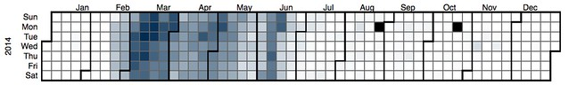

The [last post](/blog2/2016/09/04/exploring-moodle-book-usage-part-6-what-do-they-contain/) in this series looked briefly at the contents of Moodle Book resources. This post is going to look at when the book resources are used, including:

- What time of day are the books used?
- When in the semester are they used?

By the end I spent a bit of time exploring the usage of the Book resources in the course I teach.

## What time of day are they used?

This is a fairly simple, perhaps useless, exploration of when during the day. More out of general interest and laying the ground work for the code for the next question.

Given the huge disparity in the number of views versus print versus updates, there will be separate graphs for each. Meaning 3 graphs per year.  For my own interest and for the sake of comparison, I've included a fourth graph which is the same analysis for the big 2015 offering of the course I teach.  This is the course that perhaps makes the largest use of the Book and also the offering in which  I did lots of updates.

The graphs below show the number of events that occurred in each hour of the day. 12pm to 1am, 1am to 2am,...and so on.  Click on the graphs to see expanded versions.

There is no graph for prints per hour for 2012 as there were none in the database. This appears likely to be a bug that needs to be addressed.

### Overall findings from time of day

**Growth -** The maximum number of events has grown each year (as expected given earlier indications of growth).

- max views per hour: 2012 just less than 35K to 2015 over 150K
- max prints per hour: 2013 just over 400 to 2015 over 1500
- max updates per hour: 2012 just over 500 to to 2015 over 6000.

**Similarity** \- The overall of shapes of the graphs stay the same, suggesting a consistent pattern in interaction.

This is especially the case for the viewing events. Starting with a low number from midnight to 1am, a on-going drop in events until 5am when it grows until the maximum per hour between 11am and midday. Then there is a general drop away until 7pm to 8pm when it grows again until dropping away after 9pm

### Views per hour each year

**2012** 

**2013** 

**2014** 

**2015**

**EDC3100 2015 S1**

### Prints per hour each year

**2012**

**2013**

**2014**

**2015**

**EDC3100 2015 S1**

### Updates per hour each year

**2012**

**2013**

**2014**

**2015**

**EDC3100 2015 S1**

## Calendar Heatmaps

A [calendar heatmap](https://www.r-bloggers.com/ggplot2-time-series-heatmaps/) is a fairly common method of representing "how much of something" is happening each day of the year. The following aims to generate calendar heatmaps using the same data shown in the above graphs. The plan is to use the method/code outlined on [this page](https://www.crowdanalytix.com/communityBlog/10-steps-to-create-calendar-view-heatmap-in-d3-js).

It requires the generation of a two-column CSV file. First column the date in YYYYMMDD format and the 2nd column the "how much of something" for that day. See the example data on [the blog post](https://www.crowdanalytix.com/communityBlog/10-steps-to-create-calendar-view-heatmap-in-d3-js).  Looks like it might be smart enough to figure out the dates involved.  Let's see.

It is, but doing all of the years together doesn't work all that well given the significant increase in numbers of courses using the Book as time progresses and the requirement for the heatmap to use the same scale for all years. As a result the 2012 usage doesn't show up all that well. Hence each of the years were mapped on separate heatmaps.

The following calendar heatmaps show how often the Book resources were viewed on each day. The events counted are only those for Book resources from courses offered in the given year. In 2012, 2013 and 2014 this means that there is a smattering of views of a books early in the following year (semester 3 stretches from Nov to Feb). There is no similar usage for the 2015 books because the data does not include any 2016 events.

The darker the colour the greater the use. In the 2012 image below you should be able to see a tool tip showing a value of 81 (out of 100) that is quite dark, but not the darkest.

### 2012

The 2012 map seems to establish the pattern.  Heavy use at the start of semester with a gradual reduction through semester. A few upticks during semester and toward the end of semester.

I no longer have easy access to specific dates for 2012 and 2013. The 2014 heatmap has some specific dates which should broadly apply to these earlier years. 

### 2013

### 2014

The institution maintains [a web page](https://www.usq.edu.au/current-students/2014) that shows the important dates for 2014, it includes:

- March 3 - Semester 1 starts. Course websites open 2 weeks before this date - 17th Feb
- June 16 - Semester 1 exams start.
- July 21 - Semester 2 starts Course websites open 2 weeks prior - 7th July.
- November 3 - Semester 2 exams start.
- November 17 - Semester 3 starts.

### 2015

The semester 1 2015 offering of my course had the following due dates for its 3 assignments

1. 30th March - which appears to coincide with a heavy usage day.
2. 4th May - also a slightly heavy usage day, but not as heavy.
3. 15th June - two somewhat heavy usage days before and on this date.

Raising the question of what the heatmap for that course might look like - see below

### EDC3100 - S1, 2015

Focusing just on my course the increase in usage just before the due date for the assignments is more obvious. One of the reasons for this is that all the Assessment information for the course is included in a Moodle Book resource.  Other time periods relevant to this course are:

- April 6 to 17 - the two week mid-semester break; and, Which correspond to two of the lightest periods of usage of book resources.
- May 18 to June 5 - a three week period when most of the students are on Professional Experience within schools. Which also corresponds to a light period of usage.

The two heaviest days of usage are the 9th and 10th of March. The start of Week 2 of semester. It's a time when the pressure is on to get a blog created and registered and start completing learning paths.

After the peak of the first three weeks, usage of the Book resources drops to around 50% per day.

Questions to arise from this

- Does the learning journal assessment item for EDC3100 change when students interact with the course site?
- Is the pattern of usage (down to 50% a day) indicative of students turning off, or becoming more familiar with the approach?
- Does the high level of usage indicate

It also begs the question about whether particular offerings of the course show any differences.

### 2012 - S2

The 2012 S2 pattern is quite a bit different. It is a bit more uneven and appears to continue well after the semester is finished.  This is due to this being the first semester the course used the Book module and also because there was a semester 3 offering of the course for a few students that used the same resources. 

The 2012 heatmap also shows a trend that continues. i.e. usage of the Book resources continue well past the end of semester. It's not heavy usage, but is still there.

**Question**: is that just me, or does it include students?

### 2013 - S1

2013 S1 is a bit different as well. Lighter use at the start of semester. A bit heavier usage around assignment due dates. My guess is that this was still early in the evolution of how the Book was being used.

### 2013 - S2

This map seems to be evolving toward the heavy use at the start of semester. 

### 2014 - S1

And now the pattern is established. Heavy use at the start of semester and in the lead up to Assignment 1. A slight uptick then for Assignments 2 and 3. With the light usage around Professional Experience evident.

### 2014 - S2

### 2015 - S2

###    What about just the students?

The following shows just the student usage for the 2013 S1 offering. Not a huge difference to the "all role" version above suggesting that it is students who are doing most of the viewing. But it does confirm that the on-going usage of the Book resources past the end of the semester are students who appear to have found some value for the information post the course.

