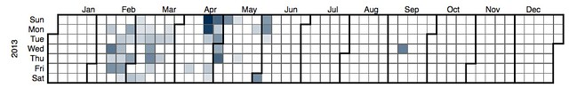

---
categories:
- exploring
- moodleopenbook
date: 2016-09-20 17:32:24+10:00
next:
  text: What if our digital technologies were protean?
  url: /blog/2016/09/21/what-if-our-digital-technologies-were-protean/
previous:
  text: Your experience of organisational digital technology?
  url: /blog/2016/09/20/your-experience-of-institutional-digital-technology/
title: Exploring Moodle Book usage - Part 7a) - when are they modified
type: post
template: blog-post.html
---
In a [previous post](/blog/2016/09/11/exploring-moodle-book-usage-part-7-when-are-they-used/) I generated various representations of when Moodle Book resources were being used and some indications of when they were being created. What I didn't do in that post was generate a calendar heatmap of when the Book resources were being create and modified. This is of interest because I'm wondering whether or not these resources (web pages) are being modified throughout the semester, or just at the beginning.

The following corrects that. It starts with calendar heatmaps showing when I've edited/created the Book resources in my course. I've tended - or least eventually developed - a practice of developing and changing the books as the semester progresses. I think I'm strange - turns out that I'm apparently not that strange at all.

## EDC3100

Each of the following shows some level of change prior and during semester. Some even show changes after the end of semester.

For most of the semester, the weekend are the days that tend to be busiest in terms of edits. Showing an unhealthy practice of using weekends to catch up.

In S1 I also teach on-campus students, which is typically done during the week. Perhaps that limits the edits that happen during the week in S1.

S1 typically starts early March and finishes late June/July. S2 typically starts late July and finishes early November.

### 2012 S2

Fair bit of work before semester and on-going.  Fair bit of work on saturday and sunday.

### 2013 S1

Lot of work in the leadup. Not so much during the early part of the semester.

### 2013 S2

More front ended activity before and early in semester.  Late in the semester not much.

### 2014 S1

More weekend editing.

### 2014 S2

A generally lighter collection of updates.

### 2015 S1

More before semester, lightish during.  Much of the work during is occurring late in the week.

### 2015 S2

A more even spread across the week.

##  Courses other than EDC3100

So what about updates in all the other courses?

Well, that is a surprise.  Indications are that at least someone is modifying a Book resource most days throughout the year.  Even in some circumstances well before or well after the year.

The question with these now is whether this spread is due to the number of book resources or number of courses using the book.  A topic for further exploration.  Perhaps by doing a heat map showing the % of courses that have books being modified?

### 2012

### 2013

### 2014

### 2015

