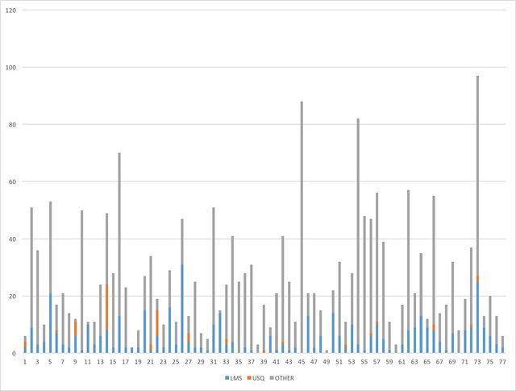

Natalie writes about how she's working a new practice into how she responds to student queries. It's a process in which she attempts to model an approach to answering the query and including links to relevant sites. This is a practice that I use a fair bit, especially with the Moodle Book resources in my undergraduate course. This post seeks to explore my own practice, but also how wide spread that practice is in others.

This post picks up on work and ideas from [an earlier post](/blog2/2016/09/04/exploring-moodle-book-usage-part-6-what-do-they-contain/). The [Moodle Book module](https://docs.moodle.org/31/en/Book_module) helps create/manage collections of web pages. My interest is to explore how much people are using them as web pages, rather than just dumping grounds for print material. One of the main affordances of the web is links. The [prior post](/blog2/2016/09/04/exploring-moodle-book-usage-part-6-what-do-they-contain/) found that around 15% of the book resources contain no links. It also found that the median number of links per book has grown from 11 through 17. It also shows that there are some books with hundreds of links. It also showed how the number of links in the book resources I produce has grown with the median hitting about 25.

This post will seek to refine and expand this exploration a bit, including

- Looking more closely at what the book resources are linking to: other book resources, multimedia, other institutional resources etc.
- Whether or not book resources are being linked to from course forum posts -- this will become the topic for another post.

## Link break down by destination

First, lets break down links by three destination categories:

- LMS - to within the institutional LMS
- USQ - other non-LMS links for the institution; and,
- OTHER - everything else.

### EDC3100 2015 2

The following graph shows the breakdown between the three categories for each book resource in the most recent offering (for which I have data) of the course I teach. It shows that typically links to the broader web tends to be the largest category, followed by other links within the LMS, and finally links to the institution.

But there is also some variety depending on the purpose of the specific book.

The book with the largest number of links (almost 100) is also one of the longer books.  It is also the book that contains all of the assessment related information (what is required, where to submit, how to request an extension, how to query marking etc). It includes 25 links to other parts of the study desk and 70 links to other sites.

The book with the most LMS-based links is titled _Conclusions Week 1_. It provides a summary of what was learned that week and includes links back to the specific pages in the various books for that week.

The book with the second most number of links, also only has external links.  This book aims to show folk how to use resources out on the web and literature to learn how to use a new digital technology. Hence it has a large number of links out onto the broader web and that's even before Diigo widgets that contain the most recent collection of links shared to the course Diigo group are rendered.

### Evolution over time - EDC3100

The next graphs show the evolution of links from the EDC3100 books over time.For each offering of the course it shows the number of links per book of each type: LMS, institutional, and other.

There is no graph for institutional links (NOT the LMS) because from 2013 S2 it flat lines indicating - apart from one - none have links to non LMS institutional resources.  I imagine this may well be very different in other courses.

The first graph shows the evolution of LMS links. The median starts and remains at about 4 LMS links per book. With a slight growth at the top end in recent years.

The next graph is for links outside the institution. The growth in these links is a bit more evident. The median growing from around 9 to around 13 and the upper from 40 to 50

### Evolution over time - All courses

The following graphs show how many links of each type (LMS, USQ and other) found in all book resources in each year. These graphs do not include EDC3100, the course I teach.

There is a broad common trend in all three.  The number of books with large number of links increases over the years. However, that number is largely insignificant as the vast number of books contain much fewer links.

The first graph shows the number of LMS related links in each book. It shows that in 2012 almost all of the books had no such links. 75% of books in 2012 has less than 5. 50% had 0. As the years progress there are a growing number of books with quite large numbers of links, with the maximum reaching 400. This corresponds to the appearance of some books that are very large. By 2015, 75% of books has less than 7. 50% less than 2. 

The next graph focuses on number of links to institutional resources (not in the LMS) in each book. The basic shape is much the same. Starting quite low and then having a number of books added in 2014/2015 with quite large numbers. However, the numbers involved fewer numbers of links than the LMS graph (e.g. the maximum gets to just over 200, rather than 400). It also shows that the overall trend is a bit down.

In 2012, 75% of books has less than 4 USQ links. By 2015, that had reduced to 3.

 The following graph focuses on links onto the broader web.  The numbers are higher.

In 2012, 75% of books had less than 17 links, 50% had less than 7. 2015 was largely the same. 

## What Moodle links exist?

Next step is to take a closer look at the Moodle links. What type of activities and resources are being linked to.

Will people be linking to anything? Mostly resources? Activities?

### EDC3100 2015 2

Start with the latest version of the course I teach.

It shows that most of the links in the latest offering are to other Moodle book resources. Over time I've made an effort to link between books to show the interconnection of ideas.

Surprisingly, it also shows links to the discussion forums.  These are going to be offering specific since each offering of a course uses different forums.  Interestingly, take away the book links, and the forum links make up almost 61% of these links.

Would an analysis that divides links between activities and resources indicate anything interesting about learning design?

### All 2015 S2 - but EDC3100

So how do all the other courses use of Books form 2015 S2 compare?

Lots of resource focus - book, pluginfile, printing the book, equella.  But also links to the quizzes and forums.

Interestingly for me it highlights 3 other courses using BIM. 2 of which I don't teach.

## But how widespread is this?

As discovered above

In 2012, 75% of books has less than 4 USQ links. By 2015, that had reduced to 3.

Meaning that those 1000+ links to Moodle books above were found in a fairly small number of books. Perhaps a couple of the quite large books. More to find out

- How widespread are these links? How many books?
- What type of links are they?

Something for later.