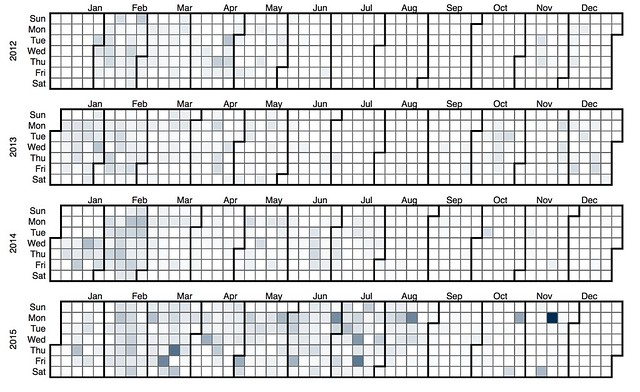
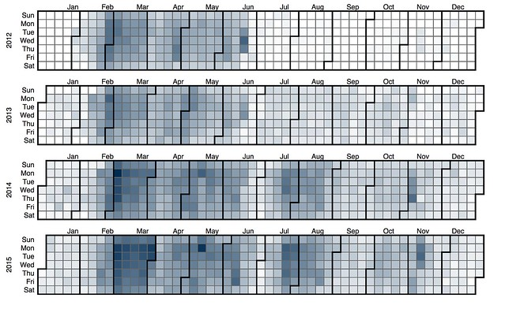

---
categories:
- exploring
- moodleopenbook
date: 2016-09-26 06:49:39+10:00
next:
  text: Some findings from initial exploration of Moodle Book usage
  url: /blog2/2016/10/06/some-findings-from-initial-exploration-of-moodle-book-usage/
previous:
  text: Exploring Moodle Book usage - Part 8 - linking to and from
  url: /blog2/2016/09/22/exploring-moodle-book-usage-part-8-linking-to-and-from/
title: Exploring Moodle Book usage - part 9 - Strange courses
type: post
template: blog-post.html
---
Time to explore some of the strange courses that have been identified.  There are currently two types:

1. courses with many individual Book resources; and
2. courses with huge Book resources.

## Strange books

### Courses with many books

Back in [part 2](/blog2/2016/08/16/exploring-moodle-book-usage-part-2-overall-use/) there appear to be a number of courses that have more than 50 individual book resources.  That seems a bit excessive.  Wonder what that indicates? What are these courses (one of mine might be part of this group)? Is there something wrong hidden in these figures (e.g. are some of them hidden)?

There are 15 course offerings with more than 30 Books.  7 of these are offerings of the course I teach.  The remaining 8 are split between 3 different bridging/preparation courses.

If the line is drawn at 20 books, then there are 23 course offerings drawn from another 2 education course , a nursing course, and another 2 bridging courses.

### Courses with huge books

In [part 6](/blog2/2016/09/04/exploring-moodle-book-usage-part-6-what-do-they-contain/) it was discovered that there are books with 100 chapters (individual web pages). Most of the books had less than 20.

There are 51 offerings with books with greater than 26 chapters (25 is the upper limit for 2015).  This converts into 20 courses with a number being offered multiple times.

_**Further stats about these courses - as per the Word doc**_

### Imported books

[Part 6](/blog2/2016/09/04/exploring-moodle-book-usage-part-6-what-do-they-contain/) in the series also outlines details of the number of books that were imported - only 9.8% of chapters imported, from 10.2% of books, from 11.8% of courses.

## Comparisons

The aim now is to take a closer look at these strange course to learn more about them.  The following graphs will report different stats about the courses that fall into the three different categories

1. IMPORT - courses that have used the Book import facility
2. BIG - courses that include big books (greater than 26 chapters)
3. MANY - courses that have many books (greater than 20 books)

### % of online only students

The institutions has a number of different types of student, including online only. The following graph shows the % of online students in each course.

It shows that the IMPORT courses tend to have a higher concentration of online students, with the MANY courses next. The BIG courses, tend to include more courses that have no online student.  There is online 1 MANY course with no online only students. Only 3 IMPORT courses with no online students. 

### \# of revisions per book

On the other hand, the following graph shows that the BIG courses, tend to have more revisions, including one that has 701 revisions.  That has to be explored a bit more - most of the BIG courses with high revisions are from the same allied health discipline. They are all - except from 2 (100% and almost 20%) - on-campus courses.

## When they are read by students

The following heatmaps aim to represent when these books are read.

### Import books

The following heatmap shows when books in courses that used the IMPORT facility were read by students. It seems to suggest that the IMPORT facility was really only heavily used in 2015.

### Big Books

The next images shows that courses with BIG books started a bit earlier and tend to be first semester occurrence.  Perhaps suggesting - like my course - a big offering in the 1st semester and a smaller repeat in the 2nd?

It also seems to suggest a tendency for the books in these courses to be read more earlier in the semester and also to be read on week days. In the first half of 2015, there's even a trend for reading more on Monday and Tuesday. 

### Many Books

## When are they modified

The next set of heatmaps are for the same collection of courses, however, these show when there were modify/create events. How often and when were they changed.

### Import

The import courses align somewhat with the above.  Really only seeing action in 2015.

And much of that importing in 2015 is taking place on the weekends - I have a suspicion that this might be my course having an influence. 

### Big

The BIG courses have modify/create spread over the years. However, it does appear that there's a tendency to modify/create happening earlier in the semester

### Many

The MANY courses are - overall - showing a bit less activity. The pattern in the first half of 2015  suggests that a single course is having a fair impact. If this is my course, then it might be worthwhile taking it out and running these again. 

## Remove EDC3100 - students viewing and printing

The next 6 heatmaps repeat the 6 from above, but with any of the offerings of the course I teach removed. This appears to radically change the picture.

### Import

Reveals the drawback of the combined heatmap approach. It appears that my course offering has a great deal of activity, which in the above Import heatmap "overwhelmed" some of the other courses.  This map shows that use of the import facility starting earlier and being used. It shows in S1 2015 quite a lot of activity toward the end of semester. 

I was interested in the balance between viewing and printing.  The following heatmap is for the same set of courses as the above, but shows only the events associated with printing out a chapter or book.  It is suggesting that these courses are rarely printed

### Big

As mentioned below, this map appears no different with my course removed. Identifying that my course isn't a BIG course. 

The following heatmap is for the same courses, but only the print actions. When compared to the other groups of courses, it suggests that the BIG courses have more print actions. Suggesting the bigger the books, the more likely students are to print them.

### Many

However, my course is one of the MANY.  Removing my course here allows the activity of the other courses to come through, in particular the small number of courses in first semester 2012 that had fairly consistent student usage throughout semester. 

And the following again shows just the print actions. It suggests that the MANY courses print a bit, but not as much as the BIG.

## Remove EDC3100 - when modified

### Import

It appears that the modifications occur toward the start of the semester and rarely continue during semester (Late Feb - S1; Late Jun/Jul - S2; Late Oct - S3) 

### Big no 3100

This appears to be pretty much the same map as above - indicating that perhaps my course is not one of the BIG courses.

### Many 3100

A more major change here. Major reduction in modifications during semester, limiting modifications largely to the start of semester. With an exception in S1, 2012. _**Is this the course that had students doing it?**_ 

## Student updates - no edc3100

There are 2 course offerings that have students modifying Book resources. The following heatmaps foll