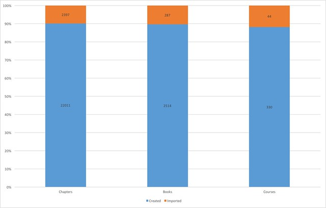

See also: [[blog-home | Home]]

I recently gave a talk at the [Moodlemoot’AU 2016 conference](https://mootau.moodlemoot.org/course/view.php?id=62) in Perth. The talk was titled [“How and why do people use the Moodle Book module?”](/blog2/2016/08/07/how-and-why-do-people-use-the-moodle-book-module/)  It reported on analysis of data from one University's Moodle isntances to explore how courses, learners, and teachers made use of the Moodle Book module (aka the Book) from 2012 through 2015. The slides, abstract, and links to various interactive graphs used in the presentation are available via [the presentation webpage](/blog2/2016/08/07/how-and-why-do-people-use-the-moodle-book-module/).

This talk is part of a broader project that is looking more [into post-adoption usage of e-learning systems](/blog2/2015/11/06/exploring-post-adoptive-usage-of-the-moodle-book-module-a-draft-proposal/), with an initial focus on the Book module.

The following provides a summary of some of what was found.  The links are to web pages that contain relevant interactive graphs.

### Most books aren't completely read

The [percentage of students who completely read](http://djon.es/moot2016/howRead/41_all.html) all of the Book resources appears quite low. In 2012, half the books were completely read by less than 47% of students. In 2015 half the books were completely read by less than 2% of enrolled students.

### More integrated design appears to increase completion

I teach a course where Moodle book resources are integrated into the course and contribute a small part toward the final result. Not unexpectedly this [produces better completion rates](http://djon.es/moot2016/howRead/43_3100.html). However, questions remain the quality of the "reading" and some ups and downs in the data.

### Courses using the Book tend to be bigger

Courses that [use the book](http://djon.es/moot2016/13_howBig.html) tend to have more students (median course enrolment of 85 in 2015) than [those that don’t](http://djon.es/moot2016/21_howBigAll.html). (median of 11 in 2015). Raising questions about what is the difference with larger courses that seems to drive the use of the Book module.

### ..and have tended not to be for online only students

The majority of courses that use the Book do [not include (m)any online students](http://djon.es/moot2016/24_onlinePercent.html), especially when compared [with all courses](http://djon.es/moot2016/25_onlinePercentAll.html).

Again raising the question of the motivation/purpose for using the Book.

However in 2015 there was an increase in the number of [courses with online students](http://djon.es/moot2016/24_onlinePercent.html) using the Book module.

This appears to be a result of the discontinuation of an institutional system that was used to transform more traditional distance education study guides into web-based resources.

### Size of books and number of books

In 2015, the median [number of Book resources per course](http://djon.es/moot2016/29_numBooks.html) was 3, however, there were two courses that had almost 80 Book resources.

In 2015, the median [number of chapters per Book](http://djon.es/moot2016/31_numChapters.html) was 4, however, there were 3 that had more than 80 chapters. In 2014, there was a Book resource that contained over [74,000 words](http://djon.es/moot2016/33_numWords.html).

### Most people are not using the Book import functionality

The Book module provides two broad methods to create resources:

1. create; and Use a web-based editor to type (or perhaps copy and paste is the most popular method) text into the Book resource.
2. import. Given a HTML file (or collection of such files) created externally, you can then import that file and it will be broken up into chapters.

It appears that very few people are using the import facility.  The following graph shows that roughly 10% of chapters, books and course offerings at this institution involved the use of the import method.

After the presentation, someone from the institution's central L&T group came up for a chat. Indications are that between he (supporting another teacher) and I (in my course), we potentially account for all use of the import functionality.  Further discussions reveal issues arising from people copying and pasting from Word into the Book module.

It appears that content authoring might remain an unresolved problem.

