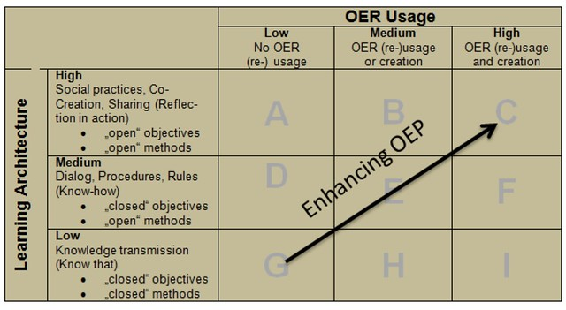
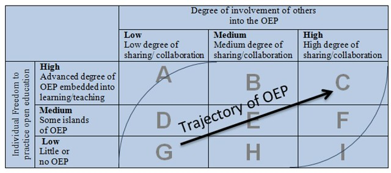
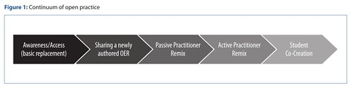

What follows is a continuation of an [earlier exploration](/blog2/2016/09/01/exploring-frameworks-to-understand-oeroep/) into extant "frameworks" to understand OER/OEP.

## The OPAL OEP guide

A 2010/2011 [project](http://www.open.ac.uk/iet/main/research-innovation/research-projects/open-educational-quality-initiative-opal) partly funded by the European Commission aimed "at establishing a forum which works to build greater trust in using and promoting open educational resources".  Has a particular focus to move beyond OER to "focus on innovation and quality through open educational practices (OEP). Ehlers (2011) describes it in more detail and suggests that

Individuals (learners, professionals) likewise can use Matrix 1 to better understand OEP and to self-assess and position themselves to the extent that OEP constitutes part of their own learning/ teaching abilities. They can use the second matrix to analyse the OEP landscape in which they operate, which can be represented in the degrees of freedom to practice open education and the extent to which it is embedded in an open social sharing and collaborative environment. (pp. 6-7)

The diagram (Matrix 1) below show different stages of OEP using a combination of OER usage and learning architecture.  Coughlan and Perryman (2015) label this the OPAL open educational practices maturity model and use it to evaluate the practices of three global health projects. Coughlan and Perryman (2015) suggests that it

has been the dominant OEP analysis framework since its development in 2011 in connection with the Open Education Quality Initiative (p. 177)

So the OEP matrix consists of

1. OER;
2. Learning architecture aka pedagogical practice.

OPAL (2011) offers the following example

field “H” could relate to “I am sometimes using OER for normal lectures”, field “B” would represent rather “I am using open educational resources in open seminars and learning scenarios”

OPAL (2011) offers the following explanations of the low, medium and high levels of learning architecture (p. 5)

- “**Low**” if objectives as well as methods of learning and/ or teaching are rooted in “closed” one way, transmissive and re-productive approaches to teaching and learning. In these contexts, the underlying belief is that teachers know what learn- ers have to learn and mainly focus on knowledge-transfer.
- “**Medium**” represents a stage in which objectives are still pre-determined and given, but methods of teaching and learning are represented as open pedagogical models. They encourage dialogue oriented forms of learning or problem based learning (PBL) focusing on dealing with developing “Know how”.
- “**High**” degrees of freedom and openness in pedagogical models are represented, if objectives of learning as well as methods (e.g. learning pathways) are highly determined and governed by learners. Questions or problems around which learning is ensuing are determined by learners (SRL – self regulated learners), and teachers facilitate through open and experience-oriented methods which accommodate different learning pathways, either through scaffolding and tutorial in- teractions (ZPD Vygotskian inspired approaches) or contingency tutoring (Woods & Woods strategies of re-enforcement, domain or temporal contingency)

Ehlers (2011) then offers "Matrix 2" in the following image. It's intended to be used to "categorise, assess, and position the existing landscape of OEP within a context".  Based on the freedom to participate and the involvement of others.

Ehler (2011) positions OEP as the 2nd phase of open. It has a focus on actually using OER to improve learning. A move that requires the combination of OER and open learning architectures.  The following bullet list describing phase 2 is provided by Ehler (2011, pp 3-4)

- builds on OER and moves on to the development of concepts of how OER can be used, reused, shared, and adapted
- goes beyond access into open learning architectures, and seeks ways to use OER to transform learning
- focuses on learning by constructing knowledge assets, sharing them with others, and receiving feedback and reviews
- follows the notion of improving quality through external validation because sharing resources is in the foreground
- is about changing the traditional educational paradigm of many unknowledgeable students and a few knowledgeable teachers to a paradigm in which knowledge is co-created and facilitated through mutual interaction and reflection
- strives to understand that OER has to contribute to institutions‘ value chain.

The last point is potentially questionable.  What is the institution?  If we're focused on teacher education, is the institution our respective universities or the teaching profession?

### Limitations

However, Coughlan and Perryman (2015) found that

the pedagogy and object-focused OPAL framework is not sufficiently comprehensive to cover the open collaboration featuring in our case studies (p. 177)

And supplemented it with four dimensions from the OEP social configuration framework from Vrieling, Van den Beemt and De Laat (2016) and also [Schreurs et al (2014)](http://www.irrodl.org/index.php/irrodl/article/view/1905/3010). What's missing is deemed to be more about the behaviour of those involved, they go onto argue that

that current OEP evaluation frameworks are not sufficiently comprehensive nor nuanced to capture all of these practices; indeed, the models reduce the three case studies to appearing very similar (p. 184)

Other weaknesses are identified, but I wonder how much of this is simply weaknesses inherent in all models ([they are all wrong](/blog2/2015/08/28/all-models-are-wrong-but-some-are-useful-and-its-application-to-e-learning/) at some level/perspective). For example, the following from Coughlan and Perryman (2015)

For example, influential frameworks such as the OPAL matrix, with its language of teachers, courses and educational institutions, are overly narrow and do not map easily outside academia.

### Open Educational Practice Maturity Matrix

OPAL (2011) the proceed to provide a maturity matrix to position an organisation re: uptake of OEP.  Three sets of questions based around: positioning the org in an OEP trajectory; creating a vision of openness; and, implementing and promoting OEP

## Relationship between OPAL and Stagg

The [last exploration](/blog2/2016/09/01/exploring-frameworks-to-understand-oeroep/) of OEP frameworks was largely focused on Stagg (2014) who developed a continuum of open practice.   Stagg and most of the other frameworks covered in that earlier exploration have an institutional focus. They include consideration of what the institution can/should do to support OEP.

But what about moving beyond the institution? Integrating OEP into teacher education would seem to place some value on engaging with the professions, which is beyond any single university.  How does that work? What is required there?

Leaving behind those questions for now, what's the connection between the Stagg, OPAL and other frameworks?

The Stagg continuum appears to be finer in the granularity with which it divides OER resources/practices, but at the same stage it isn't as fine grained around pedagogical activities.  Hence the following mapping of Stagg's continuum against the OER usage dimension of the OPAL matrix doesn't quite work.  e.g. Student co-creation from Stagg doesn't map against this dimension.

- Low - no OER (re-)usage No equivalent from Stagg
- Medium - OER (re-)usage **or** creation Equivalent's from Stagg might include and other following, as long as the either/or relationship exists between usage and creation.
    - Awareness/access - there is a basic level of (re-)usage of OER
    - Passive remix - some level of (re-)usage
    - Active remix - a higher level of (re-)usage
    - Sharing a newly authored OER
- High - OER (re-usage) **and** creation The equivalent from Stagg above is in the combination of both (re-)usage and creation.

## Judith & Bull and OPAL

Judith and Bull (2016) analyse OER literature and identified a set of categories for strategies that can be used - each having "increasing levels of collaborative support involved in OER implementation"

- individualised strategies; individual or small team.
- programmatic strategies; Organised programs within institutions.
- institutional strategies; Approaches more embedded within normal institutional activities.
- networked or user-shaped strategies. This appears to be touching more on Coughlan's and Perryman's (2015) use of the social configuration framework, but perhaps that's in each of them.

This is then converted into a continuum of openness that maps some aspects of the above.

## References

Coughlan, T., & Perryman, L. (2015). Learning from the innovative open practices of three international health projects : IACAPAP , VCPH and Physiopedia. _Open Praxis_, _7_(2), 173–189. Retrieved from http://openpraxis.org/index.php/OpenPraxis/article/view/188

Ehlers, U. (2011). Extending the Territory: From Open Educational Resources to Open Educational Practices. _Journal of Open, Flexible and Distance Learning_, _15_(2), 1–10.

Stagg, A. (2014). OER adoption: a continuum for practice. _Universities and Knowledge Society Journal_, _11_(3), 151–164. http://doi.org/10.7238/rusc.v11i3.2102

Vrieling, E., Beemt, A. Van Den, & Laat, M. De. (2016). What’s in a name: dimensions of social learning in teacher groups. _Teachers and Teaching_, _22_(3), 273–292. http://doi.org/10.1080/13540602.2015.1058588