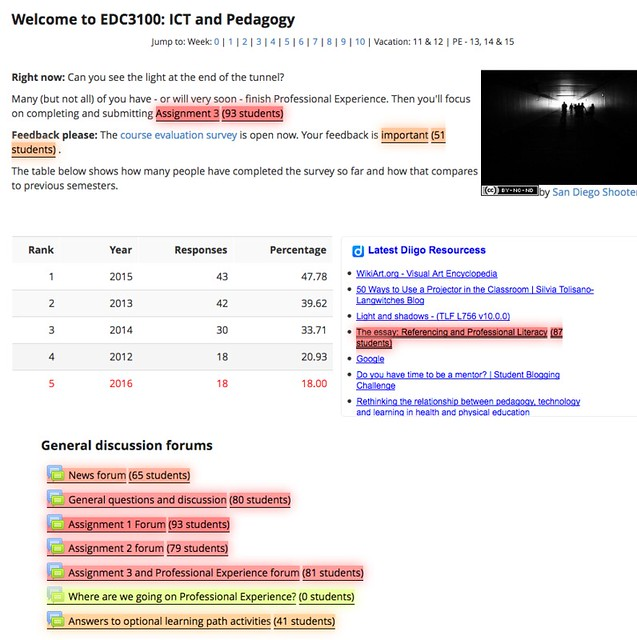
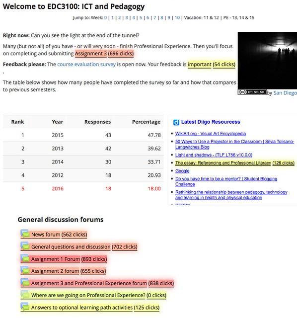
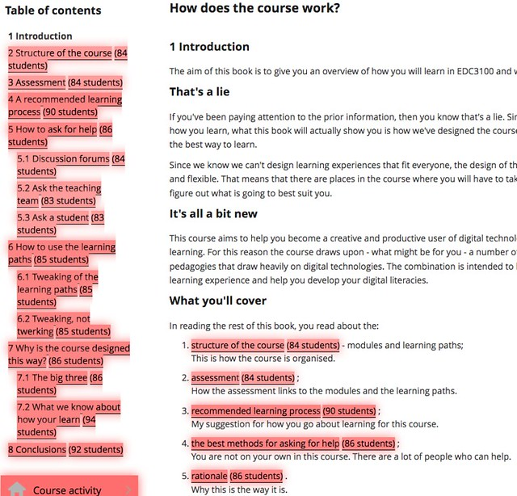
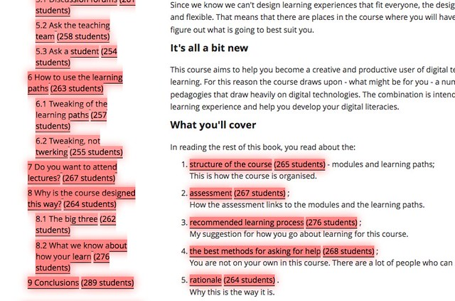
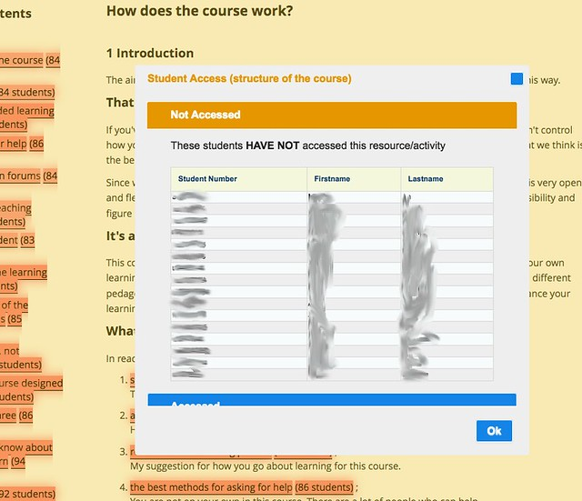
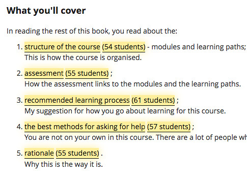
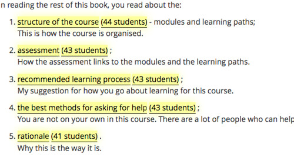

[MAV](https://github.com/damoclark/mav-enterprise) is just about up and running at USQ as one of [the Technology Demonstrators](https://www.usq.edu.au/learning-teaching/demonstrators/about). It's taken longer than I thought, but it's there.  The following demonstrates MAV running on a course I teach and is intended to illustrate some of what it can do.

Hoping we'll get an opportunity to use [this type of process](/blog2/2016/09/08/making-course-activity-more-transparent-a-proposed-use-of-mav/#using) to support others to use MAV to explore what's happening in their courses. The aim being to explore what, if any, insights MAV provides teaching staff.

### See usage of any Moodle link

Once MAV is installed on Firefox, whenever you view a Moodle course page every Moodle link on that page will be modified to show how it's been used by students.

You can see the number of students who have accessed the link.  Even the course link that's include via the Diigo widget get's highlighted.  You can also see that no student has been able to use the hidden "Where are we going" forum.

Or you can the number of times students have clicked on the link.

Interestingly, but perhaps not surprisingly, in the above the link about the importance of student's completing course evaluations is clicked about once per student (51 students with 54 clicks), but the Assignment 3 specification has been visited at least 7 times per student (93 students with 696 clicks).

### On any course page

This happens on any Moodle page for the course. The following shows the MAV view on a Moodle Book page from the S2 2016 offering of my course. It shows the first page which gives an overview of the rest of the book, including links to those specific pages.

It shows that the _recommended learning process_ page was visited by 90 students, however the rest of the pages in this book were visited by 86 or 84 students.

And here's the same page from the Semester 1 offering. There is also a similar slight increase for that same page.

### Find out who has or hasn't viewed the page

MAV adds in an indication of the number of students (or clicks) for each Moodle link. If you click on students link, MAV will show you a list of the students who have (or have not) visited that page.

At CQU there is a link from this view to a system that allows the managing of nudges (communication attempts) with the students.

### View specific groups

I've always been interested in the difference in engagement between on-campus and online students. MAV allows you to focus on specific groups. Here's the S1 2016 book page showing the Springfield students 

Here's the same section for the Toowoomba on-campus students.

It appears that the Toowoomba students are using this book less, and there is also NOT the same peak for the _recommended learning process_ page.

