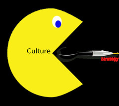

Today the good folk at my institution's library (and others I assume) are [running a symposium](http://www.usq.edu.au/connect-create-curate) "exploring current practice and future potential for open educational practice and libraries".

As most of the participants are employed by institutions (and the libraries thereof) there appears to be much interest in how institutions can support, encourage and enable open education.

In the tweet stream for the symposium (#oeplib) the question of Open Educational Culture arose. I think there's some value in the idea, but I want to explore some of the dissonance that exists within institutions and their progress toward an open educational culture.

https://twitter.com/StevenPChang/status/799431871608156160

Main questions arising from the following are:

1. Perhaps institutions have to think a bit more deeply about the type of culture that organisational artifacts (like policy) are creating?
2. If promoting open is your thing, then disciplinary cultures may be a more worthy starting point?
3. Before attempting to create an Open Educational Culture, perhaps folk should experience more closely those disciplinary cultures that have been doing open for some time?

### Culture

 "[Culture eats strategy](https://www.flickr.com/photos/jjfbbennett/8256143475/)" ([CC BY-NC-SA 2.0](https://creativecommons.org/licenses/by-nc-sa/2.0/)) by [jjfbbennett](https://www.flickr.com/people/jjfbbennett/)

So what is culture? The literature is replete with reams of responses to that particular question. The one that the pragmatist in me prefers is the one offered by [Martin (2006)](http://southernlibrarianship.icaap.org/content/v07n01/martin_m01.htm) (and many others)

Simply put, organisational culture is "the way we do things around here"

Martin goes on to drawn upon Schein's work on organisational culture, in particular the idea that organisational culture consists of three levels: artifacts, espoused values, and underlying assumptions. Summarised in the following table.

Culture is the way we do things, and we do what is easy. We do what the artifacts, values and underlying assumptions of our organisations make it easy for us to do (with some exceptions).

Three levels of culture (Adapted from Schein, 1992, p. 24)
| Level | Description |
| --- | --- |
| 1\. Artifacts | Visible and feelable structures and processes  Observed behaviour - difficulty to decipher |
| 2\. Espoused beliefs and values | Ideals, goals, values, aspirations  Ideologies  Rationalisations - may or may not be congruent with behaviour and other artifacts |
| 3\. Basic underlying assumptions | Unconscious, taken-for-granted beliefs and values - determine behaviour, perception, thought and feeling |

### Policy as an artifact and the tensions it reveals

At a certain level within any organisation it is policy that

What type of open educational culture does a policy embody when it includes something like the following?

examines the suitability of learning and teaching materials to be made available as OERs on a case-by-case basis

This appears to be a culture that mirrors [Peter's description](https://oepuqusq.wordpress.com/2016/09/02/bringing-up-the-rear/) of our own experience (emphasis added)

In principle being open is acknowledged as a good thing but in practice it seems not to happen much and to be not easy to accomplish within the institutional processes. _It seems likely that is linked to concerns about reputational effects_. Open resources and practices will surely influence perceptions of the institution among those who access the open material and possibly more widely if they ‘talk’ about it. _Thus the interests of the institution seem to be best served by ensuring that what is made open is carefully managed and quality assured to present the best possible impression_. That will require substantial effort to vet material that is opened and provide an incentive to restrict access to anything that might diminish that impression.

It seems to be a culture where the motives for OER tends more toward what [Falcolner et al (2016)](https://ajet.org.au/index.php/AJET/article/view/2258) label _reputation building_, rather than other possible motives such as _open access to knowledge_ or _enhancing pedagogy_. Falconer et al (2016) place the _reputation building_ motive for OER into a group that "share a marketisation model of higher education, based on cost-benefit analysis" (p. 99).  Rather than a second group that repudiates "maketisation as an appropriate model for higher education and are committed to a value of "academic commons" (p. 99).

As Falconer et al (2016) identify these motives "are not necessarily independent and exclusive. It is entirely possible for projects to have several motives at once" (p. 100). The people behind such policies are likely to be motivated more by the second group of motives, but the cultural reality of contemporary universities requires consideration of the first group.

A necessity which seems to say quite a bit about the culture of an institution.

It's a problem, especially if you see that a reputation building motive "is one that imposes fundamental limits on adoption of OER unless there is a radical shift in attitudes to reuse and repurposing" (Falconer et al, 2016, p. 102).

A radical shift that is perhaps suggested by the title of @tegalex's talk at the symposium later this afternoon - "Libraries, access, and openness: Is it time for Copyright disobedience?"

### Disciplinary culture versus institutional culture

In terms of culture and its impact on OER, Falconer et al (2016) suggest that

The rules that are most likely to influence OER release are those surrounding disciplinary ways of working, intellectual property rights (IPR), and institutional quality processes. Subject disciplines that already have a tradition of sharing teaching resources across institutional boundaries are more likely to regard openness favourably and integrate it into their practice. (p. 101)

But I wonder if there might be a broader influence for disciplinary culture, especially if the intent is to move beyond Open Educational Resources (OER) toward Open Educational Practices (OEP)?

In working on Albion et al (2016) we were reflecting on our prior experience with "open". My work with open started in the mid-1990s when teaching Information Technology with engagement with the Linux and early Internet/Web communities. Communities that had an open culture. So when teaching a course in Linux Systems Administration it made sense to make everything about the course open: [textbook](http://web.archive.org/web/19971017052720/http://mc.cqu.edu.au/subjects/85321/study-guide/index.html), [website](http://web.archive.org/web/19971017051530/http://mc.cqu.edu.au/subjects/85321/index.html), [discussion forums](http://web.archive.org/web/19971017052750/http://mc.cqu.edu.au/subjects/85321/groups/index.html) etc.

20 years later and I've been working within preservice teacher education. While the teaching discipline does include a number of teachers who actively share their resources, it isn't a culture that has breathed "open" in the same way that large parts of the Information Technology discipline. My anecdotal experience is that talking about open educational practices is significantly easier when talking with IT folk, especially those involved with open source etc. Discussions involving people from disciplines without that exposure to open practices in their daily work practices has to start at a much more foundational layer.

A very simple example is talking to people about [my project](https://github.com/djplaner/moodle-booktool_github) integrating Github with the Moodle Book module. People who use GitHub like participants in open source software projects or increasingly [open research](https://en.wikipedia.org/wiki/Open_research) get the idea and why it might be a good idea. People without that experience, don't understand version control, but more fundamentally, they don't understand the value of [release early, release often](https://en.wikipedia.org/wiki/Release_early,_release_often).

### Creating an Open Educational Culture - lessons from open source?

The _reputation building_ motive for open appears at some level either not to appreciate, or not to [grok](https://en.wikipedia.org/wiki/Grok) ideas like [release early, release often](https://en.wikipedia.org/wiki/Release_early,_release_often). Perhaps suggesting that those within institutions attempting to create an Open Educational Culture should start by spending some significant time within an existing disciplinary culture (or perhaps a diversity of such cultures) that accepts and practices open.

If you don't understand open, can you effectively create an Open Educational Culture?

Of course this is complicated by the observation that there are far more than ["Fifty shades of open"](http://firstmonday.org/article/view/6360/5460) (Pomerantz & Peek, 2016).

### References

Albion, P., Jones, D., Campbell, C., & Jones, J. (2016). Open Educational Practice and Preservice Teacher Education: Understanding past practice and future possibilities. Submitted to SITE'2017

Falconer, I., Littlejohn, A., McGill, L., & Beetham, H. (2016). [Motives and tensions in the release of Open Educational Resources: the JISC UKOER programme](https://ajet.org.au/index.php/AJET/article/view/2258). _Australasian Journal of Educational Technology_, _32_(4), 92–105. http://doi.org/10.14742/ajet.2258

Pomerantz, J., & Peek, R. (2016). [Fifty shades of open](http://firstmonday.org/article/view/6360/5460). _First Monday_, _21_(5). http://doi.org/http://dx.doi.org/10.5210/fm.v21i5.6360