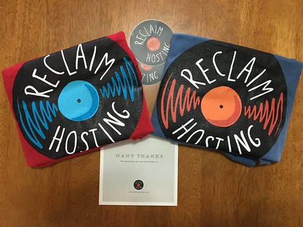

This will (hopefully) be my last post on the [wordpress.com](http://wordpress.com) hosted version of this blog. Goodbye wordpress.com.

I'm biting the bullet and going self-hosted with [Reclaim Hosting](https://reclaimhosting.com/). Hello Reclaim Hosting.

 "[Yay, My Reclaim Hosting T-Shirts Are Her](https://www.flickr.com/photos/cogdog/26815347231/)" ([CC BY 2.0](https://creativecommons.org/licenses/by/2.0/)) by [cogdogblog](https://www.flickr.com/people/cogdog/)

 

The new blog will be located at [http://djon.es/blog/](http://djon.es/blog/).

In theory, if I've done everything correctly, then if you try to view this post on a blog (as opposed to in a reader), then you should already be looking at that blog. I'm paying Wordpress.com for at least a year to redirect people trying to view posts on the old Wordpress.com blog to the equivalent posts on the new blog.

At this stage, I haven't done anything with subscriptions and I may not do anything. Meaning, if you want to continue being notified of my dribble, then you'll need to subscribe to the new blog (see the subscribe widget in the right hand menu). Sorry for the additional step, but I'm hoping this might reduce the number of pretend subscribers that blog has gathered over the years.