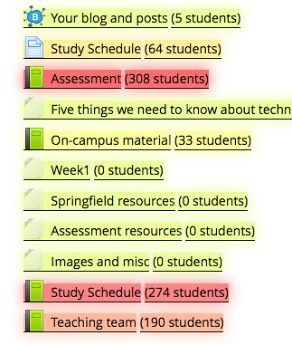
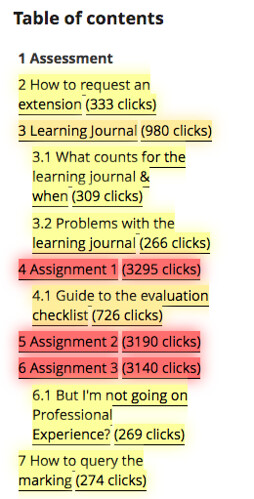
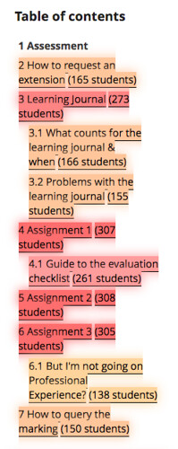

---
categories:
- eei
date: 2017-01-25 13:16:45+10:00
next:
  text: The PEBKAC problems of digital L&T and how to solve it?
  url: /blog/2017/02/10/the-pebkac-problem-of-ict-support-and-training/
previous:
  text: Formulating a Trello process
  url: /blog/2017/01/12/formulating-a-trello-process/
tags:
- bad
- mav
- moodle
title: Exploring course site resource usage using MAV
type: post
template: blog-post.html
---
The following starts with the following question raised from a colleague about a Moodle course site they have designed.

https://twitter.com/chalkhands/status/823750342999306240

The tabs mentioned in the above aren't standard to Moodle. They are an institutional addition and a follow up tweet illustrates

https://twitter.com/chalkhands/status/823751353155534850

The tabs have been added (I believe) as they capture important information that students should be able to find easily on every course site from this institution. The consistency == quality argument of which I'm not a fan.

The actual problem @chalkhands is having arises from a number of clashing perspectives/models for creating a Moodle course site. The following is not going to tackle that issue. Instead, this discussion has sparked an interest in exploring just how important those tabs and the information held there is to students. Or more correctly, how much have they been used in the courses I have been responsible for (and can I find out).

### You can't find out?

The "institutional tabs" are supported by some local additions to Moodle that provide the functionality. It appears that the usage of some of these tabs can't be tracked by the standard Moodle logs. In particular, it appears that the _Assessment_, _Study Schedule_, and _Teaching Team_ can't be tracked on a standard site. At least can't seem to find how to find this information via the Moodle logs report.

### The benefits of hacking (this time)

In this particular case, it's lucky that I have been guilty of "hacking" the site. Instead of the institutional specific method for these particular tabs they are pointing to more traditional Moodle plugins, which play with the Moodle logging facility. In turn, this allows me to use [the Moodle Activity Viewer](https://github.com/damoclark/mav-enterprise) (MAV) script to find out how these things are being used.

For example, I can explore usage of the Assessment, Study Schedule and Teaching Team tabs by students in the S1, 2016 of the 300+ undergrad course I taught.

I can see how many times they clicked on the resources. (Click on the images to see larger versions)

I can see the number of students who clicked on the resources

Unsurprisingly, the Assessment tab was the most used. The following table summarises.

| Resource | Students | Clicks | Clicks/Student |
| --- | --- | --- | --- |
| Assessment | 308 | 27,976 | 90.8 |
| Study Schedule | 274 | 2988 | 10.9 |
| Teaching team | 190 | 1061 | 5.6 |

What is surprising is just how much the Assessment tab is used. In theory, students can print/download a copy of this information. In spite of that, students are averaging around 91 clicks on that information during a semester.

I wonder why? Could they not figure out how to print the information? Was the printed version of insufficient quality?

Given that just under 50% of students never clicked on the teaching team information, I wonder what that says about the value of the tab? Or how it compares with other courses?

### What parts of the assessment information was useful?

Using a standard Moodle plugin and combining that with MAV allows me to quickly get an indication of just which parts of the Assessment information was being used. The assessment information was implemented using the Moodle Book module, which produces a table of contents. The following images show the MAV modified table of contents for the Assessment book from the same offering.

Number of clicks on each section.

Number of students using each section.

The most clicked on information in this book are the three pages specifying what the students had to do for the three assignments. The next closest was the "learning journal" information which outlines one of the _different_ practices in the course. The nature of which causes some consternation early in the course. But even with that, a good 10% of students never visit that information.

Also a bit interesting, less than half the enrolled students ever visit the information about how to query the marking of their assignments.