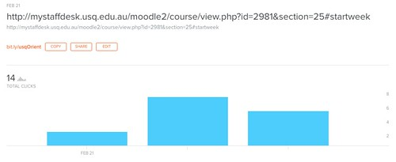

See also: [[blog-home | Home]]

Yesterday I helped out with the folk running the session intended to orient new full-time teaching academics to teaching at our institution. What follows are the slides, other resources, and some initial reflections on the session.

_New (28 March, 2017):_ [Results](https://docs.google.com/forms/d/1-JCPkM6HUJ2xvAcItwE_UXpdR2p6c3w4zSHdwTJsCkw/viewanalytics) from participant evaluation now available. Three separate participants suggested a longer session, a first for an orientation session?

### Slides

!!! warning "Outdated content no longer available"

    Presentation from Slideshare no long available

### Resources

McWilliam, E. (2008). Unlearning how to teach. Innovations in Education and Teaching International, 45(3), 263–269.

Snowden, D. (2017). [The tyranny of the explicit](http://cognitive-edge.com/blog/the-tyranny-of-the-explicit/). Retrieved 22 Feb, 2017.

Stead, D. R. (2005). A review of the one-minute paper. Active Learning in Higher Education, 6(2), 118–131.

Wiliam, D. (2006). Assessment: Learning communities can use it to engineer a bridge connecting teaching and learning. JSD, 27(1).

Institutional resources

- [The institutional space](http://bit.ly/usqOrient) for the session hosted on TeachDesk.
- The [institutional policy](http://policy.usq.edu.au/documents/1348PL) on learning and teaching.
- The [institutional course expectation review checklist](https://lor.usq.edu.au/usq/integ/gen/bb035aed-b503-40ec-8fdf-49b7341d5e73/0/?attachment.uuid=83036aa4-71cc-4eb6-a4fe-b035ed223656)

Other resources

- The session drew heavily on [URL shortening services](https://en.wikipedia.org/wiki/URL_shortening) to short URLs shown in the presentation.
    
    There are many [different URL shorteners](https://www.lifewire.com/shortening-long-links-3486603), for this session we used [http://bit.ly](http://bit.ly). The image below shows the statistics that bit.ly shows about how shortened URLs have been used. Currently, I only use the free version of bit.ly.
    

- [Obvious to you. Amazing to others](http://bit.ly/obvAmazing)
    
    YouTube video from Derek Sivers intended to encourage people to share their insights, no matter how apparently obvious.
    
- [Community of Inquiry model](https://coi.athabascau.ca/)
    
    The pedagogical model/framework that underpinned the design of the session.
    
- [Padlet](https://padlet.com/)
    
    One of the technologies used in the session for which there are [many suggestions](https://www.google.com/search?q=using+padlet+teaching&ie=utf-8&oe=utf-8&client=firefox-b-ab) around how it can be used to support teaching.
    
    To date, using Padlet in my teaching hasn't cost any money.
    
[Simple minute paper](http://bit.ly/exMinute) used in one of the scenarios

Wide array of [online resources](https://www.google.com/search?q=minute+paper&ie=utf-8&oe=utf-8&client=firefox-b-ab) on the minute paper idea. In this instance, the minute paper was implemented [using Google forms](https://www.google.com/search?q=minute+paper&ie=utf-8&oe=utf-8&client=firefox-b-ab#q=using+google+form&*). The Google forms technology is [widely used by teachers](https://www.google.com/search?q=minute+paper&ie=utf-8&oe=utf-8&client=firefox-b-ab#q=using+google+form+teaching&*).

### Reflections

The session was based explicitly on the assumption that we couldn't provide people with all the knowledge they needed to know. Instead, the focus was on helping them make connections with people and resources that can help, generating discussion between them, and identifying what else they'd like to know. Based on that aim, it appears that the session succeeded. Lots of active engagement and discussion on the day and random positive comments from people. A simple evaluation is underway, will be interesting to see what comments that brings.

The collaborative teaching room was a great space for this type of activity. Having a low ratio between participants and facilitators (and a focus on facilitators being participants) was also a positive. Allowed more perspectives to be weaved into activities. There might be an argument for broadening the diversity of "facilitators".

That said, given the limited time to design the session and that it was our first time designing such a session there are some areas to improve upon, including:

- Introduction had too much talking.
    
    The introduction section was probably too long. There was some useful information sprinkled through that section, but too much of me trying to explain why were doing things this way and not enough of participants doing stuff.
    
- Need more time doing stuff.
    
    Due to a lack of time in both planning and implementation the third section we had planned was compromised. This was originally intended to be a session focused on participants actively designing and implementing solutions to problems identified earlier. I think there would be real value in having quite some time on this type of session where people are able to focus on their courses and do something (with help in the room). This would require more computer access.
    
- Need more time.
    
    Due to prior experience and other reasons, we cut the session back to 3.5 hours (from an almost full day). Based on this experience (and the previous problem) I think there's some value in pondering an expansion back to the full day. With the 2nd half of the day focused on doing stuff. Prior sessions reportedly dragged due to a number of presentations where people sat passive. With more active suggestions, this appears to be less of a problem.
    
- Even better integration into institutional systems/practices/resources.
    
    A focus of the day was to try and integrate what we do with various institutional systems/practices/resources. The TeachDesk was used to house information and host pre-session introductions. The institutional course review checklist was the primary focus for the first session. This integration could be improved in quantity and quality. However, most of the improvements need to come from the institutional side, not this session's side.
    
    For example, on the activities throughout the day was for participants to use post-its to identify any questions (that couldn't be answered immediately) and suggestions for the institution around teaching. Some of these were going to be worked in the final session, but most were going to be followed up with afterwards. The problem is that there is (as far as I know) no institutional place to raise/answer questions and suggestions around teaching. There might be places where specific questions/suggestions might be raised (e.g. problems with ICT systems can be raised with the ICT helpdesk). However, teaching is much more than this and cuts across institutional boundaries.
    
    This raises some questions about how to provide such a central space?
    
    The broader problem is (for me) to have institutional systems/practices that can be readily integrated and enhanced through sessions such as orientation and many other means.