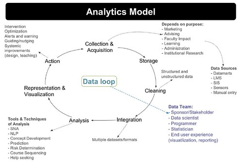
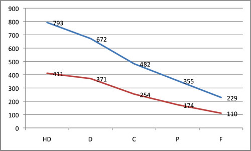
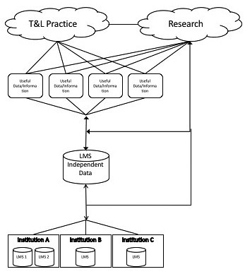

---
categories:
- indicators
date: 2017-03-08 07:57:16+10:00
next:
  text: Communication and professional learning for teaching at Universities
  url: /blog/2017/03/09/communication-and-professional-learning-for-teaching-at-universities/
previous:
  text: The teleological reason why ICTs limit choice for university learners and
    learning
  url: /blog/2017/03/01/the-teleological-reason-why-icts-limit-choice-for-university-learners-and-learning/
title: Thinking about (more) reproducible research and learning analytics
type: post
template: blog-post.html
---
There are moves afoot to revisit some of the earlier research arising from [Indicators project](http://indicatorsproject.wordpress.com/) and hopefully move beyond. To do that well we need to give some thought to updating the methods we use to analyse, share and report what we're doing. In particular, because we're now a cross-institutional project. The following captures some early exploration of this problem.

This has actually become the first of 2 or 3 blog posts. This one was getting too large. The sequence of post looks likely to be

1. (this post) Think a bit more about the requirements: what do we want to share? with whom?
2. Reflecting on some recent past experience.
3. Looking at some possibilities

After that, hopefully, we'll actually do something.

## Requirements

So what would we like to be able to do? In a perfect world we might be aiming for [reproducible research](https://www.ncbi.nlm.nih.gov/pmc/articles/PMC3383002/). But that's beyond the scope of what we need right now. At the very least we want to develop a research method/environment that helps make the research that we're doing _more_ reproducible.

### What will be more reproducible?

The _Reproducibility spectrum_ provided by [Peng (2011)](https://www.ncbi.nlm.nih.gov/pmc/articles/PMC3383002/) appears to include the following components

1. data;
    
    The data from institutional systems that is in put into the analysis
    
2. code;
    
    What actually does that analysis.
    
3. results indicators/patterns; and,
    
    The final correlations, patterns etc produced by the analysis. Back in the day we used the term [_pattern_](https://indicatorsproject.wordpress.com/patterns/)
    
4. interpretations/hypotheses/conclusions.
    
    We'll be layering upon the results we'll be layering our own interpretations/conclusions.
    

These components could be thought of being circular, especially if learner and/or teacher action in response to interpretations is added. Learners and teachers may take action in response to interpretations, which in turn generates more data to be analysed by code... Researcher action also plays a part, through going back to re-analyse the data with a different lens, or designing experiments to generate new data. Echoes of the Siemens (2013, p. 13) data loop, but with a slightly different focus.

 Learning Analytics Model")

Making this cycle more reproducible would be useful.

For example, the following graph has the following components

1. data;
    
    Data from a Blackboard LMS over numerous years showing the number of times students had clicked on discussion forums. The data was limited to courses where staff participation (measured by clicks on the course site) was high. Combined with student final result (HD, D, C, P, F).
    
2. code;
    
    Either some messy PHP code written by @beerc, some better structured but still messy Perl code written by me, or a combination of both. Probably with the addition of Excel spreadsheets for visualisation.
    
3. results;
    
    The graph below indicating that that average # of clicks on a discussion forum tends to increase the better a student's final grade is.
    
4. interpretations/hypotheses/conclusions.
    
    One interpretation is that students get better grades by being more dilligent/expending more effort. Hence they click more. Of course this is a hypothesis.
    

### To whom?

Way back in 2009, [the presentation](https://www.slideshare.net/davidj/introducing-the-indicators-project) for the [first indicators project paper](https://indicatorsproject.wordpress.com/2009/10/09/the-indicators-project-identifying-effective-learning-adoption-activity-grades-and-external-factors/) included the following image to the right as an early explanation of what we were doing.

This image can be mapped somewhat onto the components of _what_ from the previous section

- data = the institutional databases and the LMS independent data.
    
    At this point in time, I'm guessing we'll be working with our institutional data. The LMS independent data idea will have to wait
    
    That said, the recently announced [Project Inspire](https://moodle.org/mod/forum/discuss.php?d=348308) from Moodle HQ might provide some assistance here.
    
- code = typically the arrows between components.
- results = useful data/information
- intepretations = useful data/information

The _T&L practice_ and _Research_ 'clouds' in the above image point to the _Who_ question

- T&L practice
    
    1. Teaching staff - interested in reproducing the research on their course, students, learning designs.
    2. Teaching support staff/leadership - interested in reproducing the research on groups of courses.
    
    Largely interested in working with the results/interpretations.
    
- Research
    
    Could divide research into various groups based on research interests, methods etc.
    
    Would potentially be interested in accessing the data, code and results/interpretations.
    

The useful data/information captures results and interpretations aspects of the _what_ from the previous section.

Potentially, we'd like aspects of this work to be _more_ reproducible (/accessible) for the following broad groups

1. researchers within the project;
    
    Given we're at different institutions. We wouldn't be sharing data, at least not until a lot more necessary work is done.
    
    However, we would like to share code, results (suitably anonymised), and interpretations.
    
    The sharing here also includes co-construction/modification of these artefacts. Suggesting a need for version control and collaboration.
    
2. researchers outside the project;
    
    If we take a more open approach, probably the same sharing as with ourselves. However, early on some of us might like to share more final conclusions of what we do.
    
    Sharing code tends to imply we're using the same technology. We might be able to agree to this within the project, but outside is never going to happen. But we should perhaps allow for the possibility.
    
3. teaching academics
4. misc. support groups

### What about the learner?

I'm very aware that the above discussion (and much of what I've written previously) suffers from the learner being absent. At some level, this is for pragmatic reasons and linked to the problem that the _placing some limits_ section tries to deal with. That said, however, the above would be enhanced by broadening consideration to the student. Something which this project - [The Learning Analytics Report Card](http://www.de.ed.ac.uk/project/learning-analytics-report-card) appears to be giving a lot of thought to.

I came to that project from [this talk](http://redpincushion.us/blog/i-cant-categorize-this/it-should-be-necessary-to-start-critical-digital-pedagogy-in-troubled-political-times/) by Amy Collier. A talk which offers _Lesson 2: Solutionism decomplexifies too much_. Much of what I do likely comes across as solutionism (given my closeness to the subject, I'm not a reliable judge, what do you think?). However, my conception of this post and the purpose of this project is to start a process that results in methods, tools and thinking that allow more people to be engaged with the work we do.

The title of the talk - It should be necessary to start: Critical digital pedagogy in troubled political times - arises from a book [_We Make the Road by Walking_](https://books.google.com.au/books/about/We_Make_the_Road_by_Walking.html?id=zU8uFA4hlY0C&redir_esc=y) and Collier makes this connection

> In the early stages of the book, as Freire and Horton are discussing the spoken format of the book, Freire remarks that they will make the road by walking, meaning that the book will emerge from their conversations, and he adds what seems like an offhand remark that “in order to start, it should be necessary to start.”

This quote connects with my views on this work in two ways. First, this is just a start. Second, and perhaps more importantly, the rationale behind being able to more easily share how and what we do is to make it easier for us and others to "make the road by walking".

## Placing some limits

  
"[Ben Hur - 1959\_01](https://www.flickr.com/photos/newhousedesign/3377185004/)"  
([CC BY-NC-SA 2.0](https://creativecommons.org/licenses/by-nc-sa/2.0/)) by  
[newhousedesign](https://www.flickr.com/people/newhousedesign/)

Trying to support all of the above would be bigger than Ben Hur. Picking up on this being a start and we'll make the road by walking, the first step is to focus on a subset. The subset we'll start with - I think - should be

1. Practices that help the researchers two different institutions share code, results and interpretations.
    
    In theory, this could eventually expand beyond our little project and be used by others. But that will/may come.
    
2. Practices that help the researchers share (appropriately anonymous) results and interpretation with others.
    
    Initially, this is liable to be limited to people within our respective institutions, but may extend more broadly.
    
    Actually, I'm thinking there's value institutionally and from a research perspective in setting up some sort of mechanism by which we can engage more people in asking questions and drawing conclusions about what is found. A platform that helps analysis, but promotes sharing and collaboration around interpretation.
    

So maybe we'll start there.

Next post should reflect back on what was done last year.

## References

Siemens, G. (2013). Learning Analytics: The Emergence of a Discipline. American Behavioral Scientist, (August). doi:10.1177/0002764213498851